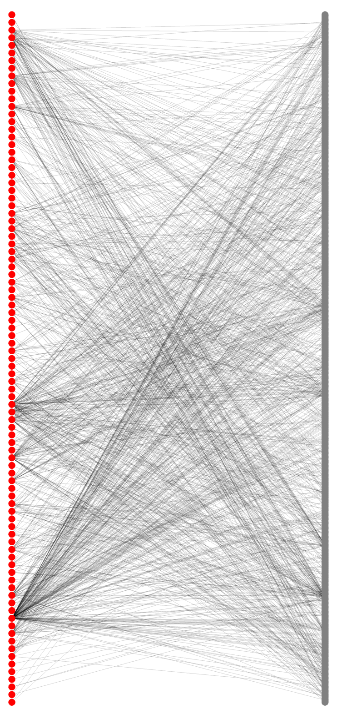
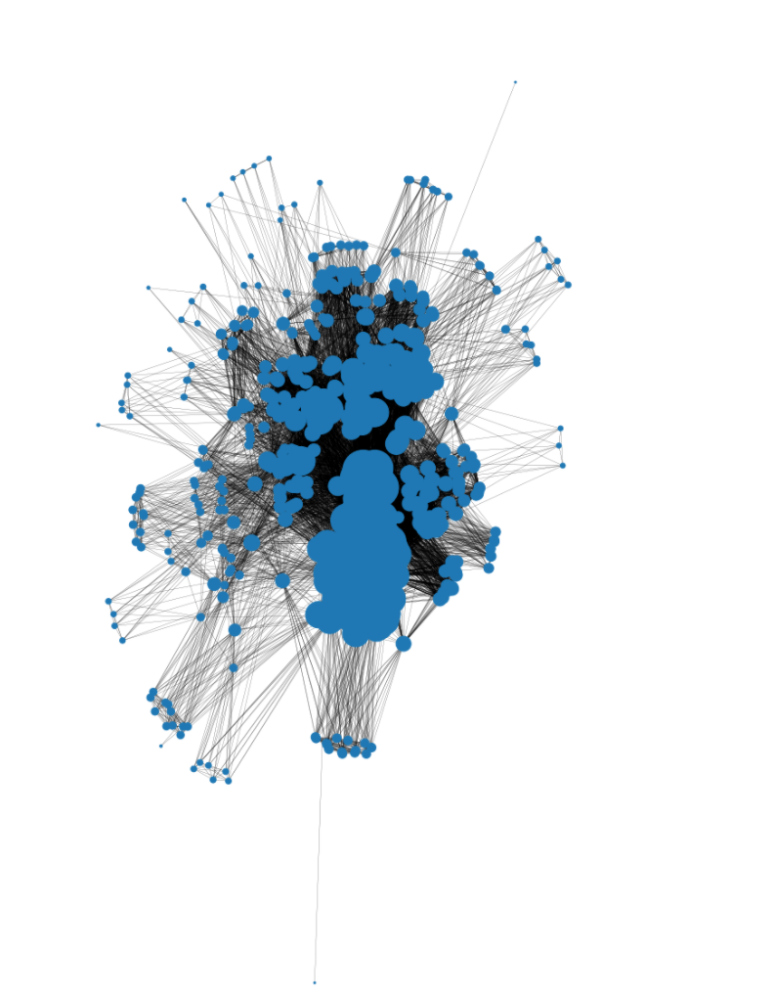
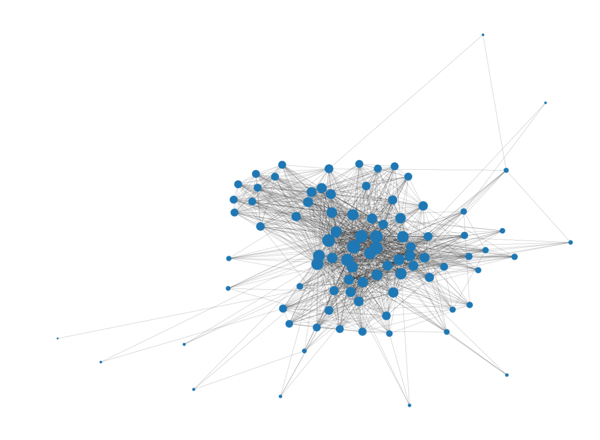

# Bipartite network analysis
## Introduction
This report provides a brief analysis of the pollinating relationships between insects and plants. The data set concludes the connections and attributes between nodes which is `edges_L6.csv` and `nodes_l6.csv` respectively. 

## Packages required
The required packages are listed below:
```py
from networkx.algorithms import bipartite
import matplotlib.pyplot as plt
import networkx as nx
import pandas as pd
import numpy as np
from sklearn.metrics.pairwise import cosine_similarity
from IPython.core.interactiveshell import InteractiveShell
InteractiveShell.ast_node_interactivity = "all"
```

## Data extraction
Firstly, by implying `read_csv` and `from_pandas_edgelist` from pandas and networks modules, the provided data set is put into `edges` and `nodelist`, then forming a graph called `G`.
```py
edges = pd.read_csv('edges_L6.csv', sep=',')
nodelist = pd.read_csv('nodes_l6.csv', sep=',', index_col=0)
G = nx.from_pandas_edgelist(edges, '# source', 'target', edge_attr = 'count')
```

After that, the `bipartite` attribute is added into graph `G` for preparation generating bipartite network.
```py
plant = nodelist[nodelist.pollinator == 0]
nx.set_node_attributes(G, dict(plant.pollinator), 'bipartite')
insect = nodelist[nodelist.pollinator == 1]
nx.set_node_attributes(G, dict(insect.pollinator), 'bipartite')
```

The graph `G` should be checked by `is_bipartite` to make sure it is a proper bipartite graph by returning boolean `True`.
```py
bipartite.is_bipartite(G)
```

Then, two node sets are separated called `node_set_insect` and `node_set_plant` respectively from the data `edges`'s source and target to prepare for projecting the graph.
```py
node_set_insect = edges['# source']
node_set_plant = edges['target']
```

Two projected graph are generated based on the node set insect and plant without considering the ratio.
```py
projected_graph_insect = bipartite.weighted_projected_graph (G,node_set_insect, ratio = False)
projected_graph_plant = bipartite.weighted_projected_graph (G,node_set_plant, ratio = False)
```

## Q1 Data interpretation
From the result, there are `679` insects and `91` plants in total after dropping duplicates. `1206` edges are found in graph `G`.
```py
print(f'Number of nodes in insect = {len(node_set_insect.drop_duplicates())}')
print(f'Number of nodes in plant = {len(node_set_plant.drop_duplicates())}')
print(f'Number of edges in the graph = {len(G.edges)}')
```
```py
Number of nodes in insect = 679
Number of nodes in plant = 91
Number of edges in the graph = 1206
```

## Q2 Most insects and plants
By showing the first five-row of the data frame calculating the frequency number of value, insect `196` and `198` share the same amount with `25`. Thus, `Cheilosia sp.11 and sp.4 (Syr. : Dip. )` pollinate most plants. Plant `12` is pollinated by the most insects which is `Anthriscus aemula`.
```py
node_set_insect.value_counts().to_frame().head(5)
node_set_plant.value_counts().to_frame().head(5)
```
```py
# source
196	25
198	25
248	23
398	21
481	16

target
12	189
41	77
34	66
40	50
39	46
```

## Q3
Node similarity can compare a set of nodes based on the nodes they are connected to. Two nodes are considered similar if they share many of the same neighbours. By discovering the highest cosine similarity, the strongest competitors to each other will be shown. Since there are amount of pairs share the maximum value, for instance, insect `116` and `538` are one of the top value pair.
```py
repeated_list = []
sorted_dict = {}

adj_A = nx.to_numpy_matrix(projected_graph_insect)
cos_sim_A = cosine_similarity(adj_A) # Create a cosine similarity matrix
idx = np.argsort(cos_sim_A, axis=None)[::-1] # Form an array to identify the sequence of the matrix value
rows, cols = np.unravel_index(idx, cos_sim_A.shape) # Form rows and cols array by identifying values' index
A_sorted = cos_sim_A[rows, cols] # Sort the value in orders to the matrix

for r, c, v in zip(rows, cols, A_sorted):
    total_no = r + c # Calculate the summation of the row and column number to avoid repeated value
    if (r == c or total_no in repeated_list): continue # Skip the loop if the value with the same row and column name
    else:
        sorted_dict[r, c] = v
        repeated_list.append(total_no) # Add the total number into the list for next loop checking

max_cos=dict(sorted(sorted_dict.items(), key=lambda x: x[1],reverse=True)[:5]) # Show all at once in descending order
print(max_cos)
```
```py
{(116, 538): 0.9946808510638292, (116, 466): 0.9946808510638292, (116, 298): 0.9946808510638292, (116, 297): 0.9946808510638292, (363, 342): 0.9946808510638292}
```
## Q4 Projected graph interpretation
### a
In the projected graph of insect, edges represent the relationship among insects which pollinate at least one same plant with each other. Therefore, for similar meaning, edges in plant projected graph representing the relationship among plants which is pollinated by at least one same insect.
```py
nx.info(projected_graph_insect)
nx.info(projected_graph_plant)
```
### b
Through the result, the insect projected graph has `679` nodes, which means there are `679` types of insect. From the total `31443` edges, which means a link among them, the average degree which is used to measure the number of edges compared to the number of nodes is shown as `92.6156`. It illustrates an insect has a connection with around 92 others pollinating the same plant. From the projected graph of plant, there are `91` types of plants in total. With a total number of edges `1345`, a plant is pollinated with around `29.5604` plants sharing the same insect.
```py
'Name: \nType: Graph\nNumber of nodes: 679\nNumber of edges: 31443\nAverage degree:  92.6156'
'Name: \nType: Graph\nNumber of nodes: 91\nNumber of edges: 1345\nAverage degree:  29.5604'
```

## Q5 Largest degree centrality
Degree centrality is equivalent to the number of edges. It is more central with a higher value of a node. Although the largest degree of centrality may not indicate the importance of a node in connecting others, it is still a good measurement to understand. In the outcome, insect `398` has the highest value of degree centrality of `0.7168` which means `Acteniceromorphus nipponensis (Ela. : Col. )` shares the largest number of insects regarding the pollinating preference. Plant `90` which is `Weigela  hortensis` has the highest value of `0.8` among plants which means it shares the largest number of plants being pollinated.
```py
degree_centrality_insect = nx.degree_centrality(projected_graph_insect)
max_key_insect= max(degree_centrality_insect, key=degree_centrality_insect.get)
max_value_insect = max(degree_centrality_insect.values())
print(max_key_insect, max_value_insect)

degree_centrality_plant = nx.degree_centrality(projected_graph_plant)
max_key_plant = max(degree_centrality_plant, key=degree_centrality_plant.get)
max_value_plant = max(degree_centrality_plant.values())
print(max_key_plant, max_value_plant)
```
```py
398 0.7168141592920354
90 0.8
```

### Q5b Comparison with Q2
In question 2, the result is used the bipartite network for calculation. Therefore, edges are the relationship between insects and plants. However, in question 5, the edges meaning is changed to the relationship between insects or plants sharing the same target during pollination. Hence, it prompts a different result.

## Q6 Isolated nodes identification
An isolated node means it is not adjacent to any other node and completely isolated from the other groups. From the result, insect `586` is isolated with others in the projected graph of the insect. It indicates that `Camponotus obscripes (For. : Hym. )` only pollinate with the particular plant that other insects won't. It shares no common insects pollinate with. From the projected graph plant, only plant `29` is isolated. It can be shown that `Cryptotaenia  japonica` is only pollinated with a particular insect without sharing it with others. From the edges, it can be noted insect `586` and `29` has the relationship between them, which mean they only pollinate for each other.
```py
list(nx.isolates(projected_graph_insect))
list(nx.isolates(projected_graph_plant))
```
```py
[586]
[29]
```

## Q7
The Girvan Newman Algorithm is one of the appropriate approaches to analysing the subgroups in the two projected networks. It removes the edges with the highest betweenness until there are no edges remain. If a network contains communities or groups that are only loosely connected by a few inter-group edges, then all shortest paths between different communities must go along one of these few edges. Thus, the edges connecting communities will have a high edge betweenness. From the conclusion, both projected graph of insect and plant should be divided into `2` communities.
```py
def edge_to_remove(g): 
    d1 = nx.edge_betweenness_centrality(g) 
    list_of_tuples = list(d1.items()) 
      
    sorted(list_of_tuples, key = lambda x:x[1], reverse = True) 
    return list_of_tuples[0][0] 
  
def girvan(g): 
    a = nx.connected_components(g) 
    lena = len(list(a)) 
    print (' The number of connected components are ', lena) 
    while (lena == 1): 
        u, v = edge_to_remove(g) 
        g.remove_edge(u, v)  
          
        a = nx.connected_components(g) 
        lena=len(list(a)) 
        print (' The number of connected components are ', lena) 
    return a 

no_insect_cluster = girvan(projected_graph_insect)
no_plant_cluster = girvan(projected_graph_plant)
```
```py
 The number of connected components are  2
 The number of connected components are  2
 ```

## Q8 Assortativity
The degree assortativity coefficient measures the correlation between the characteristics of every pair of nodes that are connected analogously to the Pearson correlation coefficient assessing the association between two continuous variables. It is a number between -1 and 1. A positive associativity coefficient based on degrees indicates that nodes in the network have a tendency to connect with the other ones that have a similar number of connections. A negative value indicates that nodes in a network tend to connect with the other nodes that have a different number of connections. Since both values in this case were relatively closer to 0 than 1, the result showed a very mild assortativity characteristic. In the projected insect graph, insects tend to connect with the other insects that have a similar number of neighbours in the graph with the assortativity cofficient of `0.1497`. The connections in the projected graph represent the co-pollinating relationship. In the plant graph, plants tended to connect with the other plants that have a different number of connections with the number of `-0.1510`, indicating there are few plants that can be pollinated by multiple insects. 
```py
nx.degree_assortativity_coefficient(projected_graph_insect)
nx.degree_assortativity_coefficient(projected_graph_plant)
```
```py
0.14973550731876661
-0.15103115294930652
```

## Q9 Visualization
Here is the bipartite network with the coloured node based on the value of 'pollinator'.
```py
plt.figure(figsize=(16,36))
pos = nx.bipartite_layout(G, projected_graph_plant)
colors = ['red' if node[1]['bipartite']==0 else 'gray' for node in G.nodes(data = True)]
nx.draw_networkx(G, pos = pos, node_color = colors, width = 0.2, with_labels = False)
```


The graph below is the projected graph of insect with the size based on the degree of centrality.
```py
plt.figure(figsize=(60,54))
degree_centrality_insect = nx.degree_centrality(projected_graph_insect)
nx.set_node_attributes(projected_graph_insect, degree_centrality_insect, 'degree_centrality')
sizes = [n[1]['degree_centrality'] * 3000 for n in projected_graph_insect.nodes(data = True)]
nx.draw_networkx(projected_graph_insect, node_size = sizes, with_labels = False, width = 0.2)
```


The graph below is the projected graph of plant with the size based on the degree of centrality.
```py
plt.figure(figsize=(54,54))
degree_centrality_plant = nx.degree_centrality(projected_graph_plant)
nx.set_node_attributes(projected_graph_plant, degree_centrality_plant, 'degree_centrality')
sizes = [n[1]['degree_centrality'] * 1000 for n in projected_graph_plant.nodes(data = True)]
nx.draw_networkx(projected_graph_plant, node_size = sizes, with_labels = False, width = 0.2)
```
