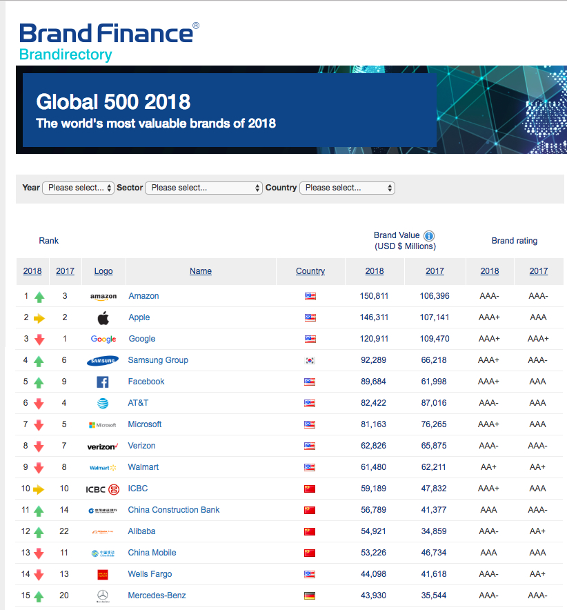
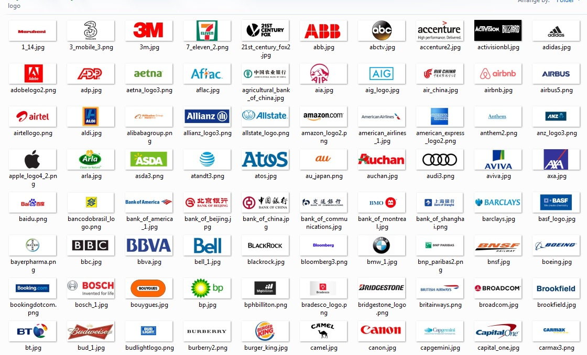
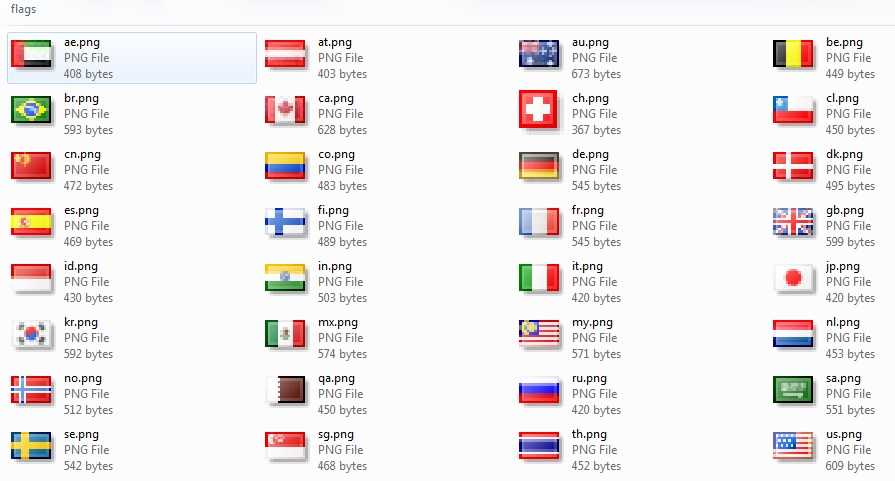
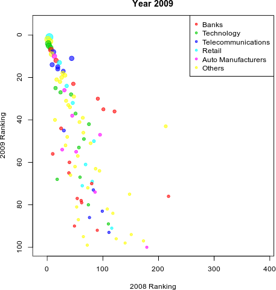

 
<style>
  body {font-size: 13pt; line-height:2.0;}
  pre code {font-size: 12pt;}
  .emred {color: red;}
  .emblue {color: blue;}
  .emgreen {color: green;}
</style>

 

```{r setup, include=FALSE}
options(width=90)
knitr::opts_chunk$set(echo = TRUE, message=FALSE, warning=FALSE)
```

**What's covered in this lecture?**

* A real case study about global top brands
* Web parsing and scrapping by R:rvest
* Global top brand data visualization 


# Introductory Web Scraping

- There are all kinds of open data avaiable on the Internet. Some data can be directly downloaded or copied, while others need technical ways to retrieve. 
- Today we learn how to use `R:rvest` for web data retrieval, e.g, the global 500 brands from [BrandFinance.com](http://brandfinance.com/).  
- This opens new horizons for us data scientists to actively collect data, other than waiting for data feeds ... 


```{r, out.width = "800px", fig.align='center', echo=FALSE}

```

The URL: http://brandirectory.com/league_tables/table/global-500-2018

## Web Parsing 

- Use Google Chrome web browser, right click to `view page source`.
- You need to get familiar with some basic HTML and CSS ... 
- Right click to carefully `Inspect` the pages to identify the data for collection.

```{r}
library(rvest)
thisurl = "https://brandirectory.com/rankings/global/2018/table"
webpage <- read_html(thisurl)

# Inspect the webpage
xdata <- webpage %>% html_nodes("body tbody") 
DataX = NULL
for (i in 1:length(xdata)){
  tmp <- xdata[i] %>% html_nodes("td") 
  rank18 <- tmp[1] %>% html_text()  %>% as.numeric() 
  rank17 <- tmp[2] %>% html_text()  %>% as.numeric()
  company <- tmp[3] %>% html_text() 
  company = trimws(gsub("\n", "", company))
  country <- tmp[4] %>% html_text() 
  country = trimws(gsub("\n", "", country))
  flag <- tmp[5] %>% html_nodes("img") %>% xml_attr("src")
  value18 <- tmp[5] %>% html_nodes("span") %>% html_text()  
  value17 <- tmp[6] %>% html_nodes("span") %>% html_text()  
  rate18 <- tmp[7] %>% html_text()  
  rate18 = trimws(gsub("\n", "", rate18))
  rate17 <- tmp[8] %>% html_text()  
  rate17 = trimws(gsub("\n", "", rate17))
  DataX = rbind(DataX, c(rank18, rank17,company, country,value18, value17, rate18, rate17))
}

colnames(DataX) = c("Rank18", "Rank17", "Company", "Country", 
                    "Value18", "Value17", "Rate18", "Rate17")
DataX = as.data.frame(DataX)
knitr::kable(head(DataX), format="html")
```
- html_nodes: More easily extract pieces out of HTML documents.
- html_text: Extract attributes, text and tag name from html.
- trimws: Remove leading and/or trailing whitespace from character strings.


## Data Preprocessing
```{r}
DataX = read.csv("TopBrand2018.csv")
summary(DataX)  # Before preprocessing ... to detect the data problems ... 
DataX$Company = as.character(DataX$Company)
DataX$Logo = as.character(DataX$Logo)
DataX$Flag = as.character(DataX$Flag)
DataX$Rank18 = as.numeric(DataX$Rank18)
DataX$Rank17 = as.numeric(DataX$Rank17)
DataX$Value18 = as.numeric(DataX$Value18)
DataX$Value17 = as.numeric(DataX$Value17)
DataX$Rate18 = as.numeric(DataX$Rate18)
DataX$Rate17 = as.numeric(DataX$Rate17)
summary(DataX) # After preprocessing ... thus develop the data sense ... 
```

```{r fig.align='center', fig.width = 8, fig.asp=0.8}
DataX$Country = gsub("/images/flags/", "", DataX$Flag)
DataX$Country = gsub(".png", "", DataX$Country)
DataX$Country = as.factor(DataX$Country)
barplot(sort(summary(DataX$Country), decreasing = T)[1:10], 
        col=5, main="Top 10 Countries with Top Brands")
```

## Image Downloading
```{r eval=FALSE}
library(curl)
if(!dir.exists("images")) dir.create("images")
if(!dir.exists("images/profile")) dir.create("images/profile")
if(!dir.exists("images/profile/logo")) dir.create("images/profile/logo")
for (i in 1:nrow(DataX)) 
  curl_download(url = paste("http://brandirectory.com", DataX$Logo[i], sep=""), 
                destfile = paste("./", DataX$Logo[i], sep=""))
```

```{r, out.width = "800px", fig.align='center', echo=FALSE}

```
- dir.exists: Utility using a system interface to check whether a directory exists.

- dir.create: Create a new folder on your computer from R using the dir.create function.

- curl_download: Download file to disk.

```{r eval=FALSE}
if(!dir.exists("images/flags")) dir.create("images/flags")
flaglist = unique(DataX$Flag)
for (i in 1:length(flaglist)) 
  curl_download(url = paste("http://brandirectory.com", flaglist[i], sep=""), 
                destfile = paste("./", flaglist[i], sep=""))
```

```{r, out.width = "800px", fig.align='center', echo=FALSE}

```


# Top Brand Data Visualization 

* Define the research question: investigate how the top brand ranking/values change from year to year
* Based on a more complete web scrapping from year 2007 to 2017
* Also collected the sectors for each top brand company 

## Data Preprocessing

**Step 1:** Start with data loading and preprocessing. For simplicity, we omit missing values. 

```{r fig.align='center',fig.width=6, fig.asp=1}
DataX = read.csv("BrandFinance.csv")
DataX = DataX[, c("Year", "Rank", "RankLastyear", "Company", "Value", "Rate", "Country", "Sector")]
DataX$Value[DataX$Value==-1] = NA
DataX$Rate[DataX$Rate==-1] = NA
DataX$RankLastyear = as.numeric(as.character(DataX$RankLastyear))
DataX = na.omit(DataX)
summary(DataX)   
```

```{r fig.align='center',fig.width=7, fig.asp=0.9}
tmp = sort(summary(DataX$Sector), decreasing = T)[1:5]
barplot(tmp, col=5, space=0, xaxt = "n", yaxt="n",
        main="Top 5 sectors with Top 100 Brands")
text(x= c(1:length(tmp))-0.6, 2, names(tmp), cex=1.2, pos=4, srt=90, xpd=TRUE)
TopSector = names(tmp)
```

## Creative Bubble Charts 

**Step 2:** Think creatively how the top brand ranking/values can be visualized ...

```{r fig.align='center', out.width = "500px", fig.asp=1.0}
levels(DataX$Sector)[!is.element(levels(DataX$Sector),TopSector)] = "Others"
DataX$Sector = factor(DataX$Sector, c(TopSector, "Others"))
Colmap = adjustcolor(1+seq(1,nlevels(DataX$Sector)), alpha.f=0.6)
xlim0=c(-10, max(DataX$RankLastyear))
ylim0=c(-5,max(DataX$Rank))
BubblePlot <- function(DataX,Year){
  TmpX = DataX[DataX$Year == Year, ]
  TmpX$Country = factor(TmpX$Country)
  Size = 1+9*(TmpX$Value-min(DataX$Value))/diff(range(DataX$Value))
  par(mar=c(4,4,3,3))
  plot(TmpX$RankLastyear, TmpX$Rank, 
       xlim=xlim0, ylim=rev(ylim0),
       pch=20, col=Colmap[TmpX$Sector], cex=Size,
       xlab = paste(Year-1, "Ranking"), ylab = paste(Year, "Ranking"), 
       main = paste("Year", Year))
  legend("topright", levels(DataX$Sector), pch=20, col=Colmap)
  }
BubblePlot(DataX, 2017)
```

## Let It Animate

**Step 3:** Generate the animation with year frames


```{r eval=FALSE}
library(magick)
ListYear = sort(unique(DataX$Year))
Img <- image_graph(500, 500, res = 72)
for (k in 1:length(ListYear)) BubblePlot(DataX, ListYear[k])
dev.off()
Img %>% image_trim() %>% image_animate(fps = 1) %>% image_write("TopBrands.gif")
```
```{r fig.align="center", out.width = "500px", echo=FALSE}
  
``` 

## Let It Be Interactive

**Step 4:** You are right, we are talking about Plotly ... 


```{r fig.align='center', fig.width=9, fig.asp=0.8}
library(plotly)
Year = 2017
TmpX = DataX[DataX$Year == Year, ]
TmpX$Country = factor(TmpX$Country)
TmpX$Size = 1+19*(TmpX$Value-min(DataX$Value))/diff(range(DataX$Value))
plot_ly(TmpX, x = ~RankLastyear, y = ~Rank, type="scatter", mode = "markers", 
        size = ~Size, color = ~Sector,
        hoverinfo = 'text',
        text = ~paste("", Company)) %>%
  layout(xaxis = list(range = xlim0, 
                      zeroline=FALSE,
                      title=paste(Year-1, "Ranking")),
         yaxis = list(range = ylim0, 
                      autorange="reversed", 
                      zeroline=FALSE, 
                      title=paste(Year, "Ranking"))
         )
```


```{r fig.align='center', fig.width=9, fig.asp=0.8}
library(ggplot2)
gg <- ggplot(DataX, aes(RankLastyear, Rank, color = Sector, text=Company)) +
  geom_point(aes(size = Value, frame = Year)) + 
  scale_y_reverse(lim=c(100,-5))
ggplotly(gg)
```

