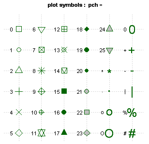
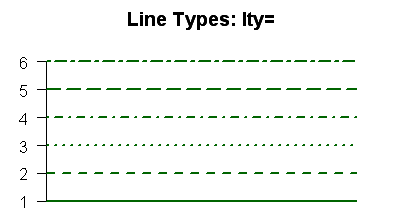
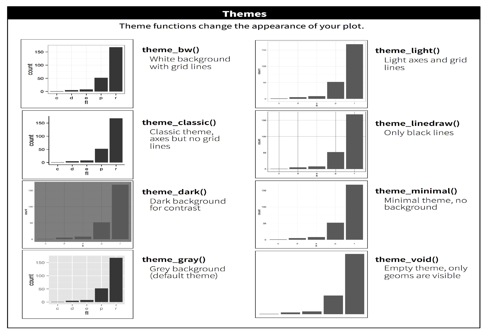

```{r setup, include=FALSE}
options(htmltools.dir.version = FALSE)
```

# Outline

- Exploratory Data Analysis
  
- Basic Plots
  
- Quick Plot with qplot()
  
- Advanced Plots with ggplot()

- Data Manipulation
---

# Exploratory Data Analysis

This data frame contains the following columns: 

  - Sex: Factor with levels "F" and "M".
  - Bwt: body weight in kg.
  - Hwt: heart weight in g.

It is always a good idea to take a look at the data # (if it is not too large).
You can always summarize a dataset to find the basic statistics

```{r}
library(MASS)
attach(cats)
summary(cats)
```

---
# Exploratory Data Analysis
- Check Data

.pull-left[

```{r, }
dim(cats)
names(cats)
class(Hwt)
class(Sex)
```
]

.pull-right[

```{r, }
head(cats)
tail(cats)
```
]

---
#  Exploratory Data Analysis

- Basic Summary

Some useful functions are listed:

.pull-left[
```{r}
mean(Bwt)
var(Bwt)
sd(Bwt)
sqrt(var(Bwt))
```
]

.pull-right[
```{r}
sub1 = subset(cats,Sex=='F')
head(sub1, 3)
sub2 = subset(cats, 
       (Bwt<=2.5 & Hwt>=10))
head(sub2, 3)
```
]

---
# Basic Plots 
- Line Plot
```{r, fig.align="center", fig.width=6, fig.height=5}
# Calculate range of x and y 
g_range <- range(0, Hwt, Bwt)
plot(Hwt, type = "o", ylim=g_range, col="blue")
lines(Bwt, type = "o", col="red")
legend(1, g_range[2], c("Hwt","Bwt"), col=c("blue","red"), lty=1)
```

---
#  Basic Plots
- Bar Plot
```{r,fig.align="center", fig.width=6, fig.height=4}
Male = apply(cats[Sex=='M', c("Bwt","Hwt")], 2, mean)
Female = apply(cats[Sex=='F', c("Bwt","Hwt")], 2, mean)
data = as.matrix(rbind(Male,Female))
barplot(data,beside=TRUE,col=c("blue","red"))
legend("left", c("Male", "Female"), fill=c("blue","red"))
```

---
#  Basic Plots
- Boxplot
```{r,fig.align="center", fig.width=8, fig.height=6}
boxplot(cats[,c("Bwt","Hwt")], col=c("blue","red"))
```

---
#  Basic Plots
- Histogram
```{r,fig.align="center", fig.width=8, fig.height=6}
hist(Bwt)
```

---
#  Basic Plots
- Pie Plot
```{r,fig.align="center", fig.width=8, fig.height=6}
MaleNum = nrow(cats[Sex=='M', ])
FemaleNum = nrow(cats[Sex=='F', ])
pie(c(MaleNum,FemaleNum), col=rainbow(2),
   labels=c("Male","Female"))
```

---
#  Basic Plots
- Scatter plot
```{r,fig.align="center", fig.width=8, fig.height=6}
plot(Bwt, Hwt)
```

---
# Basic Plots (More Options)
- Title (main)
- Label (xlab, ylab)
- Color (col)
- Legend (legend)
- Font Size (cex)
- Line type (lty)
- Line Width (lwd)
- Symbol (pch)
- So on

---
# Basic Plots (More Options)
- Here we re-do the scatter plot.
```{r,fig.align="center", fig.width=6, fig.height=4, size=2}
plot(Bwt, Hwt, xlab = "Body Weight in kg", ylab="Heart Weight in g",
     main="scatterplot", type='n')
points(Bwt[Sex=='F'], Hwt[Sex=='F'], col="red", pch=1, cex=1)
points(Bwt[Sex=='M'], Hwt[Sex=='M'], col="blue", pch=2, cex=1)
legend("topleft",cex=1, legend= c("Female","Male"),
       col=c("red", "blue"), pch=c(1,2))
```

---
# Basic Plots (More Options)
.pull-left[
- Symbols
<figure>
  
</figure>
]

.pull-right[
- Line Types

<figure>
  
</figure>
]

- For more details, please refer to https://www.statmethods.net/advgraphs/axes.html or R documents

---
# Basic Plots (Visualize Linear Regression)
-  Build linear regression model on heart weight and body weight
```{r}
mod=lm(Hwt~Bwt,data=cats)
summary(mod) 
```

---
# Basic Plots (Visualize Linear Regression)
- Plot the fitted line to the points
```{r,fig.align="center", fig.width=6, fig.height=4}
plot(Bwt, Hwt, xlab = "Body Weight in kg", ylab="Heart Weight in g",
       main="scatterplot", type='n')
points(Bwt[Sex=='F'], Hwt[Sex=='F'], col="green", pch=3, cex=1)
points(Bwt[Sex=='M'], Hwt[Sex=='M'], col="purple", pch=4, cex=1)
legend("left",cex=1, legend= c("Female","Male"),
       col=c("green", "purple"), pch=c(3,4))
abline(mod, col='red',lwd=3) # equivalent to abline(coef = coef(mod))
```

---
# Quick Plot with qplot()

- qplot() is a quick plot API of R:ggplot2, supplies many defaults.
- It is analog to base plot(), where ※q§ means quick.

```{r, eval = FALSE}
qplot(x, y, data=, color=, shape=, size=, alpha=, geom=, method=, 
      formula=, facets=, xlim=, ylim= xlab=, ylab=, main=, sub=)
```

- geom  
Specifies the geometric objects that define the graph type. The geom option is expressed as a character vector with one or more entries. geom values include "point", "smooth", "boxplot", "line", "histogram", "density", "bar", and "jitter".

- facets	
Creates a trellis graph by specifying conditioning variables. Its value is expressed as rowvar ~ colvar. To create trellis graphs based on a single conditioning variable, use rowvar~. or .~colvar.

- method and formula  
For example, to add simple linear regression lines, you'd specify geom="smooth", method="lm", formula=y~x.

---
# Quick Plot with qplot()
- Geom

.pull-left[
```{r, fig.width=5, fig.height=4, warning = FALSE}
library(ggplot2)
qplot(Species, Sepal.Width, 
      geom="boxplot", 
      data = iris, 
      main="Boxplot")
```
]

.pull-right[
```{r,fig.width=5, fig.height=4, warning = FALSE}
library(ggplot2)
qplot(Species, Sepal.Width, 
      geom="violin", 
      data = iris, 
      main="Violin Plot")
```
]

---
# Quick Plot with qplot()
- Facets, colors and sizes
```{r,fig.align="center", fig.width=7, fig.height=5, warning = FALSE}
qplot(Sepal.Length, Petal.Length, geom="jitter", data = iris, 
      facets =.~Species, colour = Species, size = Species)
```

---
# Quick Plot with qplot()
- Smoothing
```{r,fig.align="center", fig.width=7, fig.height=5, warning = FALSE}
qplot(Sepal.Length, Petal.Length, data = iris, 
      geom=c("point","smooth"), method="lm")
```

---
# Advanced Plots with ggplot()
- install.packages("ggplot2")
- library(ggplot2)
```{r warning=FALSE, echo=TRUE, results='hide', message=FALSE}
library(ggplot2)
```

- ggplot() provides more flexible APIs
- Layered grammar   
Provide options like position, statistics, coordinate systems, faceting, themes and so on
```{r warning=FALSE, eval = FALSE}
ggplot(data = <DATA>) + 
  <GEOM_FUNCTION>(
     mapping = aes(<MAPPINGS>),
     stat = <STAT>, 
     position = <POSITION>
  ) +
  <THEMEs> + 
  <COORDINATE_FUNCTION> +
  ...
```
- For your self learning  
http://rfun.library.duke.edu/ggplot/#themes

---
# Advanced Plots with ggplot()
- Case study with Boston Housing
```{r warning=FALSE}
library(MASS)
head(Boston)
```

---
# Advanced Plots with ggplot()
- Basic Box plot
```{r,fig.align="center", fig.width=8, fig.height=4, warning=FALSE}
# Create a 2D ggplot graph, with Charles River (chas) 
# as the x_axis and median value of house as the y_axis;
p <-ggplot(data=Boston,aes(x=factor(chas),y=medv)) 
# Add the boxplot, title, xlab, ylab and summary on the graph
p+geom_boxplot(outlier.colour="red",outlier.shape=8,outlier.size=4)+
ggtitle("House price VS Charles River dummy variable")+
xlab("Charles River dummy variable")+ylab("House price") +
stat_summary(fun.y=mean, geom="point", shape=23, size=3)
```

---
# Advanced Plots with ggplot()
- Boxplot with multiple groups
```{r,fig.align="center", fig.width=8, fig.height=4, warning=FALSE}
# Use an additional keyword "fill" to achieve multiple groups; 
# In addition, you may use keyword "color" to include more groups.
p <-ggplot(data=Boston,aes(x=factor(chas),y=medv, fill=factor(rad))) 
# Add the boxplot, title, xlab, ylab and summary on the graph
p+ geom_boxplot(outlier.colour="red",outlier.shape=8,outlier.size=4)+
ggtitle("House price VS Charles River dummy variable & rad")+
labs(x = "Charles River dummy variable",y = "House price")
```

---
# Advanced Plots with ggplot()
- Dodge bar plot
```{r,fig.align="center", fig.width=8, fig.height=4, warning=FALSE}
p <-ggplot(data=Boston,aes(x=factor(rad), fill=factor(chas)))
p + stat_summary(aes(y = medv), fun = mean, 
                 geom = "bar", position = position_dodge()) +
    labs(x = "Accessibility to radial highways",
         y = "Averge medv")+
    coord_flip()
```

---
# Advanced Plots with ggplot()
- Histogram with kernel density
```{r,fig.align="center", fig.width=8, fig.height=4, warning=FALSE}
ggplot(Boston, aes(x=medv))+
geom_histogram(aes(y = ..density..), colour= "black", 
               fill="white",binwidth=2)+
geom_density(alpha=.2, fill = "red")+
ggtitle("Histogram of House Price") +
xlab("House Price") + ylab("Density") + 
geom_vline(aes(xintercept=mean(medv)),
color="blue", linetype="dashed", size=1)
```

---
# Advanced Plots with ggplot()
- Histogram with an overlay normal density
```{r,fig.align="center", fig.width=8, fig.height=4, warning=FALSE}
ggplot(Boston, aes(x = medv)) +
geom_histogram(aes(y = ..density..), color = "royalblue",
               fill = "white", alpha=0.5, binwidth=1.5) +
stat_function(fun = dnorm, colour= "red",
          args= list(mean = mean(Boston$medv, na.rm = TRUE),
          sd= sd(Boston$medv, na.rm = TRUE))) +
ggtitle("Normal Curve for overall House Price")
```

---
# Advanced Plots with ggplot()
- Scatter plot with regression line
```{r,fig.align="center", fig.width=8, fig.height=4, warning=FALSE}
ggplot(Boston, aes(x=rm, y=medv)) +
geom_point()+
geom_smooth(method=lm,linetype="dashed",
            color="darkred", fill="gold", formula = y ~ x)+
geom_text(x=5, y=40, label="STAT3622 Tutorial",
family = "Times New Roman", color = "red", size=8)
```

---
# Advanced Plots with ggplot()
- Scatter plot with loess smooth curve
```{r,fig.align="center", fig.width=8, fig.height=4, warning=FALSE}
ggplot(Boston, aes(x=rm, y=medv)) +
geom_point()+
geom_smooth(method = 'loess', formula = y ~ x)
```

---
# Advanced Plots with ggplot()
- To divide the points and lines by the factor chas
```{r,fig.align="center", fig.width=8, fig.height=4, warning=FALSE}
ggplot(Boston, aes(x=rm, y=medv, 
               color=factor(chas))) +
geom_point() +  facet_wrap(~chas) + 
geom_smooth(method=lm, aes(fill=factor(chas)), formula = y ~ x)
```

---
# Advanced Plots with ggplot()
- Add lines on the scatterplot
```{r,fig.align="center", fig.width=8, fig.height=4, warning=FALSE}
library(gridExtra)
sp<-ggplot(data=Boston, aes(x=rm, y=medv)) + geom_point(size=2)
sp1<-sp+geom_hline(yintercept=20,linetype="dashed",color="red")
sp2<-sp+geom_vline(xintercept=3,linetype="dotted",color="blue")
sp3<-sp+geom_abline(intercept=37,slope =-5,color="red",linetype="solid")
sp4<-sp+geom_segment(aes(x=5,y=35,xend=6,yend= 30),
                     arrow=arrow(length = unit(0.5, "cm")))
grid.arrange(sp1,sp2,sp3,sp4, ncol=2)
```

---
# Advanced Plots with ggplot() (Theme)
- Using the theme() function, you can customize your visualization extensively
- It controls all non-data display
- Image Credit: Themes from R for Data Science by Grolemund & Wickham
<figure>
  
</figure>

---
# Advanced Plots with ggplot() (Theme)
.pull-left[
```{r, fig.width=5, fig.height=4, warning=FALSE}
library(ggthemes)
ggplot(Boston, aes(x=rm, y=medv)) +
geom_point()+
theme_economist() + 
scale_colour_economist()
```
]
.pull-right[
```{r, fig.width=5, fig.height=4, warning=FALSE}
library(ggthemes)
ggplot(Boston, aes(x=rm, y=medv)) +
geom_point()+
theme_solarized(light = F) +
scale_colour_solarized("red")
```
]

---
# Advanced Plots with ggplot() (Save a graph)
```{r, eval = FALSE}
pdf("rplot.pdf") 
ggplot(Boston, aes(x=rm, y=medv, color=factor(chas), 
                   shape=factor(chas))) +
geom_point() +
geom_smooth(method=lm, aes(fill=factor(chas)))
dev.off()
```
```{r, eval = FALSE}
jpeg("rplot.jpg", width = 350, height = 350) 
ggplot(Boston, aes(x=rm, y=medv, color=factor(chas), 
                   shape=factor(chas))) +
geom_point() +
geom_smooth(method=lm, aes(fill=factor(chas)))
dev.off()
```

---
# Data Manipulation (dplyr)
## Install the library "dplyr"
- install.packages("dplyr")
- library(dplyr)
- help(package="dplyr")
```{r warning=FALSE, echo=TRUE, message=FALSE}
library(dplyr)
```

---
# Data Manipulation (dplyr)
## Diamond Dataset Introduction
- price: price in US dollars ($326每$18,823)
- carat: weight of the diamond (0.2每5.01)
- cut: quality of the cut (Fair, Good, Very Good, Premium, Ideal)
- color: diamond colour, from J (worst) to D (best)
- claritya: measurement of how clear the diamond is 
- x: length in mm (0每10.74)
- y: width in mm (0每58.9)
- z: depth in mm (0每31.8)
- depth: total depth percentage = 2 * z / (x + y) (43每79)
- table: width of top of diamond relative to widest point (43每95)
 
```{r warning=FALSE}
head(diamonds, 3)
```

---
# Data Manipulation (dplyr)
## filter() 

- $filter$ allows you to select a subset of rows.
    - Mathematical relationship: ==, <, <=, >, >=.
    - Logical Operators: &, |, !.
    - %in%, is.na(), between().

```{r warning=FALSE}
filter(diamonds, cut == "Premium")[1:6,]
```

---
# Data Manipulation (dplyr)
## filter() 

- $filter$ allows you to select a subset of rows.
    - Mathematical relationship: ==, <, <=, >, >=.
    - Logical Operators: &, |, !.
    - %in%, is.na(), between().

```{r warning=FALSE}
filter_diamonds = filter(diamonds, x>=5 & 
                         cut %in% c("Premium","Ideal"))
head(filter_diamonds)
```

---
# Data Manipulation (dplyr)
## filter()

```{r warning=FALSE, fig.width=8, fig.height=4, fig.align='center'}
ggplot(filter_diamonds, aes(x,price)) + 
  geom_bin2d() + 
  scale_y_continuous(trans = "log10") + 
  geom_smooth(method = "lm")
```

---
# Data Manipulation (dplyr)
## arrange()
- $arrange()$ works similarly to $filter()$ except that instead of filtering or selecting rows, it reorders them.

```{r warning=FALSE}
head(arrange(diamonds, cut, depth)) # by default ascending
```

---
# Data Manipulation (dplyr)
## arrange()

```{r warning=FALSE}
head(arrange(diamonds, desc(price)))
```

---
# Data Manipulation (dplyr)
## mutate()  
- It is often useful to add new columns that are functions of existing columns. This is the job of mutate():

```{r, fig.width=6, fig.height=4, fig.align='center'}
new_diamonds = mutate(diamonds, price_to_weight  = price/carat)  
head(new_diamonds[,"price_to_weight"])
```

---
# Data Manipulation (dplyr)
## mutate()  

```{r, fig.width=6, fig.height=4, fig.align='center'}
ggplot(new_diamonds, aes(x = clarity, y = price_to_weight)) +
  geom_boxplot()
```

---
# Data Manipulation (dplyr)
## group_by()  
- The group_by() function splits a dataset into several groups, and then we can calculate for example, the mean, max, min of each group.
```{r}
# Grouped by chas, and then get the sample size of each group
summarise(group_by(new_diamonds, factor(clarity)), n()) 
```

---
# Data Manipulation (dplyr)
## group_by()  
```{r, fig.width=6, fig.height=4, fig.align='center'}
# Grouped by chas, and then get the mean of each group
sumary_diamond1 = summarise(group_by(new_diamonds, factor(cut)), 
                            mean(price_to_weight))
colnames(sumary_diamond1) = c("cut","avg_price")
ggplot(sumary_diamond1, aes(x=cut, y=avg_price)) +
geom_bar(stat="identity")
```


---
# Data Manipulation (Pipeline %>%)
Powerful trick for coding a sequence of operations.
- Example 1 
```{r, fig.width=6, fig.height=3, fig.align='center', warning = FALSE, message = FALSE}
diamonds %>%
  filter(x>0, y>0, y<20) %>%
  mutate(sym=x-y) %>%
  filter(abs(sym)<0.2) %>%
  group_by(carat) %>%
  summarize(avgprice=mean(price)) %>%
  ggplot(aes(carat, avgprice)) + geom_line() + 
  geom_smooth(method = 'loess', formula = 'y ~ x')
```


---
# Data Manipulation (Pipeline %>%)
- Example 2
```{r, fig.width=6, fig.height=3, fig.align='center'}
diamonds %>%
  filter(x>0, y>0, y<20) %>%
  mutate(sym=x-y) %>%
  filter(abs(sym)<0.2) %>%
  group_by(clarity) %>%
  summarize(avgprice=mean(price)) %>%
  ggplot(aes(clarity, avgprice))+
  geom_line(aes(group=1)) + geom_point(size=2)
```

---
# Data Manipulation (Pipeline %>%)
- Example 3
```{r, fig.width=6, fig.height=3, fig.align='center'}
diamonds %>%
  filter(x>0, y>0, y<20) %>%
  mutate(sym=x-y) %>%
  filter(abs(sym)<0.2) %>%
  group_by(cut, depth) %>%
  summarize(n=n()) %>%
  filter(depth>50, depth<75) %>%
  mutate(prop=n/sum(n)) %>%
  ggplot(aes(depth, prop, color=cut)) + geom_line()
```

---
class: center, middle 
# Q&A