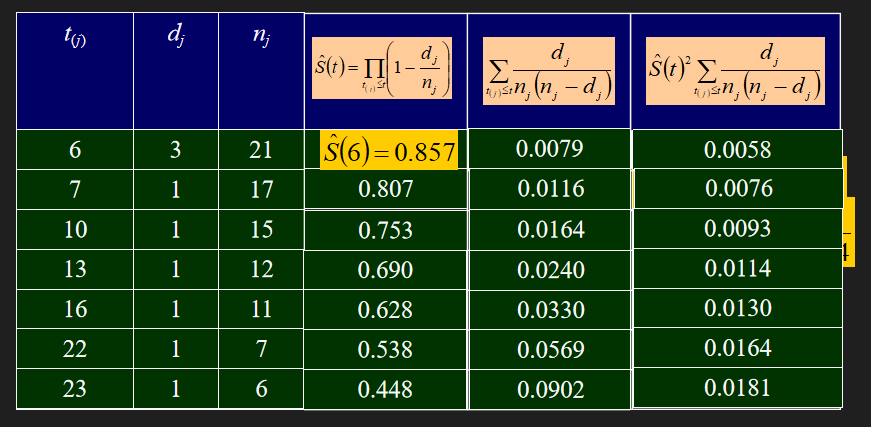
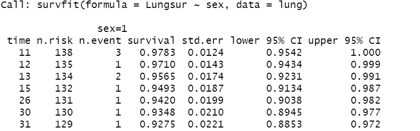
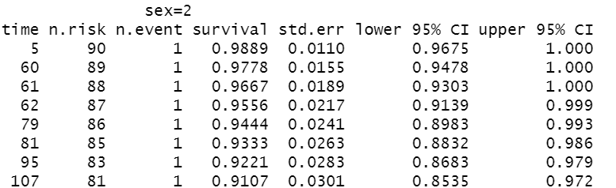
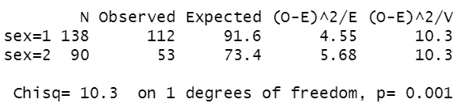
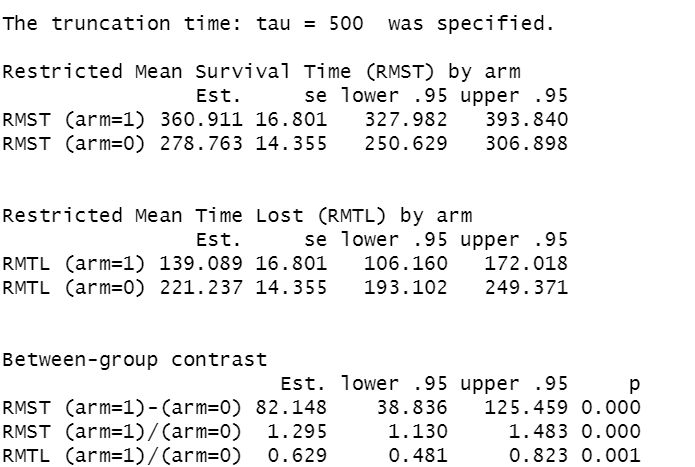
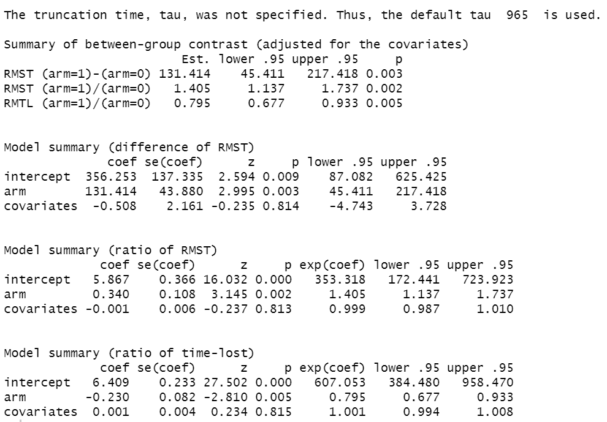

```{r setup, include=FALSE}
options(htmltools.dir.version = FALSE)
```

# Outline

- Survival Object 
  
- Kaplan-Meier Survival Function
  
- Cox Model
  
- RMST Model


---

# Survival Object
Basically observed data in survival analysis is consist of the minimum of survival time and censored time, and one indicator indicating if the observed time is censored or not. 


```{r}
# Install the package "survival" in R
# Import the lung cancer dataset and have a look at it
library(survival)
attach(lung)
head(lung)
```
- by help(lung) to see detail of lung dataset
- time: survival time
- status: censoring status 1=censored, 2=dead

---
# Survival Object
```{r warning=FALSE,message=FALSE}
#re-order the data by survial time
library(dplyr)
head(arrange(lung, time)) # by default ascending

```


---
# Survival Object
In R, We need to generate new survival object by function $Surv()$ in "survival" package for further manipulation.
```{r}
# Surv(time, event) creates a survival object for right censored data.
# "time" is the follow up time.
# "event" indicator, normally 0=alive (censored), 1=dead or 1/2 .
Lungsur=Surv(time,status)
head(Lungsur)

# pay attention to the meaning of event argument in Surv()
# what if status==1 stands for dead?
Lungsur2=Surv(time,status==1)
head(Lungsur2)
```

---
# Kaplan-Meier Survival Function
## overall survival curve 
- $survfit(formula,...)$ function creates survival curves.
- $formula$ should have the form $"Surv\ object \sim term1+...+term k"$.
- with term 1, creates the single curve of K-M estimate.
```{r echo=T}
fit1=survfit(Lungsur~1,data=lung) 
summary(fit1)
```

---
# Kaplan-Meier Survival Function
## overall survival curve 
- You may try to rebuild the K-M estimate as example in p20.
- Construct the same tabel as below, compare it with the previous one.

<figure>
  
</figure>


---
# Kaplan-Meier Survival Function
## overall survival curve 
- You can choose to plot the confident interval or not. 
.pull-left[
```{r}
plot(fit1,conf.int = FALSE,
       xlab = "Days", 
    ylab = "Overall survival probability")
title("Survival func of Lung cancer study")
```
]
.pull-left[
```{r}
plot(fit1,conf.int = TRUE,
    xlab = "Days", 
    ylab = "Overall survival probability",
     conf.type = "log")
title("Survival func of Lung cancer study")
```
]

---
# Kaplan-Meier Survival Function
## overall survival curve 
- $conf.type$ chooses the way how we derive the variance.
- $log$ is the default method, which corresponds to the Greenwood formula.
- Big criticism of Greenwood: can not guarantee the reasonable range of survival function.
- Complimentary log-log transformation can fix this problem.
- The result will be close when sample size is large enough, all based on Delta Method.


.pull-left[
<figure>
  
</figure>
]
.pull-right[
<figure>
  
</figure>
]


---
# Kaplan-Meier Survival Function
## overall survival curve 
- Alternatively, $ggsurvplot$ function from the $survminer$ package is built on $ggplot2$.
```{r warning=FALSE,message=FALSE,fig.width=4, fig.height=3}
library(survminer)
ggsurvplot(fit1,data=lung, 
           risk.table = TRUE, # show risk table.
           xlab = "Days",ylab = "Overall survival probability")
```

---
# Kaplan-Meier Survival Function
## overall survival curve 
- Add more information, like median survival time
```{r warning=FALSE,message=FALSE,fig.width=4, fig.height=3}
ggsurvplot(fit1,  data = lung,             
          risk.table = TRUE,       
          surv.median.line = "hv",  # add the median survival pointer.
        xlab = "Days",ylab = "Overall survival probability")

```


---
# Kaplan-Meier Survival Function
## stratified survival curve 
- If we want to estimate survival curve for groups.
- You can utilize the $dplyr$ package in T2 to select target group and calculate
survival function separately.
- Or, directly fitting the curve by some strata variable.
```{r echo=T, results='hide'}
fit2=survfit(Lungsur~sex,data=lung) 
summary(fit2)
```
<figure>
  
</figure>

<figure>
  
</figure>

---
# Kaplan-Meier Survival Function
### stratified survival curve

```{r echo=T,warning=FALSE,fig.width=6, fig.height=4}
ggsurvplot(fit2, data = lung, 
           pval = TRUE, #Add p-value
           conf.int = T,
           risk.table = TRUE,        # Add risk table
           xlab = "Days",ylab = "Survival probability",
           legend.labs = c("Male", "Female"),   # Change legend labels
           risk.table.height = 0.25, # Useful to change when you have multiple groups
           surv.median.line = "hv",  # add the median survival pointer.
           ggtheme = theme_bw()      # Change ggplot2 theme
  )
```

---
# Kaplan-Meier Survival Function
### stratified survival curve
- In two sample comparison problem, we can also conduct 
test through $survdiff$ function. 
- $rho$ stands for different weighted test.
```{r echo=T,results='hide'}
fit3=survdiff(Lungsur~sex,data=lung,
              rho=0 #log-rank test
              ) 
# log-rank test is default, same as in ggsurvplot.
fit3
```
<figure>
  
</figure>


---
# Cox model
- To quantify an effect size for a single variable.
- Or include more than one variable into a regression model to account for the effects of multiple variables.
- $coxph$ to fit a Cox proportional hazards regression model.
- Take gender into the Cox model, coefficient is negative, indicates that
 Female has higher survival probability compared to Male significantly.
```{r echo=T}
fit4=coxph(Lungsur ~ sex, data = lung)
fit4
```

---
# Cox model
- However, is really the cox model valid for lung cancer data?
- Two group tail crosses, the proportional hr assumption is likely to be wrong.
- $cox.zph$ tests the constantancy by weighted residuals.
```{r echo=T,warning=F,fig.width=5, fig.height=3.5}
coxtest=cox.zph(fit4)
print(coxtest)
plot(coxtest,xlab = "Days",ylab="Beta(t)")
```


---
# Cox model
### A forest plot for hazard ratio.
- $ggforest$ to draw forest plot for Cox model.
- More direct illustration.
```{r echo=T,warning=F,fig.width=6, fig.height=4}
# Adding age into the cox model.
fit4_s=coxph(Lungsur ~ sex+age, data = lung)
ggforest(fit4_s)

```

---
# RMST model
- No need for strong model assumption, Model-free and clinically interpretable.
- $rmst2$ function, shoud be careful to each argument definition.
```{r echo=T,results='hide',warning=FALSE}
library(survRM2)
arm = as.numeric(factor(sex))-1 # 0 for Male and 1 for Female
fit5=rmst2(time, status-1, arm)
fit5
```
<figure>
  
</figure>

---
# RMST model
- $tau$ can be taken at any time smaller than the minimum of the 
largest observed event time on each of the two groups.
```{r echo=T,results='hide',warning=FALSE}
fit5_s=rmst2(time, status-1, arm,tau=500)
fit5_s
```
<figure>
  
</figure>


---
# RMST model
- Adding covariates into model, eg: age.
```{r echo=T,results='hide',warning=FALSE}
fit6=rmst2(time, status-1, arm,covariates = age)
fit6
```
<figure>
  
</figure>
  
---
# RMST model
- plot RMST curve 
```{r echo=T,warning=FALSE,fig.width=5, fig.height=4}
plot(fit5,
     col.RMST = "pink",
     col.RMTL = "gray",
     xlab = "Days",ylab = "Overall survival probability")
```

---
class: center, middle 
# Q&A