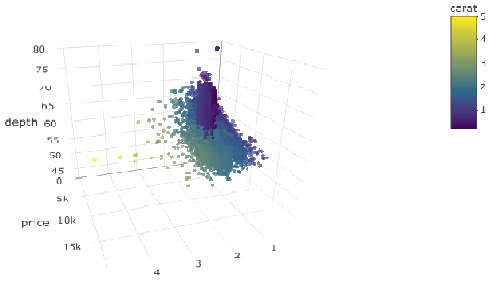

```{r setup, include=FALSE, fig.align='center', message = F}
options(htmltools.dir.version = FALSE)
```

# Outline

- Animation 

- Interactive Plots

- Geographical Data Visualization

---
# Animation 
## Magick Package Introduction
ImageMagick is a free and open-source  software suite for displaying, converting, and editing raster image and vector image files. It can read and write over 200 image file formats.

- install.packages("magick")
- library(magick)
```{r warning=FALSE, message = F}
library(magick)
```

---
## Magick Image IO
- image_read: read images from a file path, URL, or raw vector.
```{r warning=FALSE, fig.align='center', message = F}
frink <- image_read('frink.png')
frink <- image_scale(frink, "100")
```
- image_convert: convert formats of an image.
```{r warning=FALSE, fig.align='center'}
frink_jpg <- image_convert(frink, "jpg")
```
- image_info: print the information of an image.
```{r warning=FALSE, fig.align='center'}
image_info(frink_jpg)
```
- image_write: export an image in any format to a file on disk.
```{r warning=FALSE, fig.align='center'}
image_write(frink_jpg, path = "frink.jpg")
```

---
## Magick Transformations (Cut and shape)
- Functions:
  - image_scale
  - image_crop
  - image_fill
  - image_border
- Geometry Syntax: a geometry string specifying area or size.
  - "500x300" 每 Resize image keeping aspect ratio, such that width does not exceed 500 and the height does not exceed 300.
  - "500x300!" 每 Resize image to 500 by 300, ignoring aspect ratio;
  - "500x" 每 Resize width to 500 keep aspect ratio;
  - "x300" 每 Resize height to 300 keep aspect ratio;
  - "50%x20%" 每 Resize width to 50 percent and height to 20 percent;
  - "500x300+10+20" 每 Crop image to 500 by 300 at position 10,20.

```{r warning=FALSE, fig.align='center'}
image_crop(frink, "60x40+20+5")
```

---
## Magick Transformations (Cut and shape)
.pull-left[
- Set width = 100px
```{r warning=FALSE, fig.align='center'}
image_scale(frink, "100x")
```
]

.pull-right[
- Set Height = 200px
```{r warning=FALSE, fig.align='center'}
image_scale(frink, "x200") 
```
]

---
## Magick Transformations (Cut and shape)
- image_fill: fill some areas with certain color. 
```{r warning=FALSE, fig.align='center'}
image_fill(frink, "orange", point = "+50+80", fuzz = 20)
```

---
## Magick Transformations (Cut and shape)
- image_border: add a border of 20px left+right and 10px top+bottom.
```{r warning=FALSE, fig.align='center'}
image_border(image_background(frink, "hotpink"), "#000080", "20x10")
```

---
## Magick Transformations (Filters)
- Functions
  - image_blur
  - image_oilpaint
  - image_noise
  - image_negate
```{r warning=FALSE, fig.align='center'}
image_negate(frink)
```

---
## Magick Transformations (Text annotation)
```{r warning=FALSE, fig.align='center'}
image_annotate(frink, "I like R!", size = 15, degrees = 10, 
               boxcolor = "pink",location = "+10+40", 
               color = "red", font = 'Times')
```

---
## Magick Transformations (OCR text extraction)
```{r, fig.width=5, fig.height=4, warning = FALSE}
img <- image_scale(image_read("testocr.png"), "400")
cat(image_ocr(img))
```

---
## Magick Transformations (Combining with pipes)
```{r warning=FALSE, fig.align='center'}
image_read("frink.png") %>% image_scale(150) %>%
  image_rotate(270) %>%
  image_background("blue", flatten = TRUE) %>%
  image_border("red", "10x10") %>%
  image_annotate("The same thing with pipes", color = "white")
```

---
## Magick Animation
- Demo with Earth
The examples above concern single images. However all functions in magick have been vectorized to support working with layers, compositions or animation.

```{r warning=FALSE, fig.align='center'}
earth <- image_read("earth.gif") %>%
  image_scale("200x") %>%
  image_quantize(128)
head(image_info(earth))
```

---
## Magick Animation 
.pull-left[
```{r, fig.width=5, fig.height=4, warning = FALSE, fig.align='center'}
earth
```
]

.pull-right[
```{r,fig.width=5, fig.height=4, warning = FALSE, fig.align='center'}
rev(earth) %>% image_flip()
```
]

---
## Magick Animation 
- Load single images 
```{r warning=FALSE, fig.align='center'}
bigdata <- image_read('bigdata.jpg')
frink <- image_read("frink.png")
logo <- image_read("Rlogo.png")
img <- c(bigdata, logo, frink)
img <- image_scale(img, "300x300")
image_append(image_scale(img, "x200"))
```

---
## Magick Animation 
- Combine single images to create GIF

```{r warning=FALSE, fig.align='center'}
image_animate(image_scale(img, "400x400"), 
              fps = 1, dispose = "previous")
```

---
## Magick Animation 
- Manipulate the individual frames and put them back into an animation

```{r warning=FALSE, fig.align='center'}
banana <- image_scale(image_read("banana.gif"),"150")
# Background image
background <- image_background(image_scale(logo, "200"), 
                               "white", flatten = TRUE)
# Combine and flatten frames
frames <- image_composite(background, banana, offset = "+70+30")
# Turn frames into animation
animation <- image_animate(frames, fps = 10)
animation
```


---
## Gapminder Introduction
- Gapminder is created by Hans Rosling, a Swedish Professor. 
```{r warning=FALSE, echo=TRUE, message=FALSE}
library(gapminder)
```
- Let's see the website of [Gapminder](https://www.gapminder.org/tools/#$chart-type=bubbles)
```{r warning=FALSE, fig.align='center', echo=FALSE}
knitr::include_graphics("GapminderGuide.png", dpi=120)   
```

---
## Gapminder 
  - Dataset Description (1704 rows and 6 variables)
    - country: factor with 142 levels
    - continent: factor with 5 levels
    - year: ranges from 1952 to 2007 in increments of 5 years
    - lifeExp: life expectancy at birth, in years
    - pop: population
    - gdpPercap: GDP per capita (US$, inflation-adjusted)
```{r warning=FALSE}
head(gapminder)
```

---
## Gapminder 
```{r warning=FALSE, fig.align='center'}
library(ggplot2)
img <- image_graph(600, 340, res = 96)
datalist <- split(gapminder, gapminder$year)
out <- lapply(datalist, function(data){
    p <- ggplot(data, aes(gdpPercap, lifeExp, 
              size = pop, color = continent)) +
    scale_size("population", limits = range(gapminder$pop)) + 
    geom_point() + ylim(20, 90) + 
    scale_x_log10(limits = range(gapminder$gdpPercap)) + 
    ggtitle(data$year) + theme_classic()
  print(p)
})
dev.off()
animation <- image_animate(img, fps = 2)
```

---
## Gapminder 
```{r warning=FALSE, fig.align='center', eval=FALSE}
print(animation)
image_write(animation, "gapminder.gif")
```

```{r warning=FALSE, fig.align='center', echo=FALSE}
knitr::include_graphics("gapminder.gif")   
```

---
# Plotly Package
## Introduction
- Plotly's R graphing library makes interactive, publication-quality graphs online, see [Documents](https://plot.ly/r/).
- install.packages("plotly")
- library(plotly)
```{r warning=FALSE, message = F}
library(plotly)
library(dplyr)
```

---
## Demo Dataset: Diamond  
- price: price in US dollars ($326每$18,823)
- carat: weight of the diamond (0.2每5.01)
- cut: quality of the cut (Fair, Good, Very Good, Premium, Ideal)
- color: diamond colour, from J (worst) to D (best)
- claritya: measurement of how clear the diamond is 
- x: length in mm (0每10.74)
- y: width in mm (0每58.9)
- z: depth in mm (0每31.8)
- depth: total depth percentage = 2 * z / (x + y) (43每79)
- table: width of top of diamond relative to widest point (43每95)
 
```{r warning=FALSE}
diamonds <- diamonds[sample(nrow(diamonds), 5000), ]
attach(diamonds)
head(diamonds, 2)
```

---
## Basic Plots (Line Chart)
```{r warning=FALSE, fig.align='center', fig.height= 4, fig.width=10}
diamonds %>% arrange(carat)  %>% 
  plot_ly() %>%
  add_trace(x = ~carat, y = ~price, mode = 'line', type = 'scatter')
```

---
## Basic Plots (Histogram)
```{r warning=FALSE, fig.align='center', fig.height= 4, fig.width=10}
diamonds %>%
  mutate(sym=x-y, size=pi*((x+y)/2/2)^2) %>%
  filter(abs(sym)<0.2) %>%
  plot_ly() %>%
  add_trace(x = ~depth, type = 'histogram')
```

---
## Basic Plots (Bar Chart) 
```{r warning=FALSE, fig.align='center', fig.height= 4, fig.width=10}
diamonds %>% group_by(cut) %>% 
  summarize(avgx = mean(x), avgy = mean(y), avgz = mean(z)) %>% 
  plot_ly() %>%
  add_trace(x = ~cut, y = ~avgx, type = 'bar', name = "avgX") %>%
  add_trace(x = ~cut, y = ~avgy, type = 'bar', name = "avgy") %>%
  add_trace(x = ~cut, y = ~avgz, type = 'bar', name = "avgZ") 
```

---
## ggplotly
- Density Plots
```{r warning=FALSE, fig.align='center', fig.height= 4, fig.width=10}
p <- ggplot(diamonds, aes(price, fill = cut)) + 
  geom_density(alpha = 0.5) + 
  ggtitle("stacked density chart")
ggplotly(p)
```

---
## ggplotly
- Density Plots with Facets
```{r warning=FALSE, fig.align='center', fig.height= 4, fig.width=10}
p <- ggplot(diamonds, aes(x = price)) +
  geom_density(aes(fill="epanechnikov"), kernel="epanechnikov")+ 
  facet_grid(~cut) + 
  ggtitle("Kernel density estimate with Facets")
ggplotly(p)
```

---
## Advanced Charts (heatmap)
```{r warning=FALSE, fig.align='center', message = F, fig.height= 4, fig.width=10}
diamonds %>% group_by(cut, color) %>% 
  summarize(avgP = mean(price)) %>% plot_ly() %>%
  add_trace(x =~unique(cut), y =~unique(color),
          z=~matrix(avgP, byrow = F, nrow=length(unique(color)), 
                    ncol=length(unique(cut))), type = "heatmap")
```

---
## Advanced Charts (3D Scatterplot)
```{r warning=FALSE, fig.align='center', eval=FALSE}
plot_ly(diamonds, x = ~carat, y = ~price, z=~depth, type="scatter3d", 
        mode = "markers", color = ~carat, size = ~depth)
```

```{r warning=FALSE, fig.align='center', echo=FALSE}
   
```


---
## Animations with gapminder
```{r warning=FALSE, fig.align='center', fig.height= 3, fig.width=10}
library(gapminder)
gapminder %>%
  plot_ly(x = ~gdpPercap, y = ~lifeExp, size = ~pop, 
    color = ~continent, frame = ~year, text = ~country, 
    hoverinfo = "text", type = 'scatter', mode = 'markers'
  ) %>% layout(xaxis = list(type = "log"))
```

---
## Cumulative Lines Animation
```{r warning=FALSE, fig.align='center', fig.height= 4, fig.width=10}
accumulate_by <- function(dat, var) {
  var <- lazyeval::f_eval(var, dat)
  lvls <- plotly:::getLevels(var)
  dats <- lapply(seq_along(lvls), function(x) {
    cbind(dat[var %in% lvls[seq(1, x)], ], frame = lvls[[x]])
  }) 
  dplyr::bind_rows(dats) }
p <- gapminder %>% 
  filter(country %in% c("China", "United States")) %>%
  accumulate_by(~year) %>%
  plot_ly(x = ~year, y = ~gdpPercap, split = ~country, frame = ~frame, 
    type = 'scatter', mode = 'lines', line = list(simplyfy = F)) 
```

---
## Cumulative Lines Animation
```{r warning=FALSE, fig.align='center', echo=FALSE, fig.height= 6, fig.width=10}
p
```


---
# Geographical Data Visualization
## Load & Show Maps
```{r, fig.align='center', message = F, fig.height= 5, fig.width=8}
library(sp)
hkmap = readRDS("HKG_adm1.rds") # source: http://gadm.org/
hkmapdf = fortify(hkmap)
ggplot(hkmapdf, aes(long, lat, group=group)) +
  geom_polygon(fill="white", color="gray")
```

---
## Load & Show Maps
```{r, fig.align='center', message = F, fig.height= 5, fig.width=8}
ggplot() +
  geom_polygon(data=hkmapdf, aes(long, lat, group=group), 
               fill="white", color="gray") +
  ggtitle("Map of Hong Kong")
```

---
## Manipulate the dataset
```{r, fig.align='center', message = F, fig.height= 5, fig.width=8}
hkmapcode = data.frame(id=hkmap$ID_1, 
                       Code= gsub('HK.', '', as.character(hkmap$HASC_1)))
hkmapdf = merge(hkmapdf, hkmapcode, by="id")
mapdata = read.csv("HK18Districts.csv")
hkmapdf = merge(hkmapdf, mapdata, by="Code")
head(hkmapdf)
```

---
## Fill any interesting attributes
```{r, fig.align='center', message = F, fig.height= 5, fig.width=8}
ggplot(hkmapdf, aes(long, lat, group=group, fill=Population)) +
  geom_polygon() + 
  ggtitle("Hong Kong: Population by Districts") 
```

---
## Customization
```{r, eval = F}
ggplot(hkmapdf, aes(long,lat,group=group,colour=Code,fill=Region)) +
geom_polygon(alpha=0.6,colour="white") + 
geom_path() + 
scale_color_manual(values = rainbow(18)) + 
labs(list(title="Hong Kong: 3 Regions",y="Latitude")) +
scale_x_continuous("Longitude")+
guides(colour = 
guide_legend(title='District',keywidth=0.7, 
             keyheight=0.8,ncol=2,size=10, 
title.theme = element_text(size = 9,face = "italic",
                           colour = "red",angle = 0),
label.theme = element_text(size = 5,face = "italic",
                           colour = "black",angle = 90)),
 fill = guide_legend(title='Region',keywidth=1.5,keyheight=1,
                     title.theme = element_text(size = 9,
                     face = "italic",colour = "blue",angle = 0)))
```

---
## Custom Maps
```{r, echo = F, fig.align='center', message = F, fig.height= 6, fig.width=10}
ggplot(hkmapdf, aes(long,lat,group=group,colour=Code,fill=Region)) +
geom_polygon(alpha=0.6,colour="white") + 
geom_path() + 
scale_color_manual(values = rainbow(18)) + 
labs(list(title="Hong Kong: 3 Regions",y="Latitude")) +
scale_x_continuous("Longitude")+
guides(colour = 
guide_legend(title='District',keywidth=0.7, 
             keyheight=0.8,ncol=2,size=10, 
title.theme = element_text(size = 9,face = "italic",
                           colour = "red",angle = 0),
label.theme = element_text(size = 5,face = "italic",
                           colour = "black",angle = 90)),
 fill = guide_legend(title='Region',keywidth=1.5,keyheight=1,
                     title.theme = element_text(size = 9,
                     face = "italic",colour = "blue",angle = 0)))
```

---
## Custom Maps
```{r, fig.align='center', message = F, fig.height= 5, fig.width=8}
ggplot(hkmapdf, aes(long, lat, group=group, fill=Density)) +
  geom_polygon(color="grey") +
  scale_fill_gradient(limits=range(mapdata$Density),
                      low="skyblue", high="yellow") +
  ggtitle("Hong Kong: Population Density by Districts") 
```

---
## Custom Maps
```{r, fig.align='center', message = F, fig.height= 4, fig.width=8}
cnames = aggregate(cbind(long, lat) ~ District, 
                   data=hkmapdf, FUN=function(x) mean(range(x)))
ggplot() + geom_polygon(data=hkmapdf, 
  aes(x=long, y=lat, group=group, fill=Density),color="grey") +
  coord_map()+
  scale_fill_gradient(limits=range(mapdata$Density), 
                      low="skyblue", high="yellow") +
  ggtitle("Hong Kong: Population Density by Districts") +
  geom_text(data=cnames, aes(long, lat, label = District), 
            size=3, fontface="bold")
```

---
## Custom Maps
```{r, fig.align='center', message = F, fig.height= 4, fig.width=8}
mapdata2 = read.csv("hkecharge.csv") 
Picture = ggplot() +
  geom_polygon(data=subset(hkmapdf, Region=="HK"), 
               aes(long, lat, group=group), 
               color="gray", fill="white") +
  geom_point(data=mapdata2, 
             aes(Longitude, Latitude), color="red", size=2) + 
  ggtitle("Hong Kong Island: Electric EV Charging Stations")
Picture
```

---
## Save your graph
```{r, fig.align='center', message = F, fig.height= 5, fig.width=6}
############# Save your graph to your local dictionary #######
ggsave(Picture, file = "map1.png", width = 6, height = 4.5)
#another way to save
pdf("mymap.pdf")
print(Picture)
dev.off()
```

---
## leaflet package
```{r, fig.align='center', message = F, fig.height= 5, fig.width=8}
library(leaflet)
leaflet() %>%
  addTiles() %>%  # Add map tiles (Default: OpenStreetMap)
  addMarkers(lng=114.137426, lat=22.282793, 
             popup="The University of Hong Kong")
```

---
## leaflet package
```{r, fig.align='center', message = F, fig.height= 5, fig.width=8}
leaflet(data = mapdata2) %>% 
  addTiles() %>% 
  addMarkers(~Longitude, ~Latitude, 
             popup = ~as.character(Address)) %>%
  setView(lng = 114.183413 , lat = 22.248648, zoom=12)
```


---
class: center, middle 
# Q&A