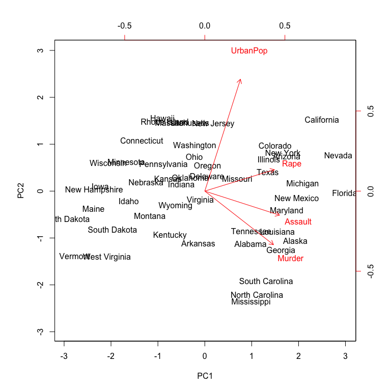

```{r setup, include=FALSE}
options(htmltools.dir.version = FALSE)
```

# Outline

- PCA theory

- Singular Value Decomposition
  
- Manually PCA realization

- Built-in PCA Functions

- Functional PCA


---
# PCA theory
## what is PCA ?
PCA is a type of linear transformation on a given data set that has values for a certain number of variables (coordinates) for a certain amount of spaces. This linear transformation fits this dataset to a new coordinate system in such a way that the most significant variance is found on the first coordinate, and each subsequent coordinate is orthogonal to the last and has a lesser variance. In this way, you transform a set of x correlated variables over y samples to a set of $p$ uncorrelated principal components over the same samples.

Mathematically, suppose a dataset ${X_1,X_2,...,X_n}$ with sample covariance matrix $S$,  $X_i$ are i.i.d. from random vector $X$ with covariance matrix $\Sigma$, which will be used in the derivation. The goal of the derivation is to find $\mathbf{a}^{T}$ that maximizes the variance of $\mathbf{a}^TX$. For this, we will consider the vector $\mathbf{a}^{T}$ that maximizes $Var(\mathbf{a}^TX)=\mathbf{a}^T\Sigma \mathbf{a}$ as the first principal component.

---
# PCA theory
## derivation of PCA
We consider the first principal components.
To do the above maximization, we will need a constraint to rein in otherwise unnecessarily large values of $\mathbf{a}$. The constraint in this example is the unit length vector $\mathbf{a}^T\mathbf{a}=1$, otherwise the maximum will be infinite. This constraint is employed with a Lagrange multiplier $\lambda$ so that the function is maximized at an equality constraint of g(x)=0. Thus the Lagrangian function is defined as:
$$\mathbf{a}^T\Sigma \mathbf{a}-\lambda(\mathbf{a}^T\mathbf{a}-1).$$
---
# PCA theory
## Brief Aside: Lagrange Multipliers
The Lagrange mulitiplier method is used for finding a maximum or minimum of a multivariate function with some constraint on the input values. As we are interested in maximization, the problem can be briefly stated as "maximize $f(x)$ subject to $g(x)=c$". here, $g(\mathbf{a})=\mathbf{a}^T\mathbf{a}=1$ and $f(\mathbf{a})=\mathbf{a}^T\Sigma \mathbf{a}$. The Lagrange multiplier, defined as $\lambda$ allows the combination of $f(\mathbf{a})$ and $g(\mathbf{a})$ into a new function $L(\mathbf{a},\lambda)$, defined as:
$$L(\mathbf{a},\lambda)=f(\mathbf{a})−λ(g(\mathbf{a})−1).$$
The sign of $\lambda$ can be positive or negative. 

The new function is then solved through partial derivatives:
$$\frac{\partial L(\mathbf{a},\lambda)}{\partial \mathbf{a}}=2\Sigma \mathbf{a}-2\lambda \mathbf{a}=0,$$
indicates $\lambda$ is an eigenvector of the covariance matrix $\Sigma$ and $\mathbf{a}$ is the corresponding eigenvector. 

---
# PCA theory
## Eigenvalues and Eigenvectors
In linear algebra, an eigenvector of a linear transformation is a nonzero vector that changes at most by a scalar factor when that linear transformation is applied to it. The corresponding eigenvalue, often denoted by $\lambda$, is the factor by which the eigenvector is scaled. In a finite-dimensional vector space $V$, one matrix $A$ represents one linear transformation, and $\mathbf{v}$ is a nonzero vector in $V$, then $\mathbf{v}$ is an eigenvector of $A$ if $A\mathbf{v}$ is a scalar multiple of $\mathbf{v}$. This can be written as
$$A\mathbf{v}=\lambda\mathbf{v}.$$
---
# PCA theory
## Important Property of symmetric matrix 
- Eigenvector of different eigenvalues are linear independent with each others:
suppose $A\mathbf{v}_i=\lambda_i\mathbf{v}_i, i=1,2$ and $\lambda_1 \neq \lambda_2$ are nonzero, then $\mathbf{v}^T_1\mathbf{v}_2=0.$ 

This property guarantees that the $k$-th principal component direction is automatically the eigenvector corresponding to the largest $k$ eigenvalue. 

So the standard PCA prosedures are: 
- Obtain the variance covariance matrix $\Sigma$ (known or estimated by sample covariance matrix);
- Obtain the eigenvalues $\lambda_k$ descendingly and corresponding eigenvectors $\mathbf{a}_k$. 
- $\mathbf{a}_kX_i$ will be the $k$-th principal component projection of observation $X_i$. 

---
# PCA theory
## Variance Accounts 
- The total variance is the sum of variances of all individual principal components.

- The fraction of variance explained by a principal component is the ratio between the variance of that principal component and the total variance.

- For several principal components, add up their variances and divide by the total variance.

By definition, $Var(\mathbf{a}^T_kX)=\mathbf{a}^T_k\Sigma \mathbf{a}_k=\lambda_k \mathbf{a}^T_k\mathbf{a}_k=\lambda_k$, so the $k$-th principal component explains $\frac{\lambda_k}{\sum\lambda_i} \times 100\%$ of the total variance. 

**You can decide how many principal components to take by observing the distribution of eigenvalues.**

---
# Singular Value Decomposition
## definition 
A singular value decomposition takes a rectangular matrix $A$, where $A$ is a $n$ by $p$ matrix, in which the $n$ rows represents the number of observations, and the $p$ columns represents the number of covariates. The SVD theorem states:
$$A_{n \times p}= U_{n \times n}S_{n \times p}V^T_{p \times p},$$
where $U_{n \times n}$, $V_{p \times p}$ are identical matrix and $S_{n \times p}$ is a diagonal matrix. $s_i=S_{i,i}$ are known as the singular values of $A_{n \times p}$.

## Relationship with Eigen-Decompostion
For any $A \in R^{n \times p}$, $A^TA$ and $AA^T$ are both symmetric matrices. The eigenvectors of $A^TA$ (should be vector of length $p$) make up the columns of $V$, the eigenvectors of $AA^T$ (should be vector of length $n$) make up the columns of $U$; and the singular values in $S$ are square roots of eigenvalues from $A^TA$ and $AA^T$. 

---
# Singular Value Decomposition
## application of SVD in PCA
Since $\Sigma$ is estimated by $\frac{X^TX}{n-1}$, from the previous statement, we will find the eigenvectors of $\Sigma$ are the right singular vectors of $X$ (since they are all scaled to be of length 1), while the eigenvalues $\lambda_k$ of $\Sigma$ and the singular values $s_k$ of $X$ satisfying $\lambda_k/s_k^2=\frac{1}{n-1}$.

**Remember to centralized $X$ before calculation, otherwise the relationship does not hold anymore!**


## Advantages and Disadvantages
- SVD does not need to calculate $X^TX$, can improve accuracy and stability. [(Eg. Lauchli Matrix)](https://math.stackexchange.com/questions/359397/why-svd-on-x-is-preferred-to-eigendecomposition-of-xx-top-in-pca)
- In most case, computational complexity of standard PCA is $O(np^2+p^3)$, SVD depends on the construction of matrix, but generally much faster.

---
# Manually PCA realization
-Use dataset *USArrests*, which contains four variables that represent the number of arrests per 100,000 residents for *Assault*, *Murder*, and *Rapein* each of the fifty US states in 1973. The data set also contains the percentage of the population living in urban areas, *UrbanPop*. In addition to loading the set, we’ll also use a few packages that provide added functionality in graphical displays and data manipulation. 
```{r warning=FALSE,message = F}
library(tidyverse)  # data manipulation and visualization
library(gridExtra)  # plot arrangement
data("USArrests")
head(USArrests, 5)
```

---
# Manually PCA realization
- obtain the eigenvectors of the covariance matrix
```{r}
scaled_df <- apply(USArrests, 2, scale)# scaling and centerinf the objections
arrests.cov <- cov(scaled_df) # obtain the covariance matrix
arrests.eigen <- eigen(arrests.cov)
arrests.eigen
```

---
# Manually PCA realization
- Obtain the proportion of variance explained (PVE) for the $k$-th principal component.
- By plotting PVE and cumulative PVE, we take the first two sets of loadings and store them in the matrix *phi*
```{r}
PVE <- arrests.eigen$values / sum(arrests.eigen$values)
round(PVE, 2)
cumsum(PVE)
phi <- arrests.eigen$vectors[,1:2] # Extract the loadings 
```

---
# Manually PCA realization
- We can directly plot PVE and cumulative PVE for visualization. 
```{r fig.height= 4, fig.width=10}
# PVE plot
PVEplot <- qplot(c(1:4), PVE) +  geom_line() +  xlab("Principal Component") + ylab("PVE") + ggtitle("Scree Plot") + ylim(0, 1)
# Cumulative PVE plot
cumPVE <- qplot(c(1:4), cumsum(PVE)) +  geom_line() + xlab("Principal Component") + ylab(NULL) + ggtitle("Cumulative Scree Plot") + ylim(0,1)
grid.arrange(PVEplot, cumPVE, ncol = 2)
```

---
# Manually PCA realization
Eigenvectors that are calculated in any software package are unique up to a sign flip. By default, eigenvectors in *R* point in the negative direction. For this example, we’d prefer the eigenvectors point in the positive direction because it leads to more logical interpretation of graphical results as we’ll see shortly. To use the positive-pointing vector, we multiply the default loadings by -1. The set of loadings for the first principal component (PC1) and second principal component (PC2) are shown below:
```{r}
phi <- -phi
row.names(phi) <- c("Murder", "Assault", "UrbanPop", "Rape")
colnames(phi) <- c("PC1", "PC2")
phi
```
Each principal component vector defines a direction in feature space.


---
# Manually PCA realization
- Projection the original data in two PC directions
```{r}
PC1 <- as.matrix(scaled_df) %*% phi[,1]
PC2 <- as.matrix(scaled_df) %*% phi[,2]
# Create data frame with Principal Components scores
PC <- data.frame(State = row.names(USArrests), PC1, PC2)
head(PC)
```

---
# Manually PCA realization
- Plot Principal Components for each State
```{r}
ggplot(PC, aes(PC1, PC2)) + 
  modelr::geom_ref_line(h = 0) +
  modelr::geom_ref_line(v = 0) +
  geom_text(aes(label = State), size = 3) +
  xlab("First Principal Component") + 
  ylab("Second Principal Component") + 
  ggtitle("First Two Principal Components of USArrests Data")
```

---
# Built-in PCA Functions
- Using above process to repeatedly perform PCA may be a bit tedious. Fortunately R has several built-in functions (along with numerous add-on packages) that simplifies performing PCA. One of these built-in functions is *prcomp*. The *prcomp* function centers the variables to have mean zero by default.
```{r}
library(stats)
pca_result <- prcomp(USArrests, scale = TRUE) 
summary(pca_result)
```
**try to find the difference when scale=0**

---
# Built-in PCA Functions
- The output from *prcomp* contains a number of useful quantities.
- The *center* and *scale* components correspond to the means and standard deviations of the variables that were used for scaling prior to implementing PCA.
```{r}
names(pca_result)
pca_result$center # means
pca_result$scale  # standard deviations
```

---
# Built-in PCA Functions
- The *rotation* matrix provides the principal component loadings, each column contains the corresponding principal component loading vector.
- We can also obtain the principal components scores from our results as these are stored in the *x* list item of our results. However, we also want to make a slight sign adjustment to our scores to point them in the positive direction.   
```{r}
pca_result$rotation
pca_result$rotation <- -pca_result$rotation
pca_result$x <- - pca_result$x
head(pca_result$x)
```


---
# Built-in PCA Functions
## PCA plot
.pull-left[
```{r message = F,fig.width=4, fig.height=3}
plot(pca_result$x[,1:2],  
     pch=21, cex=1.5,   # point shape and size
     main="Scores"      # title of plot
)
```
]
.pull-right[
```{r message = F, fig.width=4.5, fig.height=3.5}
plot(pca_result$rotation,
     pch=21, cex=1.5,   # point shape and size
     main="Loadings"     # title of plot
)
text(pca_result$rotation,           # sets position of labels
     labels=rownames(pca_result$rotation)   # print labels
)
```
]

---
# Built-in PCA Functions
- *sdev* stores the standard deviation of each principal component.
- Also indicates the variance explained for each pcs.
```{r}
(VE <- pca_result$sdev^2)
PVE <- VE / sum(VE)
round(PVE, 2)
cumsum(PVE)
```

---
# Built-in PCA Functions
### PCA biplot, including loading and score together
```{r message = F,results='hide'}
par(mfrow=c(1,2))
biplot(pca_result, scale = 0) #what if scale = 1?
```
<figure>
  
</figure>

---
# Functional PCA
- Deal with it as normal $n$ by $p$ dataset
- Using the canadian weather data in the package
```{r message = F,warning=FALSE,fig.width=4.5, fig.height=3.5}
library(fda)
tke=seq(1,365,length.out = 12) #choose 12 days of the year 
tempfd=daily$tempav[tke,]
par(mfrow=c(1,1),mar = c(8, 8, 4, 2))
matplot(tempfd,xlab='day',ylab='temperature',cex.lab=1.5,cex.axis=1.5,type="l")
```

---
# Functional PCA
- Do functional principal component analysis on the 35 temperature curves
- We choose 4 FPCs here
```{r message = F,warning=FALSE,fig.width=8, fig.height=3}
temppca = prcomp(t(tempfd),scale=TRUE)
temppca$scale  # standard deviations
plot(1:12,temppca$center,type="l",ylab="Mean Temp") # means
```

---
# Functional PCA
- Check the direction of scores
```{r message = F,warning=FALSE,fig.width=8, fig.height=3}
head(temppca$x[,1:3])
temppca$x <- -temppca$x
temppca$rotation <- -temppca$rotation
```


---
# Functional PCA
- plot the first FPC loadings. 
```{r message = F,warning=FALSE,fig.width=8, fig.height=3.5}
pt1=matrix(temppca$rotation[,1],ncol=1)%*%matrix(temppca$x[,1],nrow=1)
pt2=matrix(temppca$rotation[,2],ncol=1)%*%matrix(temppca$x[,2],nrow=1)
par(mfrow=c(1,2))
matplot(pt1,type="l",main="PC1 proj")
matplot(pt2,type="l",main="PC2 proj")
```

---
# Functional PCA
- plot the first FPC scores, similar for other pcs plot.
```{r message = F,warning=FALSE,fig.width=8, fig.height=3.5}
library("kdensity")
kde = kdensity(temppca$x[,1], start = "gumbel", kernel = "gaussian")
rbPal <- colorRampPalette(c('red','blue'))
Col <- rbPal(10)[as.numeric(cut(temppca$x[,1],breaks = 10))]
par(mfrow=c(1,2))
plot(kde, main = "Score kde",xlim=c(-15,8),ylim=c(0,0.2),xlab="PC1")
points(temppca$x[,1],rep(0.1,35),col=Col)
plot(temppca$x[,1],temppca$x[,2], main = "Score 1 VS Score 2",xlab="PC1",ylab="PC2",col=Col)

```


---
class: center, middle 
# Q&A