```{r setup, include=FALSE}
options(htmltools.dir.version = FALSE)
```

# Outline

- Meta Analysis
 + quantitative, binary case
 + fix, random effect
 + forest, funnel plot
- Network Meta Analysis
 + fix, random effect
 + more detail of output
 + network, forest plot

---
# Meta Analysis
- A meta-analysis combines the results of multiple scientific studies addressing the same question, with each individual study reporting measurements that are expected to have some degree of error.
- Target
 + Pool the estimates from individual studies
 + Obtain inference for estimate
- Challange in statiatics
 + Aggregate findings across studies
 + Evaluate heterogeneity
 + Conduct sensitivity and subgroup analyses

---
# Meta Analysis
## Real Value Case
- *metacont*: Calculation of fixed and random effects estimates for meta-analyses with continuous outcome data; inverse variance weighting is used for pooling.
```{r message=FALSE,warning=FALSE}
library(meta)
data("Fleiss1993cont")
```
<figure>
  
</figure>
- *n.psyc*:	number of observations in psychotherapy group
- *mean.psyc*:	estimated mean in psychotherapy group
- *sd.psyc*:	standard deviation in psychotherapy group


---
# Meta Analysis
```{r message=FALSE,warning=FALSE, results='hide',fig.show='hide'}
# meta-analysis with continuout outcome
# comb.fixed/comb.random: indicator whether a fix/random effect mata-analysis to be conducted.
# sm: Three different types of summary measures to choose,standardized mean difference (SMD),mean difference (MD), ratio of means (ROM)
res.flesiss =  metacont(n.psyc, mean.psyc, sd.psyc, 
                        n.cont, mean.cont, sd.cont,
                        comb.fixed = T, comb.random = T, studlab = study,
                        data = Fleiss1993cont, sm = "SMD") 

res.flesiss
```
<figure>
  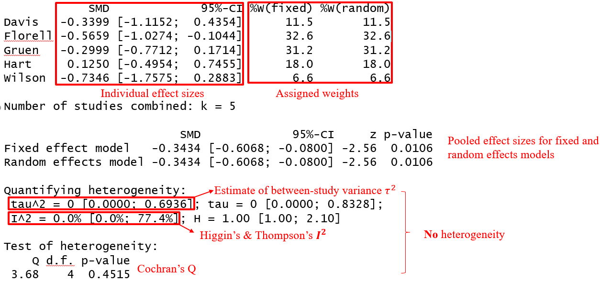
</figure>

---
# Meta Analysis
```{r message=FALSE,warning=FALSE, results='hide',fig.show='hide'}
forest(res.flesiss, leftcols = c('studlab'))
```
<figure>
  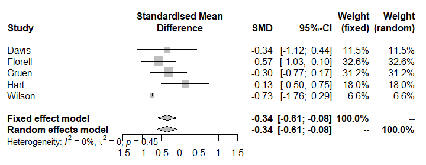
</figure>
- According to the pooled results of meta-analysis, both fixed and random effects models yield a significant benefit of the intervention group against the control group (for the days of hospital stay, the lower, the better).
- Based on $I^2=0$, estimated between-study variance $\tau^2=0$, $p$-value =0.45 for the Cochran’s Q test, there was no heterogeneity.


---
# Meta Analysis
- Use *funnel* to obtain funnel plot.
```{r message=FALSE,warning=FALSE,fig.width=8, fig.height=6}
# Funnel plot
funnel(res.flesiss)
```

---
# Meta Analysis
- *metabias*: Test for funnel plot asymmetry, based on rank correlation or linear regression method.
- Use Egger's test to check publication bias, can take string 'Egger' or 'linreg'.
```{r message=FALSE,warning=FALSE, results='hide',fig.show='hide'}
metabias(res.flesiss, method.bias = 'linreg', k.min = 5, plotit = T)
```
<figure>
  
</figure>

.pull-left[
<figure>
  
</figure>
]
.pull-right[
$p$-value=0.973>0.05 => no publication bias
However, this meta-analysis contains $k = 5$ studies. Egger's test may lack the statistical power to detect bias when the number of studies is small (i.e., $k<10$).
]

---
# Meta Analysis
## Binary case
- What if we record binary outcome from each individual studies? 
```{r}
load("binarydata.RData")
str(binarydata)
```
- Author:	This signifies the column for the study label (i.e., the first author)
- Ee:	Number of events in the experimental treatment arm
- Ne:	Number of participants in the experimental treatment arm
- Ec:	Number of events in the control arm
- Nc:	Number of participants in the control arm

---
# Meta Analysis
- Use *metabin* to do the calculation.
- As we want to have a pooled effect for binary data, we have to choose another summary measure now. We can choose from “OR” (Odds Ratio), “RR” (Risk Ratio), or RD (Risk Difference), among other things.
- *method*: indicating which method is to be used for pooling of studies. 
```{r message=FALSE,warning=FALSE, results='hide',fig.show='hide'}
m.bin <- metabin(Ee,Ne,Ec,Nc,
                 data = binarydata,
                 studlab = paste(Author),
                 comb.fixed = T,comb.random = T,
                 method = 'MH',sm = "RR") # Mantel Haenszel weighting
```
<figure>
  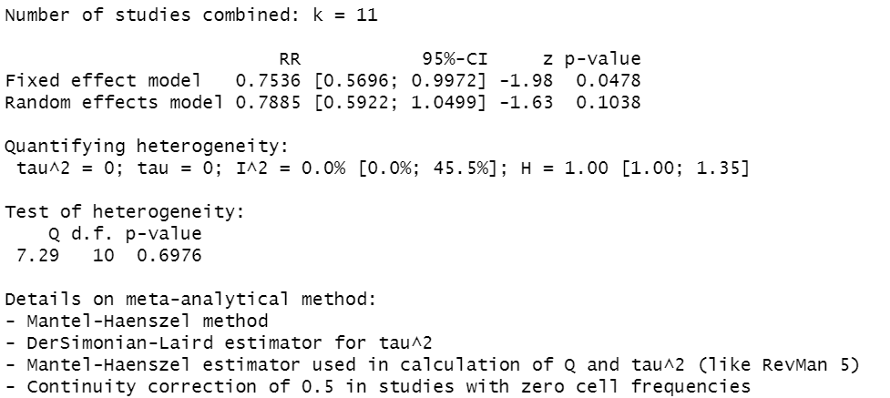
</figure>


---
# Meta Analysis
```{r message=FALSE,warning=FALSE, results='hide',fig.show='hide'}
forest(m.bin, leftcols = c('studlab'))
```
<figure>
  
</figure>

---
# Meta Analysis
- Similarly, plot funnel figure and do Egger's test.
.pull-left[
```{r message=FALSE,warning=FALSE,fig.width=8, fig.height=6}
funnel(m.bin)
```
]
.pull-right[
```{r message=FALSE,warning=FALSE,fig.width=6, fig.height=4,results='hide'}
metabias(m.bin, method.bias = 'linreg', plotit = T)
```
<figure>
  
</figure>
]


---
#Network Meta Analysis
- Limitation of Conventional Meta Analysis: can only conduct pariwise comparision, fail to include multi-arm trials.
- NMA: compare three or more interventions simultaneously in a single analysis by combining both direct and indirect evidence across a network of studies.
<figure>
  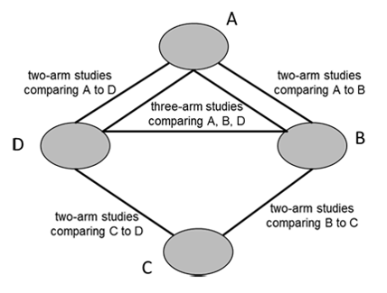
</figure>

---
#Network Meta Analysis
- Procedure under Frequentist framework for fixed effect
<figure>
  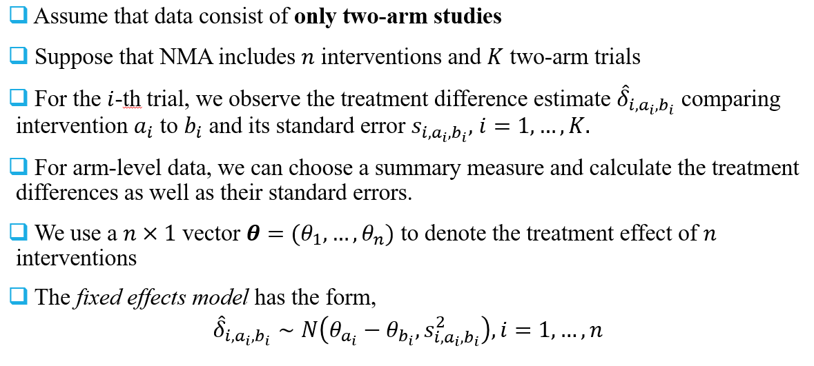
</figure>

<figure>
  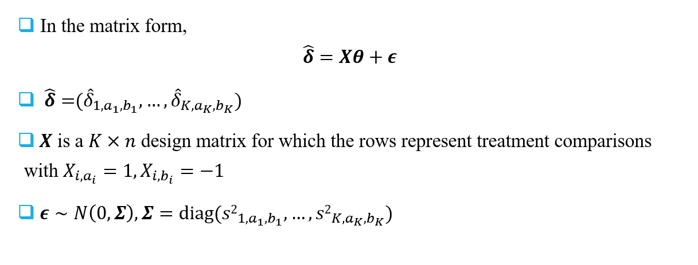
</figure>

---
#Network Meta Analysis
- Procedure under Frequentist framework for random effect
<figure>
  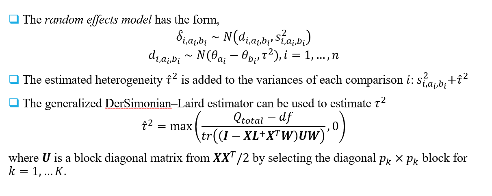
</figure>

---
#Network Meta Analysis
- *netmeta* package: network meta-analysis using frequentist methods 
```{r  message=FALSE,warning=FALSE,results='hide'}
library(netmeta)
data(Linde2015)
head(Linde2015)
```
<figure>
  
</figure>

<!-- id: label of study -->
<!-- treatment1, treatment2, treatment3 (might be NA): first, second and third treatment groups in each study -->
<!-- $n_i$: number of patients in group $i$ -->
<!-- resp$i$: number of events in group $i$ -->

---
#Network Meta Analysis
- *pairwise*: Transform arm-level binary data to treatment difference estimates of two-arm comparisons for each individual studies.
- *sm = "OR"*: take *Odds ratio* as measures of treatment effect
```{r  message=FALSE,warning=FALSE,results='hide'}
Linde.te <- pairwise(list(treatment1, treatment2, treatment3), 
               event = list(resp1, resp2, resp3), 
               n = list(n1, n2, n3), studlab = id, 
               data = Linde2015, sm = "OR") 
head(Linde.te) 
```
<figure>
  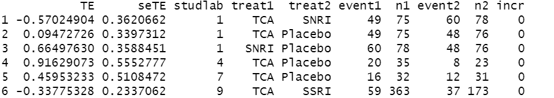
</figure>

---
#Network Meta Analysis
- *netmeta* function: a generalisation of pairwise meta-analysis that compares all pairs of treatments within a number of treatments.
- *TE*: treatment estimate between *treat1* and *treat2*.
- *reference.group*: take the reference group for measure of treatmen effect.  (Try to use other reference group)
```{r  message=FALSE,warning=FALSE,results='hide'}
Linde.net = netmeta(TE = TE, seTE = seTE, treat1 = treat1,
                    treat2 = treat2, studlab = studlab,
                    data = Linde.te, 
                    comb.fixed = T, comb.random = T, 
                    reference.group = "Placebo") 
```

---
#Network Meta Analysis
## Output of *netmeta*
- Original data (with adjusted standard errors for multi-arm studies)
<figure>
  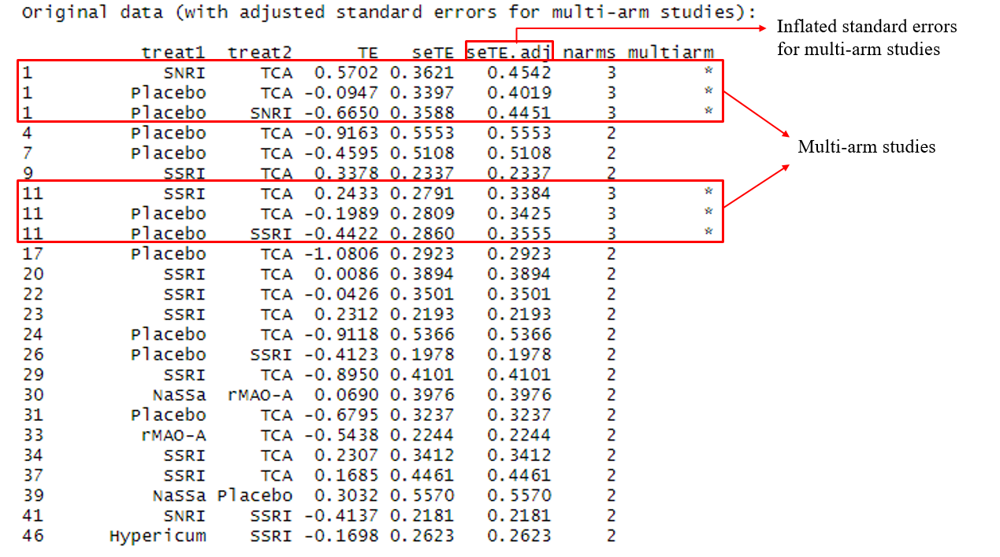
</figure>

---
#Network Meta Analysis
## Output of *netmeta*
- Treatment effect estimate
<figure>
  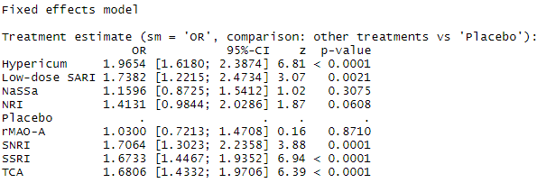
</figure>

<figure>
  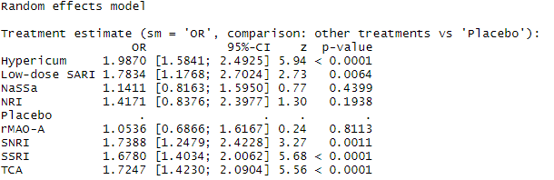
</figure>

---
#Network Meta Analysis
## Output of *netmeta*
- Heterogeneity/Inconsistency test
<figure>
  
</figure>
<figure>
  
</figure>

---
#Network Meta Analysis
## Network plot
- *netgraph*: Generic function for network graphs
```{r  message=FALSE,warning=FALSE,fig.show='hide'}
netgraph(Linde.net, plastic = F, thickness = "number.of.studies", col = 'black')
```
<figure>
  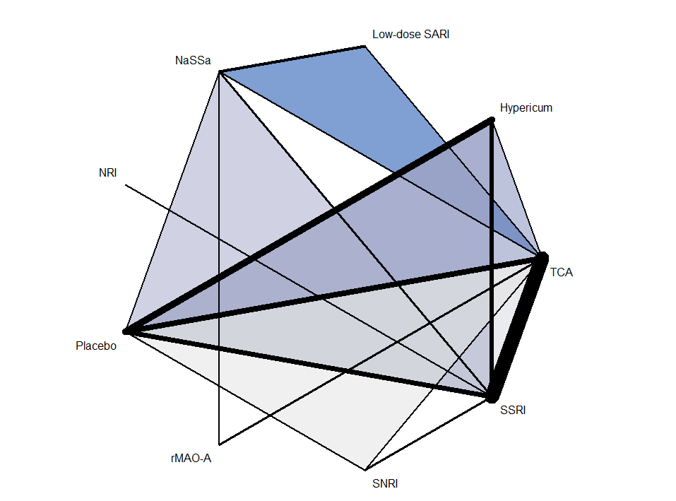
</figure>

---
#Network Meta Analysis
## forest plot for fix effect
```{r message=FALSE,warning=FALSE,fig.show='hide'}
forest(Linde.net, reference.group = 'Placebo', 
       pooled = 'fixed', leftcols = c('studlab', 'effect', 'effect.ci'), rightcols = F)
```
<figure>
  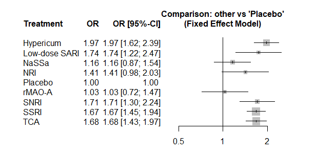
</figure>


---
#Network Meta Analysis
## forest plot for random effect
```{r message=FALSE,warning=FALSE,results='hide',fig.show='hide'}
forest(Linde.net, reference.group = 'Placebo', 
       pooled = 'random', leftcols = c('studlab', 'effect', 'effect.ci'), rightcols = F)
```
<figure>
  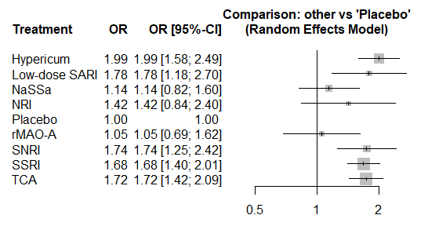
</figure>

---
#Network Meta Analysis
- *netleagu*: creates square matrix showing all pairwise comparisons with their CIs in a network meta-analysis
```{r message=FALSE,warning=FALSE,results='hide',fig.show='hide'}
Linde.netleague <- netleague(Linde.net, bracket = "(", digits=2)
Linde.netleague$fixed # network estimates in lower triangle, direct estimates in upper triangle
```
<figure>
  
</figure>

- Can also run 
```{r message=FALSE,warning=FALSE,results='hide',fig.show='hide'}
Linde.netleague$random
```
---
#Network Meta Analysis
- *netsplit*: splits network estimates into the contribution of direct and indirect evidence 
```{r message=FALSE,warning=FALSE,results='hide',fig.show='hide'}
Linde.net.split = netsplit(Linde.net, reference.group = "Placebo", 
                           baseline.reference = T, 
                           comb.fixed = T, comb.random = T)
head(Linde.net.split$fixed)
```
<figure>
  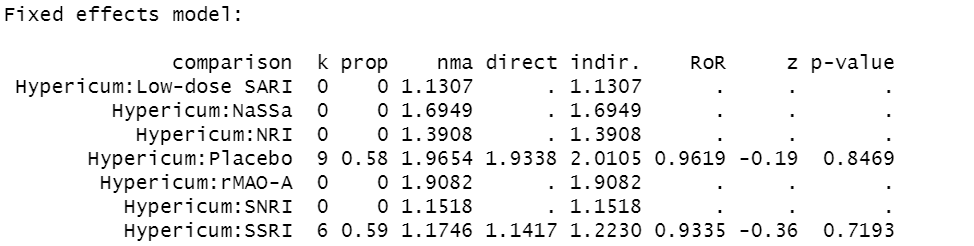
</figure>
- *comparison* - Treatment comparison; *k* - Number of studies providing direct evidence
- *prop* - Direct evidence proportion; *nma* - Estimated treatment effect (OR) in network meta-analysis
- *direct* - Estimated treatment effect (OR) derived from direct evidence
- *indir* - Estimated treatment effect (OR) derived from indirect evidence
- *RoR* - Ratio of Ratios (direct versus indirect)
- *z* - z-value of test for disagreement (direct versus indirect); $p$-value - p-value of test for disagreement (direct versus indirect)


---
#Network Meta Analysis
- Can also call the *forest* function to plot:  
```{r message=FALSE,warning=FALSE,results='hide',fig.show='hide'}
forest(Linde.net.split, pooled = 'fixed')
```
.pull-left[
<figure>
  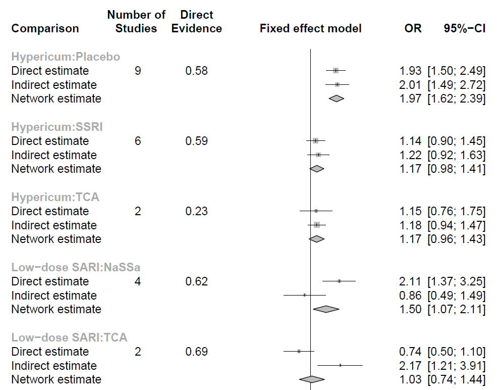
</figure>
]
.pull-right[
<figure>
  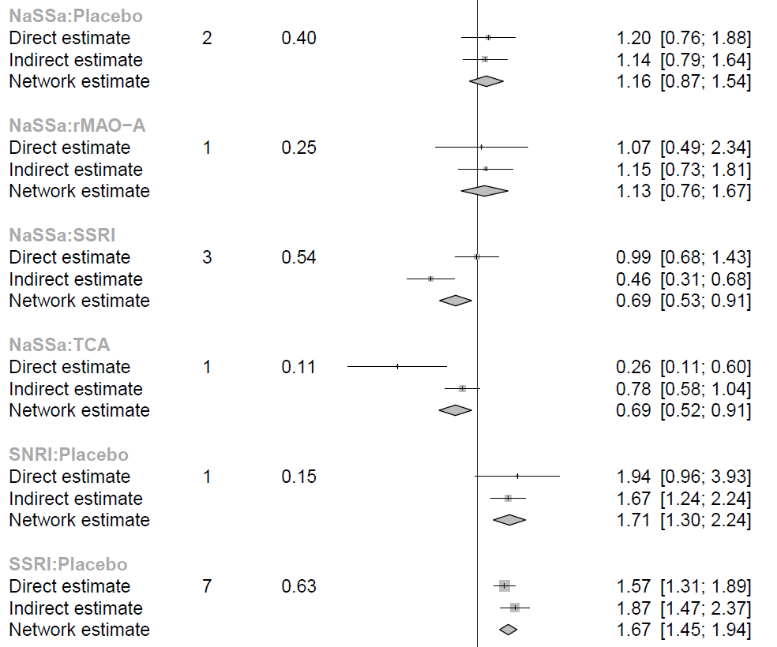
</figure>
]

---
#Network Meta Analysis
```{r message=FALSE,warning=FALSE,results='hide',fig.show='hide'}
forest(Linde.net.split, pooled = 'random')
```
.pull-left[
<figure>
  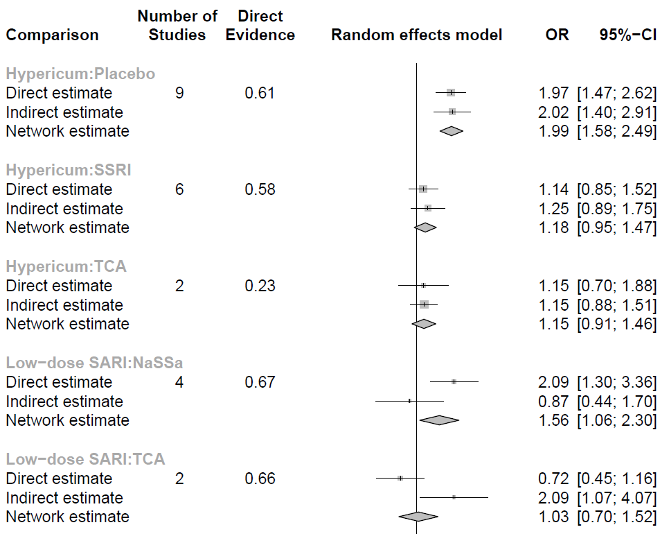
</figure>
]
.pull-right[
<figure>
  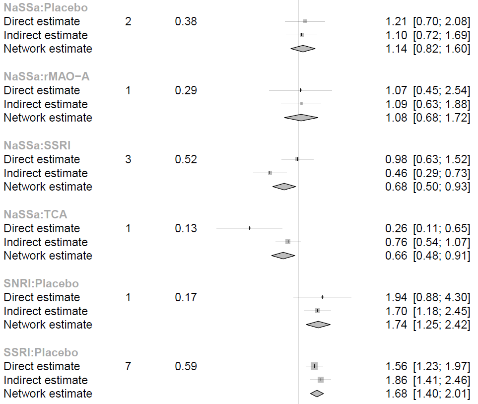
</figure>
]

---
#Network Meta Analysis
## treatment ranking
- *netrank*: rank treatments in frequentist network meta-analysis without resampling methods.
- return $P$-score: The $P$-score of treatment $i$ is defined as the mean of all $1 - P_j$ where $P_j$ denotes the one-sided $p$-value of accepting the alternative hypothesis that treatment $i$ is better than one of the competing treatments $j$, can be interpreted as the mean extent of certainty that treatment $i$ is better than another treatment. 
```{r message=FALSE,warning=FALSE,results='hide',fig.show='hide'}
Linde.rank=netrank(Linde.net, small.values = 'bad')
barplot(rbind(Linde.rank$Pscore.fixed,Linde.rank$Pscore.random), 
        beside = T, ylab = 'P-scores', ylim = c(0,1), las = 2)
```
.pull-left[
<figure>
  
</figure>
]
.pull-right[
<figure>
  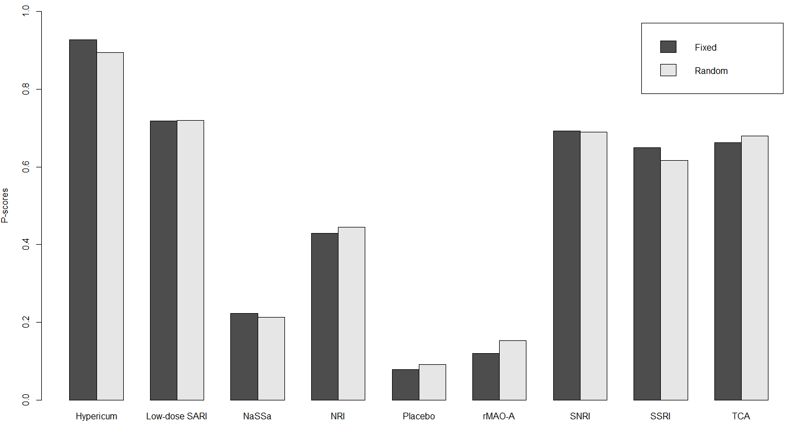
</figure>
]
---
class: center, middle 
# Q&A