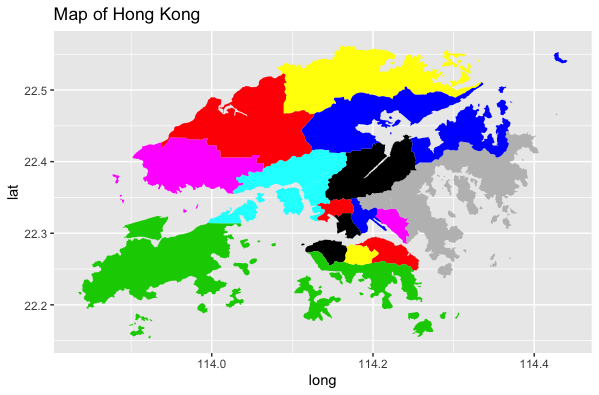
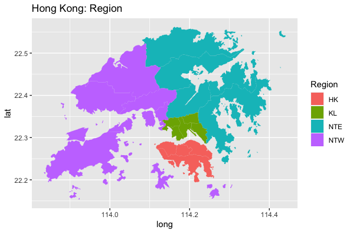
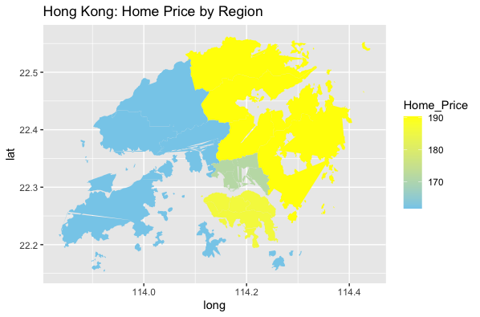
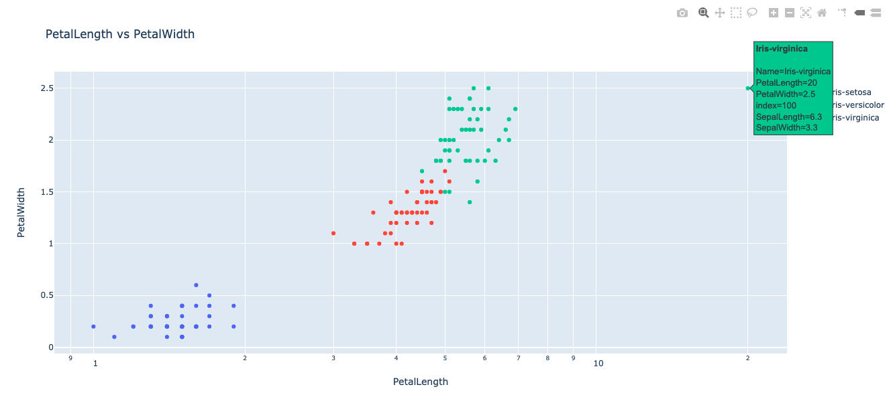
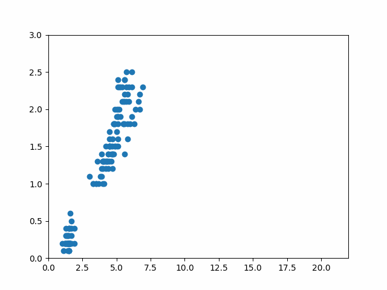
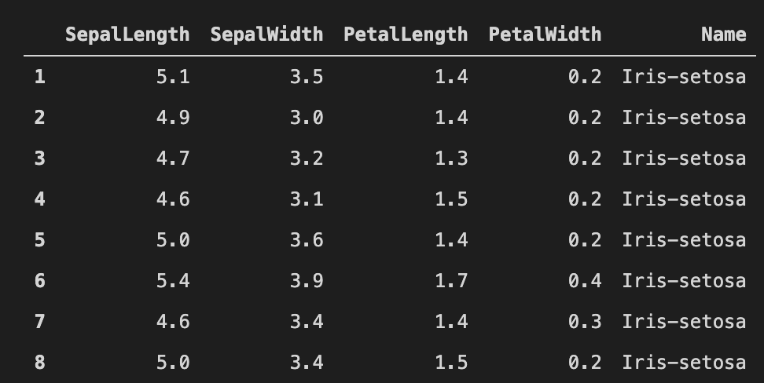

# STAT3622 Assignment 2
# Q1
## Preparation
```r
library(magick)
library(plotly)
library(dplyr)
library(sp)

HKHomeCCL = read.csv("HKHomeCCL.csv")
HK18Districts = read.csv("HK18Districts.csv")
hkmap = readRDS("HKG_adm1.rds")
```
## Q1a

```r
Symbol = names(HKHomeCCL)[-1]
fig <- plot_ly(HKHomeCCL, x = ~Date) %>% 
  add_trace(y = ~HK, name = 'HK',mode = 'lines', type = 'scatter') %>% 
  add_trace(y = ~KL, name = 'KL',mode = 'lines', type = 'scatter') %>% 
  add_trace(y = ~NTE, name = 'NTE',mode = 'lines', type = 'scatter') %>% 
  add_trace(y = ~NTW, name = 'NTW',mode = 'lines', type = 'scatter') %>%
  layout(title = "Home Price versus Date by regions")
fig
```

## Q1b

```r
hkmapdf = fortify(hkmap)
ggplot(hkmapdf, aes(long, lat, group=group)) +
  geom_polygon(fill=hkmapdf$id) +
  ggtitle("Map of Hong Kong")
```

## Q1c

```r
hkmapcode = data.frame(id=hkmap$ID_1, 
                       Code= gsub('HK.', '', as.character(hkmap$HASC_1)))
hkmapdf = merge(hkmapdf, hkmapcode, by="id")
hkmapdf = merge(hkmapdf, HK18Districts, by="Code")
ggplot(hkmapdf, aes(long, lat, group=group, fill=Region)) +
  geom_polygon() + 
  ggtitle("Hong Kong: Region")
```

## Q1d

```r
Mar22 = filter(HKHomeCCL, Date == "2020/03/22")
Mar22 = data.frame(t(Mar22[, -1]))
Mar22$Region = rownames(Mar22)
colnames(Mar22)[1] <- "Home_Price"

hkmapdf = merge(hkmapdf, Mar22, by="Region")
ggplot(hkmapdf, aes(long, lat, group=group, fill=Home_Price)) +
  geom_polygon() + 
  scale_fill_gradient(limits=range(hkmapdf$Home_Price),
                      low="skyblue", high="yellow") + 
  ggtitle("Hong Kong: Home Price by Region")
```

# Q2
## Preparation
```py
import pandas as pd
import numpy as np
import plotly.graph_objects as go
import plotly.express as px
import matplotlib.pyplot as plt
import matplotlib.animation as animation
from matplotlib.animation import FuncAnimation, ArtistAnimation
plt.rcParams["animation.html"] = "jshtml"

df = pd.read_csv('iris_bad.data', sep=',', index_col=0)
```
## Q2a


```py
fig = px.scatter(df, x="PetalLength", y="PetalWidth", color="Name",
                  hover_name="Name", hover_data=[df.index, 'SepalLength', 'SepalWidth'],
                  title="PetalLength vs PetalWidth", log_x=True)
fig.show()
```

## Q2b

```py
data = pd.read_csv('iris_bad.data', sep=',', index_col=0)
offsets_data = list(data.loc[ 100, ['PetalLength' , 'PetalWidth']])
data = data.drop(index=100)
fig, ax = plt.subplots()
x, y = list(data['PetalLength']),list(data['PetalWidth'])
sc = ax.scatter(x,y)
plt.xlim(0,22)
plt.ylim(0,3)

def animate(i):
    if i == 1:
        x.append(offsets_data[0])
        y.append(offsets_data[1])
    sc.set_offsets(np.c_[x,y])

ani = FuncAnimation(fig, animate, frames=2, interval=300, repeat=True)
ani.save("q2b.gif", writer='pillow')
```

## Q2c

```py
df = pd.read_csv('iris_bad.data', sep=',', index_col=0)
df = df.drop(index=100)
df.index = np.arange(1,len(df)+1)
df.head(8)
```