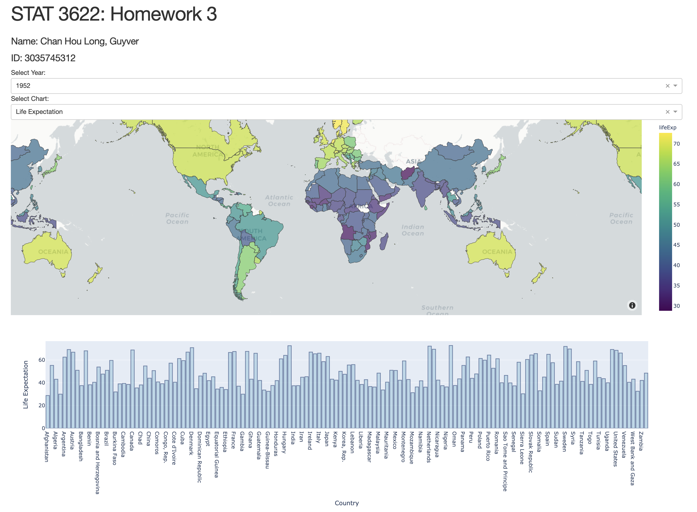
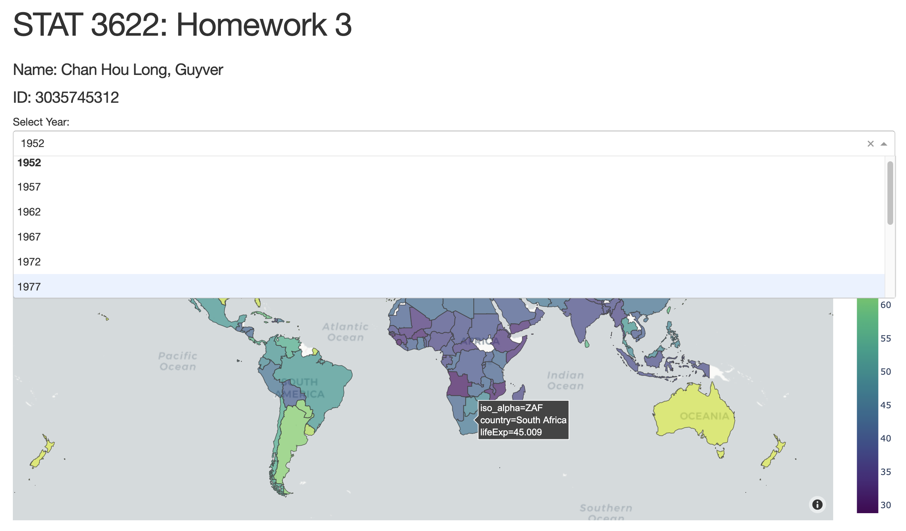
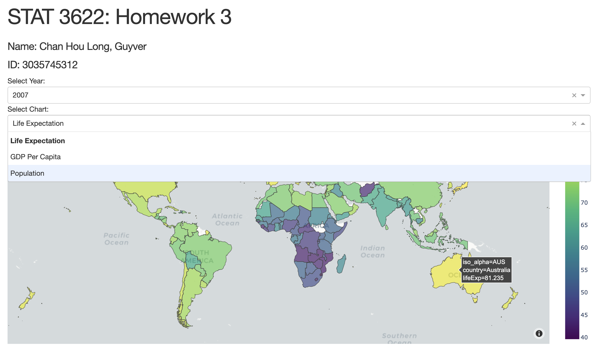
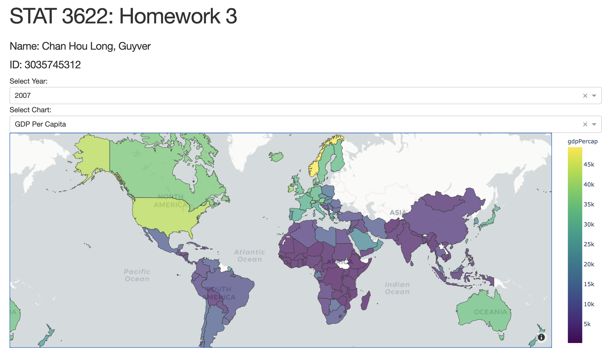
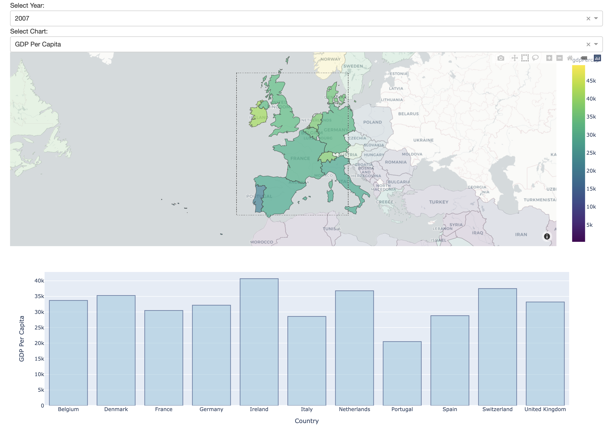

# STAT3622 Assignment 3

# Q1
## Q1a
```r
> head(DataList[[1]]) # 2011 table
  Rank Past_Rank         Company        Country    Value Past_Value Rate Past_rate
1    1         2          Google  United States $44,294M   $36,191M AAA+      AAA+
2    2         5       Microsoft  United States $42,805M   $33,604M AAA+      AAA+
3    3         1        Wal-Mart  United States $36,220M   $41,365M   AA        AA
4    4         4             IBM  United States $36,157M   $33,706M  AA+        AA
5    5         7        Vodafone United Kingdom $30,674M   $28,995M AAA+       AAA
6    6        12 Bank of America  United States $30,619M   $26,047M AAA-      AAA+

> head(DataList[[11]]) # 2021 table
  Rank Past_Rank       Company       Country     Value Past_Value Rate Past_rate
1    1         3         Apple United States $263,375M  $140,524M  AAA       AAA
2    2         1        Amazon United States $254,188M  $220,791M AAA+       AAA
3    3         2        Google United States $191,215M  $188,512M  AAA       AAA
4    4         4     Microsoft United States $140,435M  $117,072M  AAA       AAA
5    5         5 Samsung Group   South Korea $102,623M   $94,494M AAA-      AAA-
6    6         8       Walmart United States  $93,185M   $77,520M  AA+       AA+
```
```r
library(rvest)
library(xml2)
library(dplyr)
library(ggplot2)
library(plotly)
library(dygraphs)
library(xts)

thisurl = paste0(paste0("https://brandirectory.com/rankings/global/", 2011:2020, "/table",
                 collapse = ","), ",https://brandirectory.com/rankings/global/table")
thisurl = as.list(strsplit(thisurl, ",")[[1]])
DataList = as.list(1:11)
yearList = as.list(2011:2021)

dfDecade = NULL

for (j in 1:11){
  webpage <- read_html(thisurl[[j]])
  # Inspect the webpage
  xdata <- webpage %>% html_nodes("body tbody") %>% html_nodes("tr")
  DataX = NULL
  
  for (i in 1:100){
    tmp <- xdata[i] %>% html_nodes("td")
    rank <- tmp[1] %>% html_text()  %>% as.numeric()
    past_rank <- tmp[2] %>% html_text()  %>% as.numeric()
    company <- tmp[3] %>% html_text()
    company = trimws(gsub("\n", "", company))
    country <- tmp[4] %>% html_text() 
    country = trimws(gsub("\n", "", country))
    value <- tmp[5] %>% html_nodes("span") %>% html_text()
    past_value <- tmp[6] %>% html_nodes("span") %>% html_text()
    rate <- tmp[7] %>% html_text()  
    rate = trimws(gsub("\n", "", rate))
    past_rate <- tmp[8] %>% html_text()  
    past_rate = trimws(gsub("\n", "", past_rate))
    year = yearList[[j]]
    DataX = rbind(DataX, c(rank, past_rank,company, country, value, 
                           past_value, rate, past_rate))
    dfDecade = rbind(dfDecade, c(year, rank, past_rank,company, country, value, 
                              past_value, rate, past_rate))
  }
  
  colnames(DataX) = c("Rank", "Past_Rank", "Company", "Country", 
                      "Value", "Past_Value", "Rate", "Past_rate")
  DataList[[j]] = as.data.frame(DataX)
}

colnames(dfDecade) = c("Year", "Rank", "Past_Rank", "Company", "Country", 
                       "Value", "Past_Value", "Rate", "Past_rate")
dfDecade = as.data.frame(dfDecade)
```
## Q1b
The pie chart shows the proportions of the number of brands by country in 2021. The United States shares the most amount brands in the top 100, nearly half of the world. China is the second with 23% and third for Germany with 9%. 


```r
NoOfBrandIn2021 = summarize(group_by(DataList[[11]],Country=Country),
                   country.freq=n())

fig <- plot_ly(NoOfBrandIn2021, labels = ~Country, values = ~country.freq, type = 'pie')
fig <- fig %>% layout(title = 'Number of brands by country in 2021',
                      xaxis = list(showgrid = FALSE, zeroline = FALSE, showticklabels = FALSE),
                      yaxis = list(showgrid = FALSE, zeroline = FALSE, showticklabels = FALSE))

fig
```
## Q1c
In a decade, The United States dominates the number of brands from 2011 to 2021 with nearly half of the world in each year. China has risen in these 10 years from only 5% to 23%, replacing Japan become the second-largest country. Starting from 2018, Germany also substitutes Japan growing the third-largest country.


```r
NoOfBrandInDecade = summarize(group_by(dfDecade,Year = Year, Country=Country),
                              country.freq=n())

fig <- NoOfBrandInDecade %>%
        plot_ly(
          labels = ~Country,
          values = ~country.freq,
          frame = ~Year,
          type = 'pie'
        )
fig <- fig %>% layout(title = 'Number of brands by country from 2011 to 2021',
                      xaxis = list(showgrid = FALSE, zeroline = FALSE, showticklabels = FALSE),
                      yaxis = list(showgrid = FALSE, zeroline = FALSE, showticklabels = FALSE))

fig
```
## Q1d
Since the linear tends to negative in the graph, it can be seen that the ranking of most of the brands in 2021 compared with 2020 is relatively stable. Technology companies take the lead in these 2 years, growing the largest aspect in the top 100 with tremendous values such as Amazon, Apple and Google. Several companies improve a lot during a year like Ping An and Alibaba. However, Uber, LG Group and JD.com drop a couple ranking within a year.


```r
Year = 2021
DataList[[11]]$Rank = as.numeric(DataList[[11]]$Rank)
DataList[[11]]$Past_Rank = as.numeric(DataList[[11]]$Past_Rank)
xlim0=c(1, max(DataList[[11]]$Past_Rank))
ylim0=c(1,max(DataList[[11]]$Rank))
DataList[[11]] = transform(DataList[[11]], Value = as.vector(Value))
for (i in 1:100){
  DataList[[11]]$Value[i] = gsub("[^0-9///' ]","", DataList[[11]]$Value[i])
}
DataList[[11]] = transform(DataList[[11]], Value = as.numeric(Value))

sectorList = as.list(c("restaurants", "logistics","tyres", "car-rental-services",
               "auto-components", "telecoms", "telecoms-infrastructure",
               "gambling", "retail", "chemicals", "banking", "it-services",
               "oil-and-gas", "tech", "auto"))
thisurl = paste0("https://brandirectory.com/rankings/", sectorList, "/table", collapse = ",")
thisurl = as.list(strsplit(thisurl, ",")[[1]])
DataList[[11]]$Sector = rep("others", 100)

for (j in 1:length(sectorList)){
  webpage <- read_html(thisurl[[j]])
  xdata <- webpage %>% html_nodes("body tbody") %>% html_nodes("tr")
  DataX = NULL
  for (i in 1:length(xdata)){
    tmp <- xdata[i] %>% html_nodes("td")
    company <- tmp[3] %>% html_text()
    company = trimws(gsub("\n", "", company))
    
    if(company %in% as.vector(DataList[[11]]$Company)){
      DataList[[11]]$Sector[DataList[[11]]$Company == company] <- sectorList[[j]]
    }
  }
}

plot_ly(DataList[[11]], x = ~Past_Rank, y = ~Rank, type="scatter", mode = "markers",
        size = ~Value, color = ~Sector,
        hoverinfo = 'text',
        text = ~paste("", Company)) %>%
  layout(title= "Brand ranking in 2020 versus 2021",
         xaxis = list(range = xlim0, 
                      zeroline=FALSE,
                      title=paste(Year-1, "Ranking")),
         yaxis = list(range = ylim0, 
                      autorange="reversed", 
                      zeroline=FALSE, 
                      title=paste(Year, "Ranking"))
)
```
## Q1e
In these 10 years, these 4 big technology companies have at least triple the company's values. Amazon receives the largest increase from  $17780M to $254188M. Although there was a drop in 2016 for Apple, it boosts in 2020 and becomes the largest value among the 4 companies. Google and Microsoft increase their values steady, yet, the ratio of the raising of Microsoft is the slowest in these 4 companies.


```r
bigTechValue = filter(dfDecade, dfDecade$Company == "Apple" | dfDecade$Company == "Google" |
                        dfDecade$Company == "Amazon" | dfDecade$Company == "Microsoft" |
                        dfDecade$Company == "Amazon.com")
bigTechValue = transform(bigTechValue, Value = as.vector(Value))
for (i in 1:nrow(bigTechValue)){
  bigTechValue$Value[i] = gsub("[^0-9///' ]","", bigTechValue$Value[i])
}
bigTechValue = transform(bigTechValue, Value = as.numeric(Value))
bigTechValue$Company[bigTechValue$Company == "Amazon.com"] = "Amazon"

bigTechDF = select(bigTechValue, c("Year", "Company", "Value"))
appleDF = filter(bigTechDF, bigTechValue$Company == "Apple")
googleDF = filter(bigTechDF, bigTechValue$Company == "Google")
amazonDF = filter(bigTechDF, bigTechValue$Company == "Amazon")
microDF = filter(bigTechDF, bigTechValue$Company == "Microsoft")

names(appleDF)[3] = "Apple"
names(googleDF)[3] = "Google"
names(amazonDF)[3] = "Amazon"
names(microDF)[3] = "Microsoft"
appleDF$Company = NULL
googleDF$Company = NULL
amazonDF$Company = NULL
microDF$Company = NULL

bigTechDF = Reduce(function(x, y) merge(x, y, all=TRUE), list(appleDF, googleDF, amazonDF, microDF))
bigTechDF$Year = as.Date(ISOdate(bigTechDF$Year, 1, 1))

bigTechDF = xts(x = bigTechDF[, -1], order.by = bigTechDF$Year)
dygraph(bigTechDF, main = "Values from 2011 to 2021") %>%
  dyRangeSelector()
```

# Q2
### Figure 1: Illustration of the APP layout

### Figure 2: Illustration of the APP layout

### Figure 3: Illustration of the APP layout

### Figure 4: Illustration of the APP function 1

### Figure 5: Illustration of the APP function 2


# Appendix
```py
import dash
import dash_core_components as dcc
import dash_html_components as html
import plotly.express as px
import pandas as pd
import dash.dependencies as dependencies
import os
import json

external_stylesheets = ['https://codepen.io/chriddyp/pen/bWLwgP.css']

with open('./custom.geo.json', 'r') as f:
    data = json.load(f)

app = dash.Dash(__name__, external_stylesheets=external_stylesheets)
df = px.data.gapminder()

app.layout = html.Div(children=[
    html.H1(children='STAT 3622: Homework 3'),
    html.H5(children='Name: Chan Hou Long, Guyver'),
    html.H5(children='ID: 3035745312'),
    html.Div(children=[
        html.Label('Select Year:'), dcc.Dropdown(
            id='select-year',
            options=[
                {'label': var, 'value': int(var)} for var in df['year'].drop_duplicates().values
            ], value=1952),
        html.Label('Select Chart:'), dcc.Dropdown(
            id='select-chart',
            options=[
                {'label': 'Life Expectation', 'value': 'lifeExp'}, 
                {'label': 'GDP Per Capita', 'value': 'gdpPercap'}, 
                {'label': 'Population', 'value': 'pop'}
            ], value='lifeExp'),
    ]),
    dcc.Graph(
        id='choropleth-mapbox-graph'),
    dcc.Graph(
        id='bar-chart'),
],style={'width': '75%',
         'margin': 50})

@app.callback(
    dependencies.Output(component_id='choropleth-mapbox-graph',component_property='figure'),
    dependencies.Input(component_id='select-year', component_property='value'),
    dependencies.Input(component_id='select-chart', component_property='value')
)
def update_fig(year, chart):
    filtered_df = df[df['year']==year]
    fig = px.choropleth_mapbox(filtered_df, geojson=data, featureidkey="properties.iso_a3", 
                               locations='iso_alpha', color=chart,
                               mapbox_style="carto-positron",
                               zoom=1,
                               opacity=0.7,
                               color_continuous_scale="Viridis",
                               hover_data=['country'])
    fig.update_layout(margin={"r":0,"t":0,"l":0,"b":0})
    return fig

@app.callback(
    dependencies.Output(component_id='bar-chart',component_property='figure'),
    dependencies.Input(component_id='choropleth-mapbox-graph', component_property='selectedData'),
    dependencies.Input(component_id='select-year', component_property='value'),
    dependencies.Input(component_id='select-chart', component_property='value')
)
def update_bar(selectedData, year, chart):
    if not selectedData:
        filtered_df = df
    else:
        country = list(map(lambda x: x['location'], selectedData['points']))
        filtered_df = df[df['iso_alpha'].isin(country)]
    filtered_df = filtered_df[filtered_df['year'] == year]
    fig = px.bar(filtered_df, x='country', y=chart,
                labels={'pop':'population',
                        'lifeExp': 'Life Expectation',
                        'gdpPercap': 'GDP Per Capita',
                        'country': 'Country'})
    fig.update_traces(marker_color='rgb(158,202,225)', marker_line_color='rgb(8,48,107)',
                  marker_line_width=1.5, opacity=0.6)
    return fig

if __name__ == '__main__':
    app.run_server(debug=True,port=int(os.getenv('PORT', '4544')))
```

