# STAT3622 Quiz 1

# a
## colon
The log rank test for difference in survival gives a p-value of p = 0.008, indicating that group 0 and 1 differ significantly in survival.
```r
fit = survfit(Surv(PFT, status_PF) ~ group, data = colon)
ggsurvplot(fit, data = colon, pval = TRUE, risk.table = TRUE,
           conf.int = T, surv.median.line = "hv",
           xlab= "Days", ylab = "Survival probability",
           legend.labs =c("0", "1"), risk.table.height = 0.3,
           ggtheme = theme_bw())
survdiff(Surv(PFT, status_PF) ~ group, data = colon, rho=0)
```
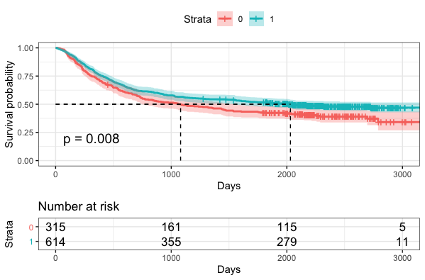
```r
Call:
survdiff(formula = Surv(PFT, status_PF) ~ group, data = colon, 
    rho = 0)

          N Observed Expected (O-E)^2/E (O-E)^2/V
group=0 315      190      162      4.77      7.03
group=1 614      316      344      2.25      7.03

 Chisq= 7  on 1 degrees of freedom, p= 0.008 
```

## gastadv
The log rank test for difference in survival gives a p-value of p = 0.05, indicating that group 0 and 1 differ insignificantly in survival.
```r
fit = survfit(Surv(PFT, status_PF) ~ group, data = gastadv)
ggsurvplot(fit, data = gastadv, pval = TRUE, risk.table = TRUE,
           conf.int = T, surv.median.line = "hv",
           xlab= "Days", ylab = "Survival probability",
           legend.labs =c("0", "1"), risk.table.height = 0.3,
           ggtheme = theme_bw())
survdiff(Surv(PFT, status_PF) ~ group, data = gastadv, rho=0)
```
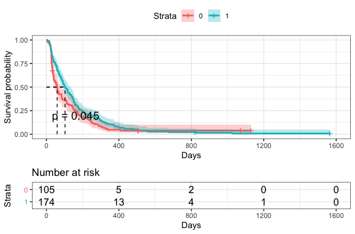
```r
Call:
survdiff(formula = Surv(PFT, status_PF) ~ group, data = df2, 
    rho = 0)

          N Observed Expected (O-E)^2/E (O-E)^2/V
group=0 105      100     84.8      2.72      4.01
group=1 174      172    187.2      1.23      4.01

 Chisq= 4  on 1 degrees of freedom, p= 0.05
```

## ovarian
The log rank test for difference in survival gives a p-value of p = 0.001, indicating that group 0 and 1 differ significantly in survival.
```r
fit = survfit(Surv(PFT, status_PF) ~ group, data = ovarian)
ggsurvplot(fit, data = ovarian, pval = TRUE, risk.table = TRUE,
           conf.int = T, surv.median.line = "hv",
           xlab= "Days", ylab = "Survival probability",
           legend.labs =c("0", "1"), risk.table.height = 0.3,
           ggtheme = theme_bw())
survdiff(Surv(PFT, status_PF) ~ group, data = ovarian, rho=0)
```
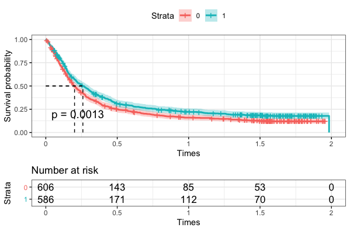
```r
Call:
survdiff(formula = Surv(PFT, status_PF) ~ group, data = df3, 
    rho = 0)

          N Observed Expected (O-E)^2/E (O-E)^2/V
group=0 606      513      463      5.45      10.4
group=1 586      464      514      4.90      10.4

 Chisq= 10.4  on 1 degrees of freedom, p= 0.001 
```

# b
## colon
The log rank test for difference in survival gives a p-value of p = 0.05, indicating that group 0 and 1 differ insignificantly in survival.
```r
fit_b = survfit(Surv(OT, status_O) ~ group, data = colon)
ggsurvplot(fit_b, data = colon, pval = TRUE, risk.table = TRUE,
           conf.int = T, surv.median.line = "hv",
           xlab= "Days", ylab = "Survival probability",
           legend.labs =c("0", "1"), risk.table.height = 0.3,
           ggtheme = theme_bw())
survdiff(Surv(OT, status_O) ~ group, data = colon, rho=0)
```
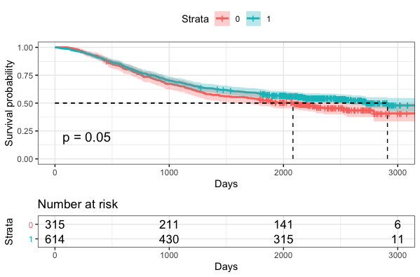
```r
Call:
survdiff(formula = Surv(OT, status_O) ~ group, data = colon, 
    rho = 0)

          N Observed Expected (O-E)^2/E (O-E)^2/V
group=0 315      168      148      2.58      3.85
group=1 614      284      304      1.26      3.85

 Chisq= 3.8  on 1 degrees of freedom, p= 0.05 
```

## gastadv
The log rank test for difference in survival gives a p-value of p = 0.09, indicating that group 0 and 1 differ insignificantly in survival.
```r
fit_b = survfit(Surv(OT, status_O) ~ group, data = gastadv)
ggsurvplot(fit_b, data = gastadv, pval = TRUE, risk.table = TRUE,
           conf.int = T, surv.median.line = "hv",
           xlab= "Days", ylab = "Survival probability",
           legend.labs =c("0", "1"), risk.table.height = 0.3,
           ggtheme = theme_bw())
survdiff(Surv(OT, status_O) ~ group, data = gastadv, rho=0)
```
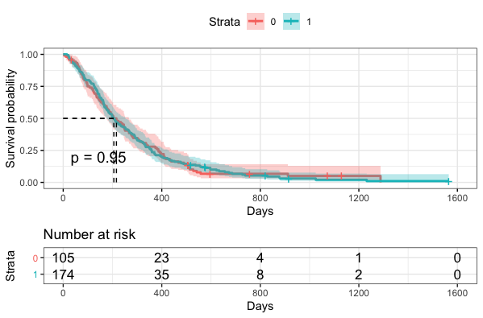
```r
Call:
survdiff(formula = Surv(OT, status_O) ~ group, data = df2, rho = 0)

          N Observed Expected (O-E)^2/E (O-E)^2/V
group=0 105       98     98.5   0.00294   0.00471
group=1 174      168    167.5   0.00173   0.00471

 Chisq= 0  on 1 degrees of freedom, p= 0.9 
```

## ovarian
The log rank test for difference in survival gives a p-value of p = 0.01, indicating that group 0 and 1 differ significantly in survival.
```r
fit_b = survfit(Surv(OT, status_O) ~ group, data = ovarian)
ggsurvplot(fit_b, data = ovarian, pval = TRUE, risk.table = TRUE,
           conf.int = T, surv.median.line = "hv",
           xlab= "Days", ylab = "Survival probability",
           legend.labs =c("0", "1"), risk.table.height = 0.3,
           ggtheme = theme_bw())
survdiff(Surv(OT, status_O) ~ group, data = ovarian, rho=0)
```
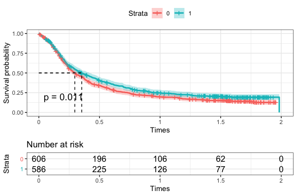
```r
Call:
survdiff(formula = Surv(OT, status_O) ~ group, data = df3, rho = 0)

          N Observed Expected (O-E)^2/E (O-E)^2/V
group=0 606      499      460      3.30      6.41
group=1 586      452      491      3.09      6.41

 Chisq= 6.4  on 1 degrees of freedom, p= 0.01 
```

# c
## colon
```r
      P_interval       RMST_P
 [1,]    20.0000  -0.03908795
 [2,]   171.0476   1.47562715
 [3,]   322.0952   8.56167259
 [4,]   473.1429  16.24994892
 [5,]   624.1905  23.77700531
 [6,]   775.2381  31.31198238
 [7,]   926.2857  42.14222188
 [8,]  1077.3333  51.77566096
 [9,]  1228.3810  62.38396672
[10,]  1379.4286  73.55822162
[11,]  1530.4762  87.20433358
[12,]  1681.5238 101.48193346
[13,]  1832.5714 114.78930119
[14,]  1983.6190 127.72627939
[15,]  2134.6667 139.98623019
[16,]  2285.7143 152.48508181
[17,]  2436.7619 166.51122411
[18,]  2587.8095 179.95914123
[19,]  2738.8571 193.97896375
[20,]  2889.9048 211.79629179
[21,]  3040.9524 231.17133372
[22,]  3192.0000 250.54637564
```
```r
RMST_P = c()
PFT_max_min = summarize(group_by(colon, group=group), 
                        PFT.max=max(PFT),
                        PFT.min=min(PFT))

maxmin_P = min(PFT_max_min$PFT.max, na.rm=TRUE)
minmax_P = max(PFT_max_min$PFT.min, na.rm=TRUE)
P_interval = seq(minmax_P, maxmin_P, length.out=22)
for (i in P_interval) {
  RMST_P = c(RMST_P, rmst2(colon$PFT, colon$status_PF, colon$group, tau = i)$unadjusted.result[1])
}
RMST_SCATTERED_P = cbind(P_interval, RMST_P)
```

## gastadv
```r
      P_interval      RMST_P
 [1,]    5.00000  0.00952381
 [2,]   58.57143  5.41205858
 [3,]  112.14286 14.98370229
 [4,]  165.71429 20.42508629
 [5,]  219.28571 23.60896485
 [6,]  272.85714 26.95378640
 [7,]  326.42857 30.40039141
 [8,]  380.00000 33.28160920
 [9,]  433.57143 34.78434771
[10,]  487.14286 35.74064944
[11,]  540.71429 36.02535840
[12,]  594.28571 35.67049429
[13,]  647.85714 35.13993231
[14,]  701.42857 34.44598773
[15,]  755.00000 33.60754398
[16,]  808.57143 32.76910023
[17,]  862.14286 31.66902539
[18,]  915.71429 30.42007261
[19,]  969.28571 29.17111982
[20,] 1022.85714 27.92216704
[21,] 1076.42857 26.27912559
[22,] 1130.00000 24.61966377
```
```r
RMST_P = c()
PFT_max_min = summarize(group_by(gastadv, group=group), 
                        PFT.max=max(PFT),
                        PFT.min=min(PFT))

maxmin_P = min(PFT_max_min$PFT.max, na.rm=TRUE)
minmax_P = max(PFT_max_min$PFT.min, na.rm=TRUE)
P_interval = seq(minmax_P, maxmin_P, length.out=22)
for (i in P_interval) {
  RMST_P = c(RMST_P, rmst2(gastadv$PFT, gastadv$status_PF, gastadv$group, tau = i)$unadjusted.result[1])
}
RMST_SCATTERED_P = cbind(P_interval, RMST_P)
```

## ovarian
```r
       P_interval       RMST_P
 [1,] 0.003174603 1.047724e-05
 [2,] 0.096145125 2.120841e-03
 [3,] 0.189115646 7.744034e-03
 [4,] 0.282086168 1.493369e-02
 [5,] 0.375056689 2.245122e-02
 [6,] 0.468027211 3.001411e-02
 [7,] 0.560997732 3.574922e-02
 [8,] 0.653968254 4.131424e-02
 [9,] 0.746938776 4.706777e-02
[10,] 0.839909297 5.294919e-02
[11,] 0.932879819 5.887837e-02
[12,] 1.025850340 6.462777e-02
[13,] 1.118820862 7.020793e-02
[14,] 1.211791383 7.522464e-02
[15,] 1.304761905 8.016617e-02
[16,] 1.397732426 8.529233e-02
[17,] 1.490702948 9.065728e-02
[18,] 1.583673469 9.610224e-02
[19,] 1.676643991 1.015693e-01
[20,] 1.769614512 1.070260e-01
[21,] 1.862585034 1.124828e-01
[22,] 1.955555556 1.179395e-01
```
```r
RMST_P = c()
PFT_max_min = summarize(group_by(ovarian, group=group), 
                        PFT.max=max(PFT),
                        PFT.min=min(PFT))

maxmin_P = min(PFT_max_min$PFT.max, na.rm=TRUE)
minmax_P = max(PFT_max_min$PFT.min, na.rm=TRUE)
P_interval = seq(minmax_P, maxmin_P, length.out=22)
for (i in P_interval) {
  RMST_P = c(RMST_P, rmst2(ovarian$PFT, ovarian$status_PF, ovarian$group, tau = i)$unadjusted.result[1])
}
RMST_SCATTERED_P = cbind(P_interval, RMST_P)
```

# d
## colon
```r
      O_interval      RMST_O
 [1,]   113.0000  -0.8110749
 [2,]   260.6667  -2.4886829
 [3,]   408.3333  -2.9758346
 [4,]   556.0000  -0.9891148
 [5,]   703.6667   1.5629042
 [6,]   851.3333   4.7209279
 [7,]   999.0000   9.1101255
 [8,]  1146.6667  13.4744126
 [9,]  1294.3333  19.1706963
[10,]  1442.0000  26.9432655
[11,]  1589.6667  34.9229338
[12,]  1737.3333  42.1495462
[13,]  1885.0000  50.1002412
[14,]  2032.6667  59.0602208
[15,]  2180.3333  68.2857336
[16,]  2328.0000  78.9164707
[17,]  2475.6667  91.8122951
[18,]  2623.3333 104.8919170
[19,]  2771.0000 116.7472892
[20,]  2918.6667 129.8393738
[21,]  3066.3333 140.5195136
[22,]  3214.0000 151.1996534
```
```r
RMST_O = c()
OT_max_min = summarize(group_by(colon, group=group), 
                       OT.max=max(OT),
                       OT.min=min(OT))

maxmin_O = min(OT_max_min$OT.max, na.rm=TRUE)
minmax_O = max(OT_max_min$OT.min, na.rm=TRUE)
O_interval = seq(minmax_O, maxmin_O, length.out=22)
for (i in O_interval) {
  RMST_O = c(RMST_O, rmst2(colon$OT, colon$status_O, colon$group, tau = i)$unadjusted.result[1])
}
RMST_SCATTERED_O = cbind(O_interval, RMST_O)
```

## gastadv
```r
      O_interval     RMST_O
 [1,]   15.00000  0.1333333
 [2,]   75.61905 -0.4094289
 [3,]  136.23810  1.6314517
 [4,]  196.85714  2.1474600
 [5,]  257.47619  1.5045057
 [6,]  318.09524  1.8426379
 [7,]  378.71429  0.4322693
 [8,]  439.33333 -0.4921401
 [9,]  499.95238 -0.4759481
[10,]  560.57143  1.8368255
[11,]  621.19048  4.4234585
[12,]  681.80952  5.4620111
[13,]  742.42857  5.3340527
[14,]  803.04762  4.4937747
[15,]  863.66667  3.3810455
[16,]  924.28571  1.5926607
[17,]  984.90476  0.3836299
[18,] 1045.52381 -1.0344376
[19,] 1106.14286 -2.8608788
[20,] 1166.76190 -4.6873199
[21,] 1227.38095 -6.5137611
[22,] 1288.00000 -8.9105672
```
```r
RMST_O = c()
OT_max_min = summarize(group_by(gastadv, group=group), 
                       OT.max=max(OT),
                       OT.min=min(OT))

maxmin_O = min(OT_max_min$OT.max, na.rm=TRUE)
minmax_O = max(OT_max_min$OT.min, na.rm=TRUE)
O_interval = seq(minmax_O, maxmin_O, length.out=22)
for (i in O_interval) {
  RMST_O = c(RMST_O, rmst2(gastadv$OT, gastadv$status_O, gastadv$group, tau = i)$unadjusted.result[1])
}
RMST_SCATTERED_O = cbind(O_interval, RMST_O)
```

## ovarian
```r
       O_interval       RMST_O
 [1,] 0.003174603 9.822411e-06
 [2,] 0.096145125 1.743802e-04
 [3,] 0.189115646 2.086898e-03
 [4,] 0.282086168 5.292132e-03
 [5,] 0.375056689 9.843471e-03
 [6,] 0.468027211 1.682546e-02
 [7,] 0.560997732 2.309456e-02
 [8,] 0.653968254 2.964623e-02
 [9,] 0.746938776 3.584233e-02
[10,] 0.839909297 4.132773e-02
[11,] 0.932879819 4.613987e-02
[12,] 1.025850340 5.066377e-02
[13,] 1.118820862 5.506878e-02
[14,] 1.211791383 5.944838e-02
[15,] 1.304761905 6.412563e-02
[16,] 1.397732426 6.864777e-02
[17,] 1.490702948 7.358461e-02
[18,] 1.583673469 7.834869e-02
[19,] 1.676643991 8.310914e-02
[20,] 1.769614512 8.803386e-02
[21,] 1.862585034 9.418190e-02
[22,] 1.955555556 1.003753e-01
```
```r
RMST_O = c()
OT_max_min = summarize(group_by(ovarian, group=group), 
                       OT.max=max(OT),
                       OT.min=min(OT))

maxmin_O = min(OT_max_min$OT.max, na.rm=TRUE)
minmax_O = max(OT_max_min$OT.min, na.rm=TRUE)
O_interval = seq(minmax_O, maxmin_O, length.out=22)
for (i in O_interval) {
  RMST_O = c(RMST_O, rmst2(ovarian$OT, ovarian$status_O, ovarian$group, tau = i)$unadjusted.result[1])
}
RMST_SCATTERED_O = cbind(O_interval, RMST_O)
```

# e
## colon
```r
RMST_SCATTERED_P = data.frame(RMST_SCATTERED_P)
RMST_SCATTERED_O = data.frame(RMST_SCATTERED_O)

ggplot(RMST_SCATTERED_P, aes(x = P_interval, y = RMST_P)) +
  geom_point() +
  xlab("Days") + 
  theme_bw() + 
  ggtitle("Scatter plot of RMST_P vs Days")

ggplot(RMST_SCATTERED_O, aes(x = O_interval, y = RMST_O)) +
  geom_point() +
  xlab("Days") + 
  theme_bw() + 
  ggtitle("Scatter plot of RMST_O vs Days")
```
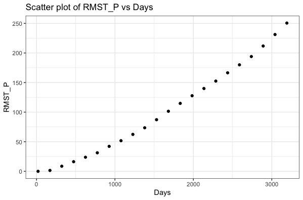
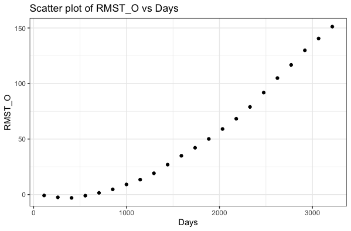

## gastadv
```r
RMST_SCATTERED_P = data.frame(RMST_SCATTERED_P)
RMST_SCATTERED_O = data.frame(RMST_SCATTERED_O)

ggplot(RMST_SCATTERED_P, aes(x = P_interval, y = RMST_P)) +
  geom_point() +
  xlab("Days") + 
  theme_bw() + 
  ggtitle("Scatter plot of RMST_P vs Days")

ggplot(RMST_SCATTERED_O, aes(x = O_interval, y = RMST_O)) +
  geom_point() +
  xlab("Days") + 
  theme_bw() + 
  ggtitle("Scatter plot of RMST_P vs Days")
```
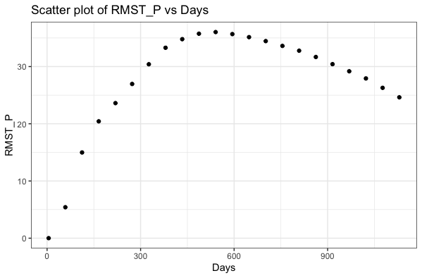
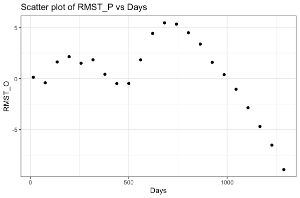

## ovarian
```r
RMST_SCATTERED_P = data.frame(RMST_SCATTERED_P)
RMST_SCATTERED_O = data.frame(RMST_SCATTERED_O)

ggplot(RMST_SCATTERED_P, aes(x = P_interval, y = RMST_P)) +
  geom_point() +
  xlab("Times") + 
  theme_bw() + 
  ggtitle("Scatter plot of RMST_P vs Times")

ggplot(RMST_SCATTERED_O, aes(x = O_interval, y = RMST_O)) +
  geom_point() +
  xlab("Times") + 
  theme_bw() + 
  ggtitle("Scatter plot of RMST_P vs Times")
```
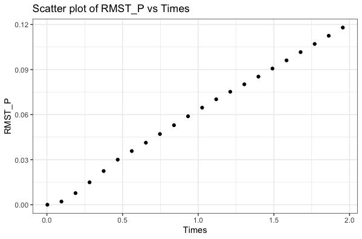
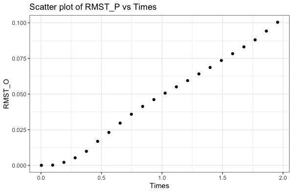

# f
## colon
Since the value of coefficient is 0.99, there is a very strong correlation between RMST_P and RMST_O. With a small p-value less than 0.01, it is significant and strong evidence against the null hypothesis H0. Thus we reject the null hypothesis H0.
```r
	Spearman's rank correlation rho

data:  RMST_SCATTERED$RMST_P and RMST_SCATTERED$RMST_O
S = 14, p-value = 2.719e-06
alternative hypothesis: true rho is not equal to 0
sample estimates:
      rho 
0.9920949 
```
To test the null hypothesis, the p-value is less than 0.01. Hence we reject the null hypothesis at 0.05 significance level.
```r
	Kendall's rank correlation tau

data:  RMST_SCATTERED$RMST_P and RMST_SCATTERED$RMST_O
T = 227, p-value < 2.2e-16
alternative hypothesis: true tau is not equal to 0
sample estimates:
     tau 
0.965368 
```
```r
cor.test(x=RMST_SCATTERED_P$RMST_P, y=RMST_SCATTERED_O$RMST_O, method = 'spearman')
cor.test(x=RMST_SCATTERED_P$RMST_P, y=RMST_SCATTERED_O$RMST_O, method = 'kendall')
```

## gastadv
Since the value of coefficient is 0.46, there is a moderate correlation between RMST_P and RMST_O. With the p-value 0.03, it is insignificant and weak evidence against the null hypothesis H0. Thus we accept the null hypothesis H0.
```r
	Spearman's rank correlation rho

data:  RMST_SCATTERED$RMST_P and RMST_SCATTERED$RMST_O
S = 952, p-value = 0.03156
alternative hypothesis: true rho is not equal to 0
sample estimates:
      rho 
0.4624506
```
To test the null hypothesis, the p-value is 0.02. Hence we reject the null hypothesis at 0.05 significance level.
```r
	Kendall's rank correlation tau

data:  RMST_SCATTERED$RMST_P and RMST_SCATTERED$RMST_O
T = 157, p-value = 0.01945
alternative hypothesis: true tau is not equal to 0
sample estimates:
      tau 
0.3593074
```
```r
cor.test(x=RMST_SCATTERED_P$RMST_P, y=RMST_SCATTERED_O$RMST_O, method = 'spearman')
cor.test(x=RMST_SCATTERED_P$RMST_P, y=RMST_SCATTERED_O$RMST_O, method = 'kendall')
```

## ovarian
Since the value of coefficient is 1, there is a very strong correlation between RMST_P and RMST_O. With a small p-value less than 0.01, it is significant and very strong evidence against the null hypothesis H0. Thus we reject the null hypothesis H0.
```r
	Spearman's rank correlation rho

data:  RMST_SCATTERED$RMST_P and RMST_SCATTERED$RMST_O
S = 3.9324e-13, p-value = 2.438e-06
alternative hypothesis: true rho is not equal to 0
sample estimates:
rho 
  1 
```
To test the null hypothesis, the p-value is less than 0.01. Hence we reject the null hypothesis at 0.05 significance level.
```r
	Kendall's rank correlation tau

data:  RMST_SCATTERED$RMST_P and RMST_SCATTERED$RMST_O
T = 231, p-value < 2.2e-16
alternative hypothesis: true tau is not equal to 0
sample estimates:
tau 
  1 
```
```r
cor.test(x=RMST_SCATTERED_P$RMST_P, y=RMST_SCATTERED_O$RMST_O, method = 'spearman')
cor.test(x=RMST_SCATTERED_P$RMST_P, y=RMST_SCATTERED_O$RMST_O, method = 'kendall')
```

# Appendix
```r
library(dplyr)
library(ggplot2)
library(survival)
library(survminer)
library(survRM2)

colon = read.delim('/Users/guyverchan/Documents/HKU/STAT3622/quiz1/colon.txt', header = TRUE, sep = ",")

# a
fit = survfit(Surv(PFT, status_PF) ~ group, data = colon)
ggsurvplot(fit, data = colon, pval = TRUE, risk.table = TRUE,
           conf.int = T, surv.median.line = "hv",
           xlab= "Days", ylab = "Survival probability",
           legend.labs =c("0", "1"), risk.table.height = 0.3,
           ggtheme = theme_bw())
survdiff(Surv(PFT, status_PF) ~ group, data = colon, rho=0)

# b
fit_b = survfit(Surv(OT, status_O) ~ group, data = colon)
ggsurvplot(fit_b, data = colon, pval = TRUE, risk.table = TRUE,
           conf.int = T, surv.median.line = "hv",
           xlab= "Days", ylab = "Survival probability",
           legend.labs =c("0", "1"), risk.table.height = 0.3,
           ggtheme = theme_bw())
survdiff(Surv(OT, status_O) ~ group, data = colon, rho=0)

# c
RMST_P = c()
PFT_max_min = summarize(group_by(colon, group=group), 
                        PFT.max=max(PFT),
                        PFT.min=min(PFT))

maxmin_P = min(PFT_max_min$PFT.max, na.rm=TRUE)
minmax_P = max(PFT_max_min$PFT.min, na.rm=TRUE)
P_interval = seq(minmax_P, maxmin_P, length.out=22)
for (i in P_interval) {
  RMST_P = c(RMST_P, rmst2(colon$PFT, colon$status_PF, colon$group, tau = i)$unadjusted.result[1])
}
RMST_SCATTERED_P = cbind(P_interval, RMST_P)

# d
RMST_O = c()
OT_max_min = summarize(group_by(colon, group=group), 
                       OT.max=max(OT),
                       OT.min=min(OT))

maxmin_O = min(OT_max_min$OT.max, na.rm=TRUE)
minmax_O = max(OT_max_min$OT.min, na.rm=TRUE)
O_interval = seq(minmax_O, maxmin_O, length.out=22)
for (i in O_interval) {
  RMST_O = c(RMST_O, rmst2(colon$OT, colon$status_O, colon$group, tau = i)$unadjusted.result[1])
}
RMST_SCATTERED_O = cbind(O_interval, RMST_O)

# e
RMST_SCATTERED_P = data.frame(RMST_SCATTERED_P)
RMST_SCATTERED_O = data.frame(RMST_SCATTERED_O)

ggplot(RMST_SCATTERED_P, aes(x = P_interval, y = RMST_P)) +
  geom_point() +
  xlab("Days") + 
  theme_bw() + 
  ggtitle("Scatter plot of RMST_P vs Days")

ggplot(RMST_SCATTERED_O, aes(x = O_interval, y = RMST_O)) +
  geom_point() +
  xlab("Days") + 
  theme_bw() + 
  ggtitle("Scatter plot of RMST_P vs Days")

# f
cor.test(x=RMST_SCATTERED_P$RMST_P, y=RMST_SCATTERED_O$RMST_O, method = 'spearman')
cor.test(x=RMST_SCATTERED_P$RMST_P, y=RMST_SCATTERED_O$RMST_O, method = 'kendall')


# ---------------------
gastadv = read.delim('/Users/guyverchan/Documents/HKU/STAT3622/quiz1/gastadv.txt', header = TRUE, sep = ",")

fit = survfit(Surv(PFT, status_PF) ~ group, data = gastadv)
ggsurvplot(fit, data = gastadv, pval = TRUE, risk.table = TRUE,
           conf.int = T, surv.median.line = "hv",
           xlab= "Days", ylab = "Survival probability",
           legend.labs =c("0", "1"), risk.table.height = 0.3,
           ggtheme = theme_bw())
survdiff(Surv(PFT, status_PF) ~ group, data = gastadv, rho=0)

fit_b = survfit(Surv(OT, status_O) ~ group, data = gastadv)
ggsurvplot(fit_b, data = gastadv, pval = TRUE, risk.table = TRUE,
           conf.int = T, surv.median.line = "hv",
           xlab= "Days", ylab = "Survival probability",
           legend.labs =c("0", "1"), risk.table.height = 0.3,
           ggtheme = theme_bw())
survdiff(Surv(OT, status_O) ~ group, data = gastadv, rho=0)

RMST_P = c()
PFT_max_min = summarize(group_by(gastadv, group=group), 
                        PFT.max=max(PFT),
                        PFT.min=min(PFT))

maxmin_P = min(PFT_max_min$PFT.max, na.rm=TRUE)
minmax_P = max(PFT_max_min$PFT.min, na.rm=TRUE)
P_interval = seq(minmax_P, maxmin_P, length.out=22)
for (i in P_interval) {
  RMST_P = c(RMST_P, rmst2(gastadv$PFT, gastadv$status_PF, gastadv$group, tau = i)$unadjusted.result[1])
}
RMST_SCATTERED_P = cbind(P_interval, RMST_P)


RMST_O = c()
OT_max_min = summarize(group_by(gastadv, group=group), 
                       OT.max=max(OT),
                       OT.min=min(OT))

maxmin_O = min(OT_max_min$OT.max, na.rm=TRUE)
minmax_O = max(OT_max_min$OT.min, na.rm=TRUE)
O_interval = seq(minmax_O, maxmin_O, length.out=22)
for (i in O_interval) {
  RMST_O = c(RMST_O, rmst2(gastadv$OT, gastadv$status_O, gastadv$group, tau = i)$unadjusted.result[1])
}
RMST_SCATTERED_O = cbind(O_interval, RMST_O)

# e
RMST_SCATTERED_P = data.frame(RMST_SCATTERED_P)
RMST_SCATTERED_O = data.frame(RMST_SCATTERED_O)

ggplot(RMST_SCATTERED_P, aes(x = P_interval, y = RMST_P)) +
  geom_point() +
  xlab("Days") + 
  theme_bw() + 
  ggtitle("Scatter plot of RMST_P vs Days")

ggplot(RMST_SCATTERED_O, aes(x = O_interval, y = RMST_O)) +
  geom_point() +
  xlab("Days") + 
  theme_bw() + 
  ggtitle("Scatter plot of RMST_P vs Days")

# f
cor.test(x=RMST_SCATTERED_P$RMST_P, y=RMST_SCATTERED_O$RMST_O, method = 'spearman')
cor.test(x=RMST_SCATTERED_P$RMST_P, y=RMST_SCATTERED_O$RMST_O, method = 'kendall')

# -------------------------
ovarian = read.delim('/Users/guyverchan/Documents/HKU/STAT3622/quiz1/ovarian.txt', header = TRUE, sep = ",")

fit = survfit(Surv(PFT, status_PF) ~ group, data = ovarian)
ggsurvplot(fit, data = ovarian, pval = TRUE, risk.table = TRUE,
           conf.int = T, surv.median.line = "hv",
           xlab= "Days", ylab = "Survival probability",
           legend.labs =c("0", "1"), risk.table.height = 0.3,
           ggtheme = theme_bw())
survdiff(Surv(PFT, status_PF) ~ group, data = ovarian, rho=0)

fit_b = survfit(Surv(OT, status_O) ~ group, data = ovarian)
ggsurvplot(fit_b, data = ovarian, pval = TRUE, risk.table = TRUE,
           conf.int = T, surv.median.line = "hv",
           xlab= "Days", ylab = "Survival probability",
           legend.labs =c("0", "1"), risk.table.height = 0.3,
           ggtheme = theme_bw())
survdiff(Surv(OT, status_O) ~ group, data = ovarian, rho=0)

RMST_P = c()
PFT_max_min = summarize(group_by(ovarian, group=group), 
                        PFT.max=max(PFT),
                        PFT.min=min(PFT))

maxmin_P = min(PFT_max_min$PFT.max, na.rm=TRUE)
minmax_P = max(PFT_max_min$PFT.min, na.rm=TRUE)
P_interval = seq(minmax_P, maxmin_P, length.out=22)
for (i in P_interval) {
  RMST_P = c(RMST_P, rmst2(ovarian$PFT, ovarian$status_PF, ovarian$group, tau = i)$unadjusted.result[1])
}
RMST_SCATTERED_P = cbind(P_interval, RMST_P)


RMST_O = c()
OT_max_min = summarize(group_by(ovarian, group=group), 
                       OT.max=max(OT),
                       OT.min=min(OT))

maxmin_O = min(OT_max_min$OT.max, na.rm=TRUE)
minmax_O = max(OT_max_min$OT.min, na.rm=TRUE)
O_interval = seq(minmax_O, maxmin_O, length.out=22)
for (i in O_interval) {
  RMST_O = c(RMST_O, rmst2(ovarian$OT, ovarian$status_O, ovarian$group, tau = i)$unadjusted.result[1])
}
RMST_SCATTERED_O = cbind(O_interval, RMST_O)

# e
RMST_SCATTERED_P = data.frame(RMST_SCATTERED_P)
RMST_SCATTERED_O = data.frame(RMST_SCATTERED_O)

ggplot(RMST_SCATTERED_P, aes(x = P_interval, y = RMST_P)) +
  geom_point() +
  xlab("Times") + 
  theme_bw() + 
  ggtitle("Scatter plot of RMST_P vs Times")

ggplot(RMST_SCATTERED_O, aes(x = O_interval, y = RMST_O)) +
  geom_point() +
  xlab("Times") + 
  theme_bw() + 
  ggtitle("Scatter plot of RMST_P vs Times")

# f
cor.test(x=RMST_SCATTERED_P$RMST_P, y=RMST_SCATTERED_O$RMST_O, method = 'spearman')
cor.test(x=RMST_SCATTERED_P$RMST_P, y=RMST_SCATTERED_O$RMST_O, method = 'kendall')
```