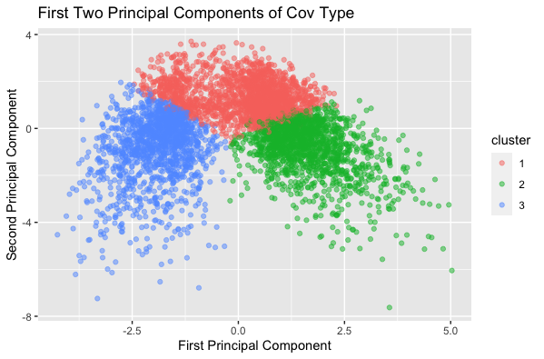
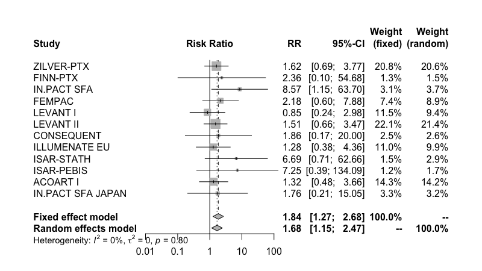
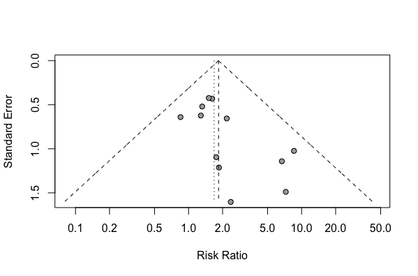
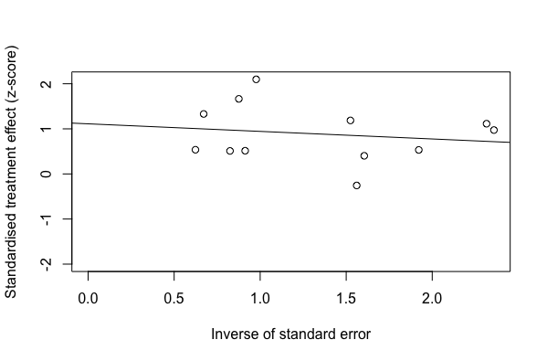

# STAT3622 Quiz 2
# Preparation
```r
library(tidyverse)
library(meta)

df = read.csv("covtype_pca.csv")
df_jaha = read.csv("jaha_paclitaxel.csv")
```
# Q1
## Q1a
```r
set.seed(2021)
cl = kmeans(df,3)$cluster
```
```r
> head(cl)
[1] 1 3 1 3 1 3
```

## Q1b
```r
pca_result <- prcomp(df)
pca_df <- as.data.frame(pca_result$x[,c(1:2)])
pca_df$cluster <- as.factor(cl)
```
```r
> head(pca_df)
          PC1        PC2 cluster
1  0.88917216  1.0975801       1
2 -1.72837584  0.7483375       3
3  0.06769367  0.4342664       1
4 -1.89263893 -0.3400084       3
5  0.60338550  0.5529723       1
6 -1.49352081  0.3341309       3
```

## Q1c

```r
ggplot(pca_df, aes(x = PC1, y = PC2, col = cluster)) + 
  geom_point(alpha = 0.5) +
  xlab("First Principal Component") +
  ylab("Second Principal Component") +
  ggtitle("First Two Principal Components of Cov Type")
```

# Q2
## Q2a
```r
> m.bin
                      RR             95%-CI %W(fixed) %W(random)
ZILVER-PTX        1.6176 [0.6939;   3.7709]      20.8       20.6
FINN-PTX          2.3617 [0.1020;  54.6790]       1.3        1.5
IN.PACT SFA       8.5657 [1.1518;  63.7027]       3.1        3.7
FEMPAC            2.1778 [0.6022;   7.8757]       7.4        8.9
LEVANT I          0.8490 [0.2419;   2.9797]      11.5        9.4
LEVANT II         1.5108 [0.6582;   3.4680]      22.1       21.4
CONSEQUENT        1.8571 [0.1725;  19.9981]       2.5        2.6
ILLUMENATE EU     1.2848 [0.3788;   4.3574]      11.0        9.9
ISAR-STATH        6.6875 [0.7138;  62.6556]       1.5        2.9
ISAR-PEBIS        7.2456 [0.3915; 134.0917]       1.2        1.7
ACOART I          1.3194 [0.4759;   3.6583]      14.3       14.2
IN.PACT SFA JAPAN 1.7576 [0.2053;  15.0488]       3.3        3.2

Number of studies combined: k = 12

                         RR           95%-CI    z p-value
Fixed effect model   1.8432 [1.2679; 2.6796] 3.20  0.0014
Random effects model 1.6849 [1.1475; 2.4740] 2.66  0.0078

Quantifying heterogeneity:
 tau^2 = 0; tau = 0; I^2 = 0.0% [0.0%; 34.4%]; H = 1.00 [1.00; 1.23]

Test of heterogeneity:
    Q d.f. p-value
 6.99   11  0.8002

Details on meta-analytical method:
- Mantel-Haenszel method
- DerSimonian-Laird estimator for tau^2
- Mantel-Haenszel estimator used in calculation of Q and tau^2 (like RevMan 5)
- Continuity correction of 0.5 in studies with zero cell frequencies
```
```r
df_jaha = df_jaha[df_jaha$Period == '2', ]
m.bin <- metabin(P.Events,P.Total,C.Events,C.Total,
                 data = df_jaha,
                 studlab = paste(Study),
                 comb.fixed = T,comb.random = T,
                 method = 'MH',sm = "RR")
```
## Q2b

```r
forest(m.bin, leftcols = c('studlab'))
```

## Q2c
Egger’s test for a regression intercept gave a p-value of 0.0406 which is smaller than 0.05, indicating possible publication bias which is a problem in the analysis. From the funnel plot, an asymmetric funnel is shown with a possibility of publication bias.
precision


```r
> metabias(m.bin, method.bias = 'linreg', plotit = T)
Linear regression test of funnel plot asymmetry

Test result: t = 2.35, df = 10, p-value = 0.0406

Sample estimates:
   bias se.bias intercept se.intercept
 1.1113  0.4728   -0.1687       0.3210

Details:
- multiplicative residual heterogeneity variance (tau^2 = 0.4365)
- predictor: standard error
- weight:    inverse variance
- reference: Egger et al. (1997), BMJ
```
```r
funnel(m.bin)
metabias(m.bin, method.bias = 'linreg', plotit = T)
```