# STAT3622 Assignment 1
- [STAT3622 Assignment 1](#stat3622assignment1)
    - [Q1](#q1)
        - [Q1a](#q1a)
        - [Q1b](#q1b)
        - [Q1c](#q1c)
        - [Q1d](#q1d)
        - [Q1e](#q1e)
        - [Q1f](#q1f)
    - [Q2](#q2)
        - [Q2a](#q2a)
        - [Q2b](#q1b)
        - [Q2c](#q2c)
        - [Q2d](#q2d)
    - [Q3](#q3)
        - [Q3a](#q3a)
        - [Q3b](#q3b)
        - [Q3c](#q3c)
        - [Q3d](#q3d)
        - [Q3e](#q3e)
    - [Q4](#q4)
        - [Q4a](#q4a)
        - [Q4b](#q4b)
        - [Q4c](#q4c)
    - [Appendix](#appendix)
# Q1
## Q1a
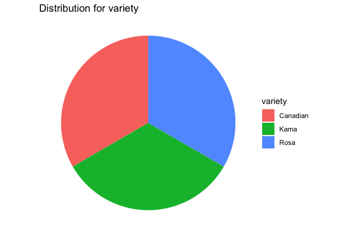
```r
ggplot(df, aes(x=factor(1), fill=variety))+
  geom_bar(width = 1)+
  coord_polar("y") +
  theme_void() + 
  ggtitle("Distribution for variety" ) 
```

## Q1b
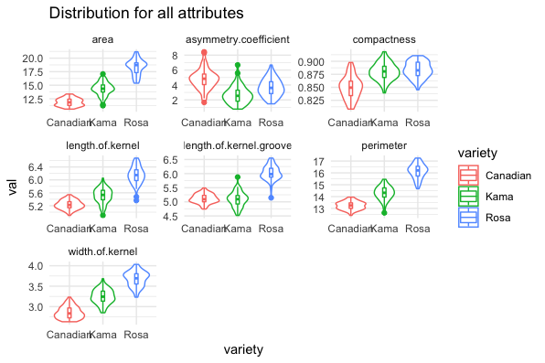
```r
gather_df = gather(df, key = "key", value = "val", -variety)
ggplot(gather_df, aes(x = variety, y = val, colour = variety)) +
  geom_violin(adjust = 1) +
  geom_boxplot(width=0.1) + 
  facet_wrap(~key, scales = "free") +
  theme_minimal()+
  ggtitle("Distribution for all attributes") 
```

## Q1c
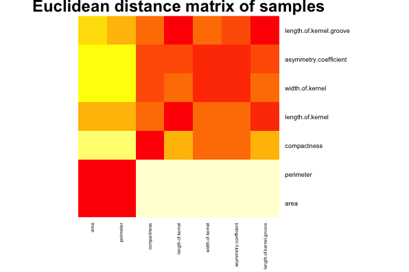
```r
df_num = select_if(df, is.numeric)
dst = data.matrix(dist(df_num))
dim = ncol(dst)
image(1:dim, 1:dim, dst, axes=FALSE, xlab="Samples 201(s)", ylab="Correlation 0.0-1.0")
```
## Q1d
```r
> head(df$flag)
[1] "True"  "False" "False" "False" "True"  "False"
```
```r
df$flag = ifelse(df$area > 15, "True", "False")
```

## Q1e
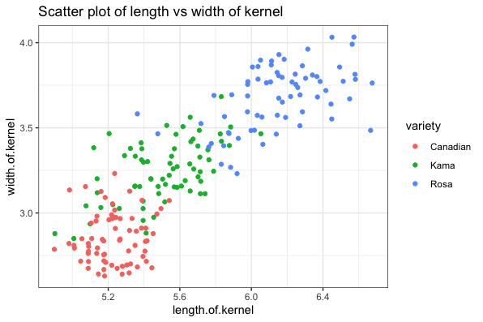
```r
ggplot(df, aes(x = length.of.kernel, y = width.of.kernel, colour = variety)) +
  geom_point() +
  theme_bw() +
  ggtitle("Scatter plot of length vs width of kernel") 
```

## Q1f
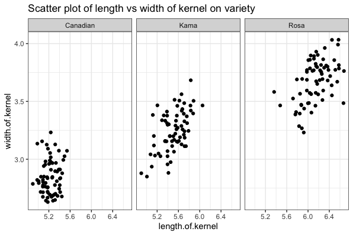
```r
ggplot(df, aes(x = length.of.kernel, y = width.of.kernel)) +
  facet_grid(. ~ variety) +
  geom_point() +
  theme_bw() + 
  ggtitle("Scatter plot of length vs width of kernel on variety") 
```

# Q2
## Q2a
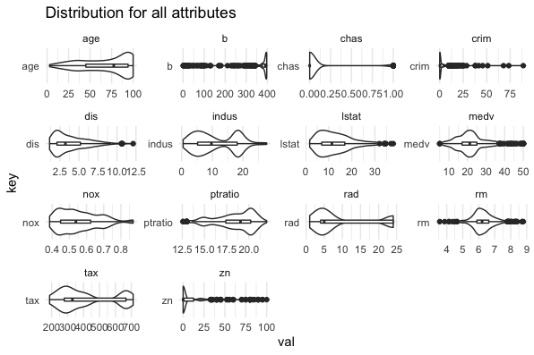

```r
gather_df_q2 = gather(df_q2, key = "key", value = "val")
ggplot(gather_df_q2, aes(x = val, y = key)) +
  geom_violin(adjust = 1) +
  geom_boxplot(width=0.1) + 
  facet_wrap(~key, scales = "free") +
  theme_minimal()+
  ggtitle("Distribution for all attributes") 
```

## Q2b
Median value of owner-occupied homes (in 1000$) increases as average number of rooms per dwelling increases and it decreases if percent of lower status population in the area increases.
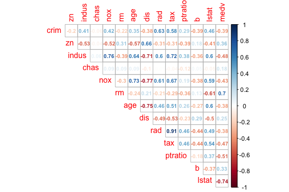
```r
corrplot(cor(df_q2), method = "number", type = "upper", diag = FALSE, number.cex = .7)
```

## Q2c

```r
Call:
lm(formula = medv ~ . - indus - age, data = df_q2)

Residuals:
     Min       1Q   Median       3Q      Max 
-15.5984  -2.7386  -0.5046   1.7273  26.2373 

Coefficients:
              Estimate Std. Error t value Pr(>|t|)    
(Intercept)  36.341145   5.067492   7.171 2.73e-12 ***
crim         -0.108413   0.032779  -3.307 0.001010 ** 
zn            0.045845   0.013523   3.390 0.000754 ***
chas          2.718716   0.854240   3.183 0.001551 ** 
nox         -17.376023   3.535243  -4.915 1.21e-06 ***
rm            3.801579   0.406316   9.356  < 2e-16 ***
dis          -1.492711   0.185731  -8.037 6.84e-15 ***
rad           0.299608   0.063402   4.726 3.00e-06 ***
tax          -0.011778   0.003372  -3.493 0.000521 ***
ptratio      -0.946525   0.129066  -7.334 9.24e-13 ***
b             0.009291   0.002674   3.475 0.000557 ***
lstat        -0.522553   0.047424 -11.019  < 2e-16 ***
---
Signif. codes:  0 ‘***’ 0.001 ‘**’ 0.01 ‘*’ 0.05 ‘.’ 0.1 ‘ ’ 1

Residual standard error: 4.736 on 494 degrees of freedom
Multiple R-squared:  0.7406,	Adjusted R-squared:  0.7348 
F-statistic: 128.2 on 11 and 494 DF,  p-value: < 2.2e-16
```
```r
lm = lm(medv ~ . -indus -age, data = df_q2)
summary(lm)
```

## Q2d

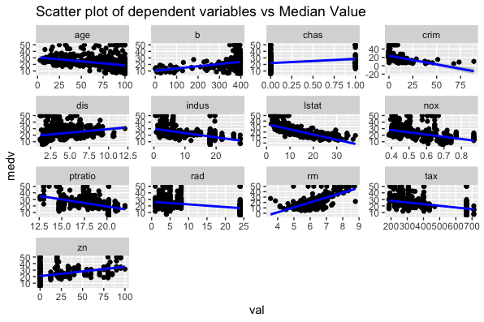
```r
lm_df_q2 = gather(df_q2, key = "key", value = "val", -medv)
ggplot(lm_df_q2, aes(x = val, y = medv)) +
  geom_point() +
  stat_smooth(method = "lm", se = TRUE, col = "blue") +
  facet_wrap(~key, scales = "free") +
  theme_gray() +
  ggtitle("Scatter plot of dependent variables vs Median Value") 
```

# Q3
## Q3a
```r
# A tibble: 2 x 2
   year displ.mean
  <int>      <dbl>
1  1999       3.28
2  2008       3.66
```
```r
avg_displ = summarize(group_by(df_q3, year=year), displ.mean=mean(displ))
```

## Q3b
```r
# A tibble: 76 x 3
# Groups:   year [2]
    year model              hwy.median
   <int> <fct>                   <dbl>
 1  1999 4runner 4wd              19.5
 2  1999 a4                       27.5
 3  1999 a4 quattro               25  
 4  1999 a6 quattro               24  
 5  1999 altima                   28  
 6  1999 c1500 suburban 2wd       17  
 7  1999 camry                    26.5
 8  1999 camry solara             26.5
 9  1999 caravan 2wd              22  
10  1999 civic                    32  
# … with 66 more rows
```
```r
median_hwy = summarize(group_by(df_q3, year=year, model=model), hwy.median=median(hwy))
```

## Q3c
```r
  displ cyl
1   7.0   8
2   6.5   8
3   6.2   8
4   6.2   8
5   6.1   8
```
```r
five_obj = arrange(select(df_q3, displ, cyl), desc(displ), desc(cyl))
head(five_obj, 5)
```

## Q3d
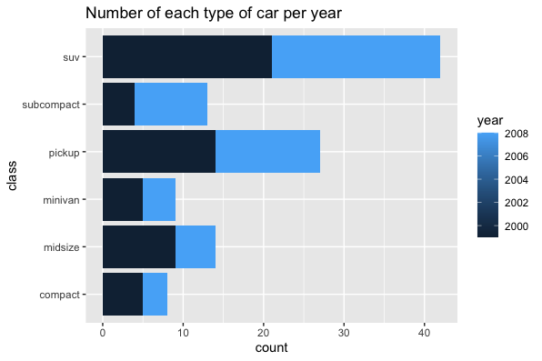

```r
no_of_car_with_condi = summarize(group_by(filter(df_q3,cyl>4 & fl=="r"),
                         year=year, class=class),
                         count = n())
ggplot(data=no_of_car_with_condi, aes(x=class, y=count, fill=year)) +
  geom_bar(stat="identity") +
  coord_flip() + 
  ggtitle("Number of each type of car per year")
```

## Q3e

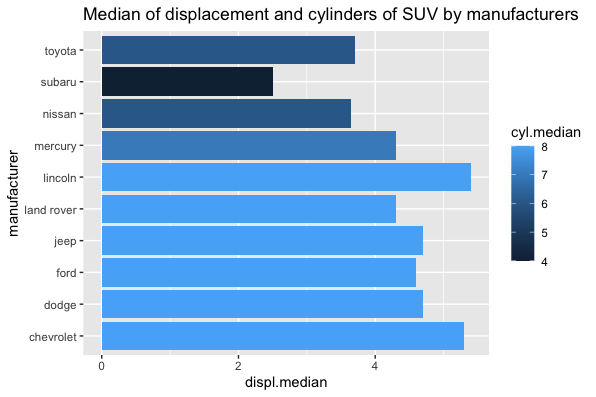

```r
affected_by_type = summarize(group_by(filter(df_q3,class == 'suv'),
                                          manufacturer=manufacturer),
                                          displ.median=median(displ),
                                          cyl.median = median(cyl))
ggplot(data=affected_by_type, aes(x=manufacturer, y=displ.median, fill=cyl.median)) +
  geom_bar(stat="identity") +
  coord_flip() + 
  ggtitle("Median of displacement and cylinders of SUV by manufacturers")
```

# Q4
## Q4a
This line graph shows the acceptance rates of loan applications from January 2015 to June 2018. The percentage of acceptance rates is being measured, so this variable is plotted on the vertical axis. The months of the year are the measurement of time and are plotted on the horizontal axis. This graph shows us that there is the highest rate in May 2015 for around 83%, after a small rebound in mid-2016, the rate drops to the lowest around 6% in November 2017 and then increases dramatically in February 2018.

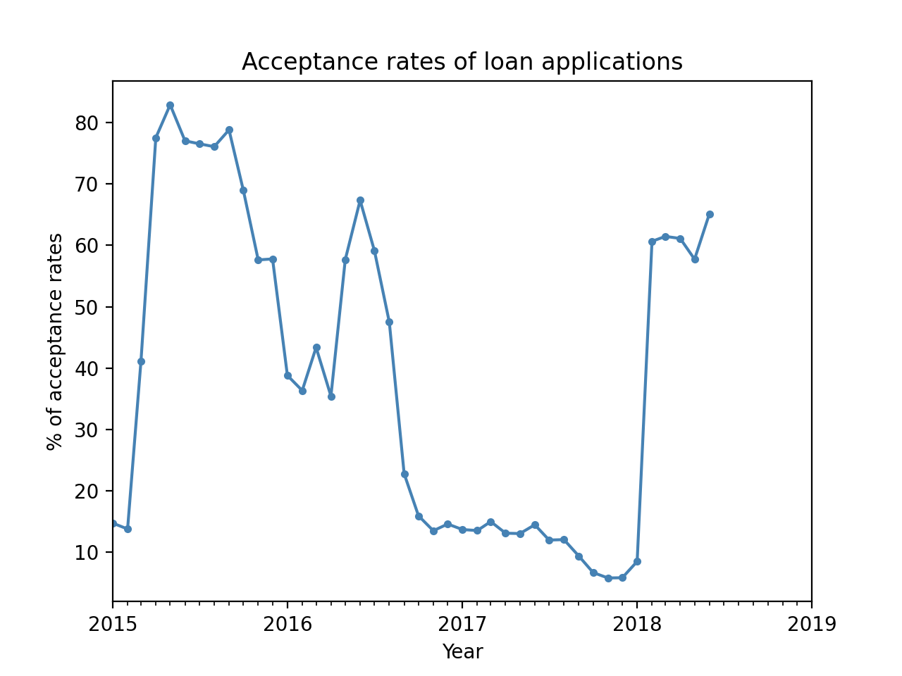

```py
date_list = sorted(list(set(df['Date'].tolist())))
no_of_accept = [len(accept.loc[accept['Date'] == date_list[i]]) for i in range(0, len(date_list))]
total_application = [len(df.loc[df['Date'] == date_list[i]]) for i in range(0, len(date_list))]
accept_rate = [no_of_accept[i]/total_application[i] * 100 for i in range(0, len(no_of_accept))]

date_list = [datetime.strptime(str(s), '%Y%m') for s in date_list] 
date_list = [np.datetime64(i) for i in date_list]

fig, ax = plt.subplots()
ax.plot(date_list,accept_rate, color = 'steelblue', marker='.')

years = mdates.YearLocator()
months = mdates.MonthLocator()
years_fmt = mdates.DateFormatter('%Y')
ax.xaxis.set_major_locator(years)
ax.xaxis.set_major_formatter(years_fmt)
ax.xaxis.set_minor_locator(months)
datemin = np.datetime64(date_list[0], 'Y')
datemax = np.datetime64(date_list[-1], 'Y') + np.timedelta64(1, 'Y')
ax.set_xlim(datemin, datemax)
ax.format_xdata = mdates.DateFormatter('%Y-%m-%d')

plt.title('Acceptance rates of loan applications')
plt.xlabel('Year')
plt.ylabel('% of acceptance rates')
plt.show()
```

## Q4b
The side-by-side bar chart shows the loan purposes grouped by the status of acceptance and declination. The blue and orange bar represent accept and decline respectively. The list of purposes is being measured, so this variable is plotted on the vertical axis. The number of purposes is plotted on the horizontal axis. From the graph, Debt consolidation is the most popular purpose in both bars. But using credit card as the purpose has the highest ratio to receive loan successfully.  

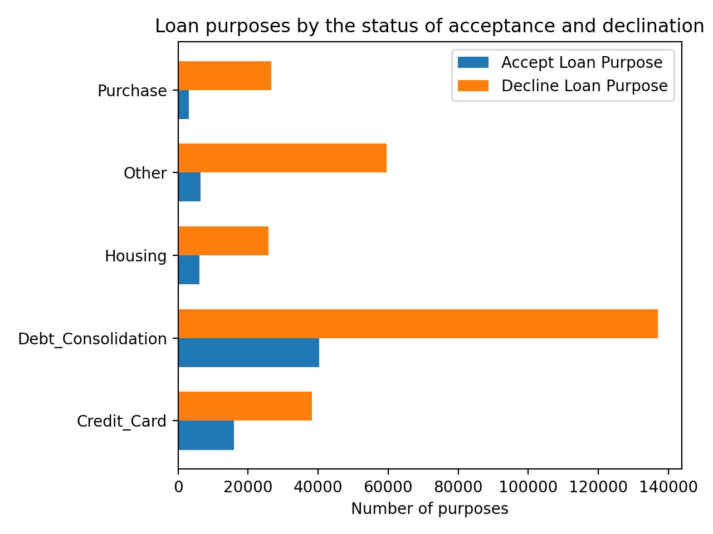

```py
purpose_list = sorted(list(set(df['Purpose'].tolist())))
accpet_loan_purpose = [len(accept.loc[accept['Purpose'] == purpose_list[i]]) for i in range(0, len(purpose_list))]
decline_loan_purpose = [len(decline.loc[decline['Purpose'] == purpose_list[i]]) for i in range(0, len(purpose_list))]

x = np.arange(len(purpose_list))
width = 0.35
fig, ax = plt.subplots()
accept_rects = ax.barh(x - width/2, accpet_loan_purpose, width, label='Accept Loan Purpose')
decline_rects = ax.barh(x + width/2, decline_loan_purpose, width, label='Decline Loan Purpose')

ax.set_xlabel('Number of purposes')
ax.set_title('Loan purposes by the status of acceptance and declination')
ax.set_yticks(x)
ax.set_yticklabels(purpose_list)
ax.legend()
fig.tight_layout()
plt.show()
```

## Q4c
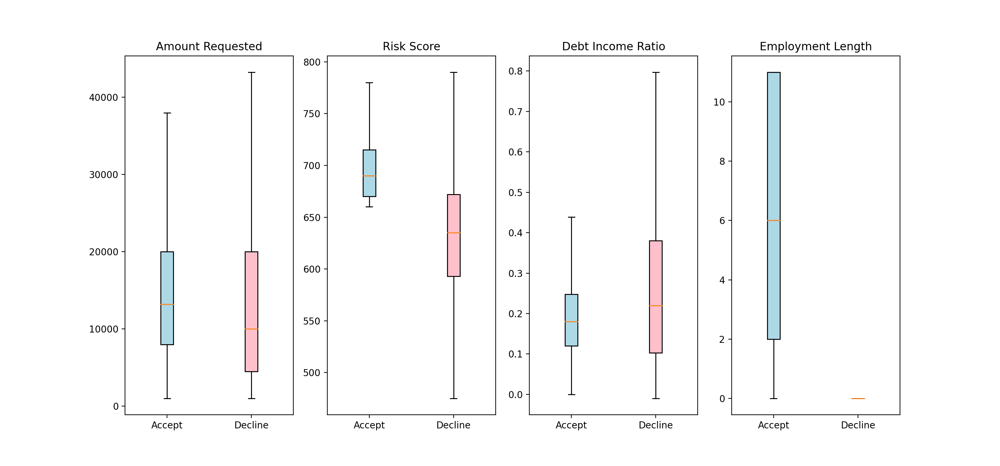
```py
fig, (ax1, ax2, ax3, ax4) = plt.subplots(nrows=1, ncols=4, figsize=(15, 7))
labels = ["Accept", "Decline"]
bplot1 = ax1.boxplot([accept['Amount_Requested'], decline['Amount_Requested']],
                    vert=True, patch_artist=True, labels=labels, showfliers=False)
ax1.set_title('Amount Requested')

bplot2 = ax2.boxplot([accept['Risk_Score'], decline['Risk_Score']],
                    vert=True, patch_artist=True, labels=labels, showfliers=False)
ax2.set_title('Risk Score')

bplot3 = ax3.boxplot([accept['Debt_Income_Ratio'], decline['Debt_Income_Ratio']],
                    vert=True, patch_artist=True, labels=labels, showfliers=False)
ax3.set_title('Debt Income Ratio')

bplot4 = ax4.boxplot([accept['Employment_Length'], decline['Employment_Length']],
                    vert=True, patch_artist=True, labels=labels, showfliers=False)
ax4.set_title('Employment Length')

colors = ['lightblue', 'pink']
for bplot in (bplot1, bplot2, bplot3, bplot4):
    for patch, color in zip(bplot['boxes'], colors):
        patch.set_facecolor(color)

fig.subplots_adjust(hspace=0.4)
plt.show()
```
# Appendix