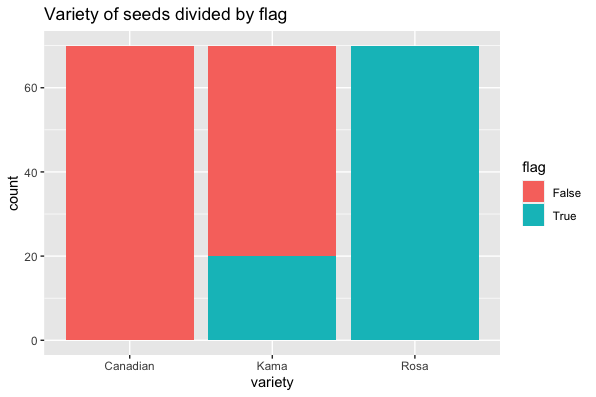
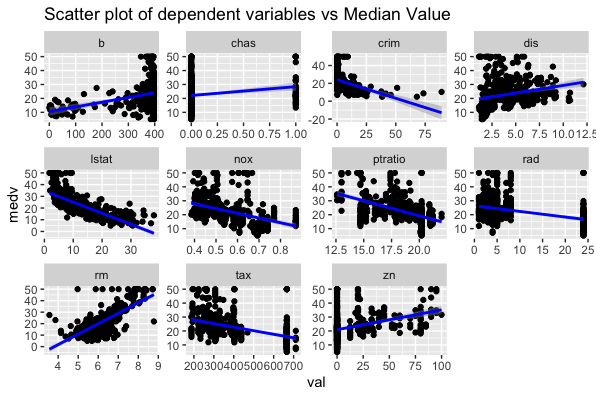
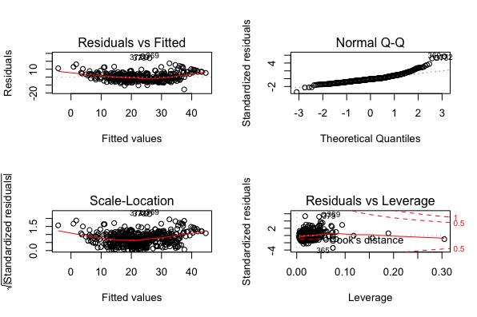

# STAT3622 Assignment 1
- [STAT3622 Assignment 1](#stat3622assignment1)
    - [Q1](#q1)
        - [Q1a](#q1a)
        - [Q1b](#q1b)
        - [Q1c](#q1c)
        - [Q1d](#q1d)
        - [Q1e](#q1e)
        - [Q1f](#q1f)
    - [Q2](#q2)
        - [Q2a](#q2a)
        - [Q2b](#q1b)
        - [Q2c](#q2c)
        - [Q2d](#q2d)
    - [Q3](#q3)
        - [Q3a](#q3a)
        - [Q3b](#q3b)
        - [Q3c](#q3c)
        - [Q3d](#q3d)
        - [Q3e](#q3e)
    - [Q4](#q4)
        - [Q4a](#q4a)
        - [Q4b](#q4b)
        - [Q4c](#q4c)
    - [Appendix](#appendix)
# Q1
## Q1a
The pie chart shows the proportions of the categorical attribute variety. All three variety are the same with 70 each.


```r
ggplot(df, aes(x=factor(1), fill=variety))+
  geom_bar(width = 1)+
  coord_polar("y") +
  theme_void() + 
  ggtitle("Distribution for variety" ) 
```

## Q1b
The violin plot shows the distribution for all attributes. From the area, length and width of the kernel, perimeter attributes, Canadian has a higher probability with smaller area comparing with larger area Rosa. From the asymmetry coefficient, Kama usually is smallest than Canadian which has the highest probability. From compactness, Kama and Rosa share a close probability of it but Canadian is comparably lower. From the length of kernel groove, Canadian and Kama share a close probability but Rosa is much higher.


```r
gather_df = gather(df, key = "key", value = "val", -variety)
ggplot(gather_df, aes(x = variety, y = val, colour = variety)) +
  geom_violin(adjust = 1) +
  geom_boxplot(width=0.1) + 
  facet_wrap(~key, scales = "free") +
  theme_minimal()+
  ggtitle("Distribution for all attributes") 
```

## Q1c
From the heatmap, the plot shows the Euclidean distance between perimeter and area, compactness has the largest value. It also shows the length of kernel groove with the length of kernel has the smallest value.


```r
mean_each_col = colMeans(df[sapply(df, is.numeric)])
dst = data.matrix(dist(mean_each_col))
heatmap(dst, Colv = NA, Rowv = NA, scale="column", cexCol=0.5, cexRow=0.7, main = "Euclidean distance matrix of samples")
```
## Q1d
The stacked bar chart shows all rosa is larger than 15 in area, and all canadian is smaller than 15 in the area. The majority of Kama is larger than 15 in the area with a small amount is lower.


```r
df$flag = ifelse(df$area > 15, "True", "False")
ggplot(df, aes(variety, fill = flag)) +
  geom_bar(position = "stack") +
  ggtitle("Variety of seeds divided by flag") 
```

## Q1e
The scatter plot shows an uphill pattern from left to right, this indicates a positive relationship between width and length of kernel. As the width increase, the length of kernel also tends to increase. From the variety, most Canadians are the smallest in width and length. Rosas share the largest size and Kamas are in the middle.


```r
ggplot(df, aes(x = length.of.kernel, y = width.of.kernel, colour = variety)) +
  geom_point() +
  theme_bw() +
  ggtitle("Scatter plot of length vs width of kernel") 
```

## Q1f
The scatter plot shows an uphill pattern from left to right, this indicates a positive relationship between width and length of kernel. As the width increase, the length of kernel also tends to increase. From the separated variety, most Canadians are the smallest in width and length. Rosas share the largest size and Kamas are in the middle.


```r
ggplot(df, aes(x = length.of.kernel, y = width.of.kernel)) +
  facet_grid(. ~ variety) +
  geom_point() +
  theme_bw() + 
  ggtitle("Scatter plot of length vs width of kernel on variety") 
```

# Q2
## Q2a
The violin plot shows the distribution for all attributes. From the age, the proportion of owner-occupied units built prior to 1940 are large with a median of 75 and a large probability near 100. From the black, the proportion of blacks by the town are also very huge around 400. From chas, most of the houses do not tract bounds river. From crim, there is only very little crime rate per capita by the town. From dis, majority houses share close distances to five Boston employment centres. From indus, it is quite diverse as part of houses have a small proportion of non-retail business acres per town but some are large with 2 high probability. From Istat, most of the houses have a lower status of the population. The median value of owner-occupied homes in around $20,000 for most people. The concentration of nitrogen oxides comparatively averages with a higher probability of 0.4 to 0.5. Most of the houses have a high pupil-teacher ratio by the town. Majority of them is not easy to access radial highways with only a little people can. The average number of rooms per dwelling is 6. The full-value property-tax rate is low for the majority but some of them have a higher probability of higher rate. Most of them share a small proportion of residential land zoned for lots.


```r
gather_df_q2 = gather(df_q2, key = "key", value = "val")
ggplot(gather_df_q2, aes(x = val, y = key)) +
  geom_violin(adjust = 1) +
  geom_boxplot(width=0.1) + 
  facet_wrap(~key, scales = "free") +
  theme_minimal()+
  ggtitle("Distribution for all attributes") 
```

## Q2b
The average number of rooms per dwelling (rm) and lower status of the population (Istat) may have impacts on the median value of owner-occupied homes as it rises if the average number of rooms climbs. It decreases if lower status population enlarges.


```r
corrplot(cor(df_q2), method = "number", type = "upper", diag = FALSE, number.cex = .7)
```

## Q2c
By selecting the all attributes without proportion of non-retail business acres and proportion of owner-occupied units as they are insignificant, all variables are significant based on p-value. For example, the regression equation is `medv = 36.34 - 0.11*crim` for crim and `medv = 36.34 + 3.80*rm` for rm.

```r
Call:
lm(formula = medv ~ . - indus - age, data = df_q2)

Residuals:
     Min       1Q   Median       3Q      Max 
-15.5984  -2.7386  -0.5046   1.7273  26.2373 

Coefficients:
              Estimate Std. Error t value Pr(>|t|)    
(Intercept)  36.341145   5.067492   7.171 2.73e-12 ***
crim         -0.108413   0.032779  -3.307 0.001010 ** 
zn            0.045845   0.013523   3.390 0.000754 ***
chas          2.718716   0.854240   3.183 0.001551 ** 
nox         -17.376023   3.535243  -4.915 1.21e-06 ***
rm            3.801579   0.406316   9.356  < 2e-16 ***
dis          -1.492711   0.185731  -8.037 6.84e-15 ***
rad           0.299608   0.063402   4.726 3.00e-06 ***
tax          -0.011778   0.003372  -3.493 0.000521 ***
ptratio      -0.946525   0.129066  -7.334 9.24e-13 ***
b             0.009291   0.002674   3.475 0.000557 ***
lstat        -0.522553   0.047424 -11.019  < 2e-16 ***
---
Signif. codes:  0 ‘***’ 0.001 ‘**’ 0.01 ‘*’ 0.05 ‘.’ 0.1 ‘ ’ 1

Residual standard error: 4.736 on 494 degrees of freedom
Multiple R-squared:  0.7406,	Adjusted R-squared:  0.7348 
F-statistic: 128.2 on 11 and 494 DF,  p-value: < 2.2e-16
```
```r
lm = lm(medv ~ . -indus -age, data = df_q2)
summary(lm)
```

## Q2d
By checking the linear relationshiop assumptions, Residuals vs Fitted graph shows the red line is approximately horizontal at zero with no fitted pattern. Scale-Location graph shows a horizontal line with nearly equally spread points. The normal probability plot of residuals follow a straight line approximately.



```r
df_q2 = select(df_q2,-indus, -age)
lm_df_q2 = gather(df_q2, key = "key", value = "val", -medv)
ggplot(lm_df_q2, aes(x = val, y = medv)) +
  geom_point() +
  stat_smooth(method = "lm", se = TRUE, col = "blue") +
  facet_wrap(~key, scales = "free") +
  theme_gray() +
  ggtitle("Scatter plot of dependent variables vs Median Value") 
```
```r
par(mfrow = c(2, 2))
plot(lm)
```

# Q3
## Q3a
```r
# A tibble: 2 x 2
   year displ.mean
  <int>      <dbl>
1  1999       3.28
2  2008       3.66
```
```r
avg_displ = summarize(group_by(df_q3, year=year), displ.mean=mean(displ))
```

## Q3b
```r
# A tibble: 76 x 3
# Groups:   year [2]
    year model              hwy.median
   <int> <fct>                   <dbl>
 1  1999 4runner 4wd              19.5
 2  1999 a4                       27.5
 3  1999 a4 quattro               25  
 4  1999 a6 quattro               24  
 5  1999 altima                   28  
 6  1999 c1500 suburban 2wd       17  
 7  1999 camry                    26.5
 8  1999 camry solara             26.5
 9  1999 caravan 2wd              22  
10  1999 civic                    32  
# … with 66 more rows
```
```r
median_hwy = summarize(group_by(df_q3, year=year, model=model), hwy.median=median(hwy))
```

## Q3c
```r
  displ cyl
1   7.0   8
2   6.5   8
3   6.2   8
4   6.2   8
5   6.1   8
```
```r
five_obj = arrange(select(df_q3, displ, cyl), desc(displ), desc(cyl))
head(five_obj, 5)
```

## Q3d
SUV is the type of car which manufacturers produce the most in both 1999 and 2008. The second one is pickup.


```r
no_of_car_with_condi = summarize(group_by(filter(df_q3,cyl>4 & fl=="r"),
                         year=year, class=class),
                         count = n())
ggplot(data=no_of_car_with_condi, aes(x=class, y=count, fill=year)) +
  geom_bar(stat="identity") +
  coord_flip() + 
  ggtitle("Number of each type of car per year")
```

## Q3e
By picking SUV as the given type of car, the median of displacement is different from various manufacturers. Lincoln has the highest value of displacement with 5.4 and follows by chevrolet 5.3. Also, cylinders can be affected as a majority of companies produce 8 cylinders but subaru usually produce 4.


```r
affected_by_type = summarize(group_by(filter(df_q3,class == 'suv'),
                                          manufacturer=manufacturer),
                                          displ.median=median(displ),
                                          cyl.median = median(cyl))
ggplot(data=affected_by_type, aes(x=manufacturer, y=displ.median, fill=cyl.median)) +
  geom_bar(stat="identity") +
  coord_flip() + 
  ggtitle("Median of displacement and cylinders of SUV by manufacturers")
```

# Q4
## Q4a
This line graph shows the acceptance rates of loan applications from January 2015 to June 2018. The percentage of acceptance rates is being measured, so this variable is plotted on the vertical axis. The months of the year are the measurement of time and are plotted on the horizontal axis. This graph shows us that there is the highest rate in May 2015 for around 83%, after a small rebound in mid-2016, the rate drops to the lowest around 6% in November 2017 and then increases dramatically in February 2018.


```py
date_list = sorted(list(set(df['Date'].tolist())))
no_of_accept = [len(accept.loc[accept['Date'] == date_list[i]]) for i in range(0, len(date_list))]
total_application = [len(df.loc[df['Date'] == date_list[i]]) for i in range(0, len(date_list))]
accept_rate = [no_of_accept[i]/total_application[i] * 100 for i in range(0, len(no_of_accept))]

date_list = [datetime.strptime(str(s), '%Y%m') for s in date_list] 
date_list = [np.datetime64(i) for i in date_list]

fig, ax = plt.subplots()
ax.plot(date_list,accept_rate, color = 'steelblue', marker='.')

years = mdates.YearLocator()
months = mdates.MonthLocator()
years_fmt = mdates.DateFormatter('%Y')
ax.xaxis.set_major_locator(years)
ax.xaxis.set_major_formatter(years_fmt)
ax.xaxis.set_minor_locator(months)
datemin = np.datetime64(date_list[0], 'Y')
datemax = np.datetime64(date_list[-1], 'Y') + np.timedelta64(1, 'Y')
ax.set_xlim(datemin, datemax)
ax.format_xdata = mdates.DateFormatter('%Y-%m-%d')

plt.title('Acceptance rates of loan applications')
plt.xlabel('Year')
plt.ylabel('% of acceptance rates')
plt.show()
```

## Q4b
The side-by-side bar chart shows the loan purposes grouped by the status of acceptance and declination. The blue and orange bar represent accept and decline respectively. The list of purposes is being measured, so this variable is plotted on the vertical axis. The number of purposes is plotted on the horizontal axis. From the graph, Debt consolidation is the most popular purpose in both bars. But using credit card as the purpose has the highest ratio to receive loan successfully.  


```py
purpose_list = sorted(list(set(df['Purpose'].tolist())))
accpet_loan_purpose = [len(accept.loc[accept['Purpose'] == purpose_list[i]]) for i in range(0, len(purpose_list))]
decline_loan_purpose = [len(decline.loc[decline['Purpose'] == purpose_list[i]]) for i in range(0, len(purpose_list))]

x = np.arange(len(purpose_list))
width = 0.35
fig, ax = plt.subplots()
accept_rects = ax.barh(x - width/2, accpet_loan_purpose, width, label='Accept Loan Purpose')
decline_rects = ax.barh(x + width/2, decline_loan_purpose, width, label='Decline Loan Purpose')

ax.set_xlabel('Number of purposes')
ax.set_title('Loan purposes by the status of acceptance and declination')
ax.set_yticks(x)
ax.set_yticklabels(purpose_list)
ax.legend()
fig.tight_layout()
plt.show()
```

## Q4c
The box plot shows the distribution for 4 attributes. Blue is for acceptance and red is for declination. From the amount requested, the range of decline is larger than accept. But the majority of the request is between $10,000 to $20,000. The median of acceptance is slightly higher than declination. From the risk score, the range of decline and the score of acceptance is much higher, which means people who have lower score usually cannot receive the loan. From the ratio of debt income, the acceptance is slightly smaller than higher with a wide range of decline. From the employment length, there are approximately equally spread from 2 to 10 in acceptance but a majority of declination is only 0.


```py
fig, (ax1, ax2, ax3, ax4) = plt.subplots(nrows=1, ncols=4, figsize=(15, 7))
labels = ["Accept", "Decline"]
bplot1 = ax1.boxplot([accept['Amount_Requested'], decline['Amount_Requested']],
                    vert=True, patch_artist=True, labels=labels, showfliers=False)
ax1.set_title('Amount Requested')

bplot2 = ax2.boxplot([accept['Risk_Score'], decline['Risk_Score']],
                    vert=True, patch_artist=True, labels=labels, showfliers=False)
ax2.set_title('Risk Score')

bplot3 = ax3.boxplot([accept['Debt_Income_Ratio'], decline['Debt_Income_Ratio']],
                    vert=True, patch_artist=True, labels=labels, showfliers=False)
ax3.set_title('Debt Income Ratio')

bplot4 = ax4.boxplot([accept['Employment_Length'], decline['Employment_Length']],
                    vert=True, patch_artist=True, labels=labels, showfliers=False)
ax4.set_title('Employment Length')

colors = ['lightblue', 'pink']
for bplot in (bplot1, bplot2, bplot3, bplot4):
    for patch, color in zip(bplot['boxes'], colors):
        patch.set_facecolor(color)

fig.subplots_adjust(hspace=0.4)
plt.show()
```
# Appendix
```r
library(dplyr)
library(ggplot2)
library(corrplot)
library(tidyr)
library(tidyverse)

# 1
df = read.delim('./seeds.txt', header = TRUE, sep = ",")

# 1a
ggplot(df, aes(x=factor(1), fill=variety))+
  geom_bar(width = 1)+
  coord_polar("y") +
  theme_void() + 
  ggtitle("Distribution for variety" ) 

# 1b
gather_df = gather(df, key = "key", value = "val", -variety)

ggplot(gather_df, aes(x = variety, y = val, colour = variety)) +
  geom_violin(adjust = 1) +
  geom_boxplot(width=0.1) + 
  facet_wrap(~key, scales = "free") +
  theme_minimal()+
  ggtitle("Distribution for all attributes") 

# 1c
mean_each_col = colMeans(df[sapply(df, is.numeric)])
dst = data.matrix(dist(mean_each_col))
heatmap(dst, Colv = NA, Rowv = NA, scale="column", cexCol=0.5, cexRow=0.7, main = "Euclidean distance matrix of samples")

# 1d
df$flag = ifelse(df$area > 15, "True", "False")
ggplot(df, aes(variety, fill = flag)) +
  geom_bar(position = "stack") +
  ggtitle("Variety of seeds divided by flag") 

# 1e
ggplot(df, aes(x = length.of.kernel, y = width.of.kernel, colour = variety)) +
  geom_point() +
  theme_bw() +
  ggtitle("Scatter plot of length vs width of kernel") 

# 1f
ggplot(df, aes(x = length.of.kernel, y = width.of.kernel)) +
  facet_grid(. ~ variety) +
  geom_point() +
  theme_bw() + 
  ggtitle("Scatter plot of length vs width of kernel on variety") 

# 2
df_q2 = read.delim('./Boston.txt', header = TRUE, sep = ",")

# 2a
gather_df_q2 = gather(df_q2, key = "key", value = "val")
ggplot(gather_df_q2, aes(x = val, y = key)) +
  geom_violin(adjust = 1) +
  geom_boxplot(width=0.1) + 
  facet_wrap(~key, scales = "free") +
  theme_minimal()+
  ggtitle("Distribution for all attributes") 


# 2b
corrplot(cor(df_q2), method = "number", type = "upper", diag = FALSE, number.cex = .7)

# 2c
lm = lm(medv ~ . -indus -age, data = df_q2)
summary(lm)


# 2d
df_q2 = select(df_q2,-indus, -age)
lm_df_q2 = gather(df_q2, key = "key", value = "val", -medv)
ggplot(lm_df_q2, aes(x = val, y = medv)) +
  geom_point() +
  stat_smooth(method = "lm", se = TRUE, col = "blue") +
  facet_wrap(~key, scales = "free") +
  theme_gray() +
  ggtitle("Scatter plot of dependent variables vs Median Value") 

par(mfrow = c(2, 2))
plot(lm)

# 3
df_q3 = read.delim('./mpg.txt', header = TRUE, sep = ",")

# 3a
avg_displ = summarize(group_by(df_q3, year=year), 
                                displ.mean=mean(displ))
#  3b
median_hwy = summarize(group_by(df_q3, year=year, model=model), 
                                 hwy.median=median(hwy))

# 3c
five_obj = arrange(select(df_q3, displ, cyl), 
                 desc(displ), desc(cyl))
head(five_obj, 5)

# 3d
no_of_car_with_condi = summarize(group_by(filter(df_q3,cyl>4 & fl=="r"),
                         year=year, class=class),
                count = n())
ggplot(data=no_of_car_with_condi, aes(x=class, y=count, fill=year)) +
  geom_bar(stat="identity") +
  coord_flip() + 
  ggtitle("Number of each type of car per year")

# 3e
affected_by_type = summarize(group_by(filter(df_q3,class == 'suv'),
                                      manufacturer=manufacturer),
                             displ.median=median(displ),
                             cyl.median = median(cyl))
ggplot(data=affected_by_type, aes(x=manufacturer, y=displ.median, fill=cyl.median)) +
  geom_bar(stat="identity") +
  coord_flip() + 
  ggtitle("Median of displacement and cylinders of SUV by manufacturers")
```
```py
import pandas as pd
import numpy as np
from datetime import datetime 
import matplotlib.pyplot as plt
import matplotlib.dates as mdates

accept = pd.read_csv('LC_Accept.csv', sep=',')
decline = pd.read_csv('LC_Decline.csv', sep=',')
df = pd.concat([accept, decline])

# Q4a
def q4a():
    date_list = sorted(list(set(df['Date'].tolist())))
    no_of_accept = [len(accept.loc[accept['Date'] == date_list[i]]) for i in range(0, len(date_list))]
    total_application = [len(df.loc[df['Date'] == date_list[i]]) for i in range(0, len(date_list))]
    accept_rate = [no_of_accept[i]/total_application[i] * 100 for i in range(0, len(no_of_accept))]

    date_list = [datetime.strptime(str(s), '%Y%m') for s in date_list] 
    date_list = [np.datetime64(i) for i in date_list]

    fig, ax = plt.subplots()
    ax.plot(date_list,accept_rate, color = 'steelblue', marker='.')
    
    years = mdates.YearLocator()
    months = mdates.MonthLocator()
    years_fmt = mdates.DateFormatter('%Y')
    ax.xaxis.set_major_locator(years)
    ax.xaxis.set_major_formatter(years_fmt)
    ax.xaxis.set_minor_locator(months)

    datemin = np.datetime64(date_list[0], 'Y')
    datemax = np.datetime64(date_list[-1], 'Y') + np.timedelta64(1, 'Y')
    ax.set_xlim(datemin, datemax)
    ax.format_xdata = mdates.DateFormatter('%Y-%m-%d')
    plt.title('Acceptance rates of loan applications')
    plt.xlabel('Year')
    plt.ylabel('% of acceptance rates')
    plt.show()

# Q4b
def q4b():
    purpose_list = sorted(list(set(df['Purpose'].tolist())))
    accpet_loan_purpose = [len(accept.loc[accept['Purpose'] == purpose_list[i]]) for i in range(0, len(purpose_list))]
    decline_loan_purpose = [len(decline.loc[decline['Purpose'] == purpose_list[i]]) for i in range(0, len(purpose_list))]

    x = np.arange(len(purpose_list))
    width = 0.35
    fig, ax = plt.subplots()
    accept_rects = ax.barh(x - width/2, accpet_loan_purpose, width, label='Accept Loan Purpose')
    decline_rects = ax.barh(x + width/2, decline_loan_purpose, width, label='Decline Loan Purpose')

    ax.set_xlabel('Number of purposes')
    ax.set_title('Loan purposes by the status of acceptance and declination')
    ax.set_yticks(x)
    ax.set_yticklabels(purpose_list)
    ax.legend()
    fig.tight_layout()
    plt.show()

# Q4c
def q4c():
    fig, (ax1, ax2, ax3, ax4) = plt.subplots(nrows=1, ncols=4, figsize=(15, 7))
    labels = ["Accept", "Decline"]
    bplot1 = ax1.boxplot([accept['Amount_Requested'], decline['Amount_Requested']],
                        vert=True, patch_artist=True, labels=labels, showfliers=False)
    ax1.set_title('Amount Requested')

    bplot2 = ax2.boxplot([accept['Risk_Score'], decline['Risk_Score']],
                        vert=True, patch_artist=True, labels=labels, showfliers=False)
    ax2.set_title('Risk Score')

    bplot3 = ax3.boxplot([accept['Debt_Income_Ratio'], decline['Debt_Income_Ratio']],
                        vert=True, patch_artist=True, labels=labels, showfliers=False)
    ax3.set_title('Debt Income Ratio')

    bplot4 = ax4.boxplot([accept['Employment_Length'], decline['Employment_Length']],
                        vert=True, patch_artist=True, labels=labels, showfliers=False)
    ax4.set_title('Employment Length')

    colors = ['lightblue', 'pink']
    for bplot in (bplot1, bplot2, bplot3, bplot4):
        for patch, color in zip(bplot['boxes'], colors):
            patch.set_facecolor(color)

    fig.subplots_adjust(hspace=0.4)
    plt.show()

q4a()
q4b()
q4c()
```